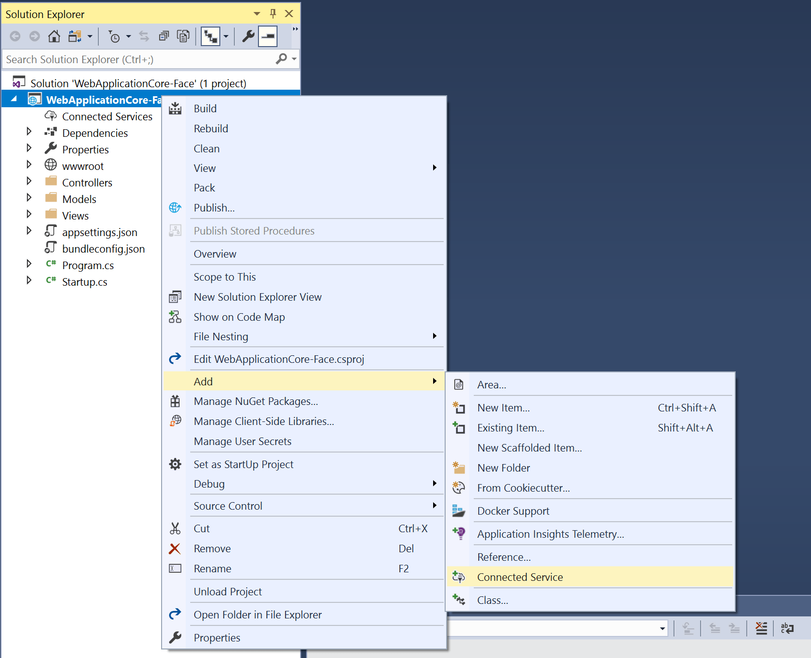

# Connecting to Cognitive Services Computer Vision API by using Connected Services in Visual Studio

By using the Cognitive Services Computer Vision API, you can detect, analyze, organize, and tag faces in photos.

This article and its companion articles provide details for using the Visual Studio Connected Service feature for Cognitive Services Computer Vision API. The capability is available in both Visual Studio 2017 15.7 or later, with the Cognitive Services extension installed.

## Prerequisites

- **An Azure subscription**. If you do not have one, you can sign up for a [free account](https://azure.microsoft.com/pricing/free-trial/).
- **Visual Studio 2017 version 15.7** with the **Web Development** workload installed. [Download it now](https://aka.ms/vsdownload).

[!INCLUDE [vs-install-cognitive-services-vsix](../includes/vs-install-cognitive-services-vsix.md)]

## Add support to your project for Cognitive Services Computer Vision API

1. Create a new ASP.NET Core web project. Use the Empty project template. 

1. In **Solution Explorer**, choose **Add** > **Connected Service**.
   The Connected Service page appears with services you can add to your project.

   

1. In the menu of available services, choose **Cognitive Services Computer Vision API**.

   

   If you've signed into Visual Studio, and have an Azure subscription associated with your account, a page appears with a dropdown list with your subscriptions.

   

1. Select the subscription you want to use, and then choose a name for the Face API, or choose the Edit link to modify the automatically generated name, choose the resource group, and the Pricing Tier.

   

   Follow the link for details on the pricing tiers.

1. Choose Add to add supported for the Connected Service.
   Visual Studio modifies your project to add the NuGet packages, configuration file entries, and other changes to support a connection the Computer Vision API.


## Use the Face API to detect attributes of faces in an image

1. Add the following using statements in Startup.cs.
 
   ```csharp
   using System.IO;
   using System.Text;
   using Microsoft.Extensions.Configuration;
   using System.Net.Http;
   using System.Net.Http.Headers;
   ```
 
1. Add a configuration field, and add a constructor that initializes the configuration field in Startup class to enable Configuration in your program.

   ```csharp
      private IConfiguration configuration;

      public Startup(IConfiguration configuration)
      {
          this.configuration = configuration;
      }
   ```
 
1. Replace the Configure method with the following code to access the Face API and test an image.

   ```csharp
        // This method gets called by the runtime. Use this method to configure the HTTP request pipeline.
        public void Configure(IApplicationBuilder app, IHostingEnvironment env)
        {
            string visionApiKey = this.configuration["ComputerVisionAPI_ServiceKey"];
            string visionApiEndPoint = this.configuration["ComputerVisionAPI_ServiceEndPoint"];

            HttpClient client = new HttpClient();

            // Request headers.
            client.DefaultRequestHeaders.Add("Ocp-Apim-Subscription-Key", visionApiKey);

            // Request parameters. A third optional parameter is "details".
            string requestParameters = "visualFeatures=Categories,Description,Color&language=en";

            // Assemble the URI for the REST API Call.
            string uri = visionApiEndPoint + "/analyze" + "?" + requestParameters;

            HttpResponseMessage response;

            // Request body. Posts a locally stored JPEG image.
            byte[] byteData = GetImageAsByteArray(@"<insert path to an image on your local drive");
            string contentString = string.Empty;
            using (ByteArrayContent content = new ByteArrayContent(byteData))
            {
                // This example uses content type "application/octet-stream".
                // The other content types you can use are "application/json" and "multipart/form-data".
                content.Headers.ContentType = new MediaTypeHeaderValue("application/octet-stream");

                // Execute the REST API call.
                response = client.PostAsync(uri, content).Result;

                // Get the JSON response.
                contentString = response.Content.ReadAsStringAsync().Result;
            }

            if (env.IsDevelopment())
            {
                app.UseDeveloperExceptionPage();
            }

            app.Run(async (context) =>
            {
                await context.Response.WriteAsync("<h1>Cognitive Services Demo</h1>");
                await context.Response.WriteAsync($"<p><b>Computer Vision API results:</b></p>");
                await context.Response.WriteAsync("<p>");
                await context.Response.WriteAsync(JsonPrettyPrint(contentString));
                await context.Response.WriteAsync("<p>");
            });
        }

   ```
    The code here constructs a HTTP request with URI and the image as binary content for a call to the Computer Vision REST API.

1. Add the helper functions GetImageAsByteArray and JsonPrettyPrint.

   ```csharp
        /// <summary>
        /// Returns the contents of the specified file as a byte array.
        /// </summary>
        /// <param name="imageFilePath">The image file to read.</param>
        /// <returns>The byte array of the image data.</returns>
        static byte[] GetImageAsByteArray(string imageFilePath)
        {
            FileStream fileStream = new FileStream(imageFilePath, FileMode.Open, FileAccess.Read);
            BinaryReader binaryReader = new BinaryReader(fileStream);
            return binaryReader.ReadBytes((int)fileStream.Length);
        }

        /// <summary>
        /// Formats the given JSON string by adding line breaks and indents.
        /// </summary>
        /// <param name="json">The raw JSON string to format.</param>
        /// <returns>The formatted JSON string.</returns>
        static string JsonPrettyPrint(string json)
        {
            if (string.IsNullOrEmpty(json))
                return string.Empty;

            json = json.Replace(Environment.NewLine, "").Replace("\t", "");

            string INDENT_STRING = "    ";
            var indent = 0;
            var quoted = false;
            var sb = new StringBuilder();
            for (var i = 0; i < json.Length; i++)
            {
                var ch = json[i];
                switch (ch)
                {
                    case '{':
                    case '[':
                        sb.Append(ch);
                        if (!quoted)
                        {
                            sb.AppendLine();
                        }
                        break;
                    case '}':
                    case ']':
                        if (!quoted)
                        {
                            sb.AppendLine();
                        }
                        sb.Append(ch);
                        break;
                    case '"':
                        sb.Append(ch);
                        bool escaped = false;
                        var index = i;
                        while (index > 0 && json[--index] == '\\')
                            escaped = !escaped;
                        if (!escaped)
                            quoted = !quoted;
                        break;
                    case ',':
                        sb.Append(ch);
                        if (!quoted)
                        {
                            sb.AppendLine();
                        }
                        break;
                    case ':':
                        sb.Append(ch);
                        if (!quoted)
                            sb.Append(" ");
                        break;
                    default:
                        sb.Append(ch);
                        break;
                }
            }
            return sb.ToString();
        }
   ```

1. Find a photo on your local hard drive, and insert that path at the call to GetImageAsByteArray.

1. Run the web application and see what Computer Vision API found in your image.


## Clean up resources

When no longer needed, delete the resource group. This deletes the cognitive service and related resources. To delete the resource group through the portal:

1. Enter the name of your resource group in the Search box at the top of the portal. When you see the resource group used in this QuickStart in the search results, select it.
2. Select **Delete resource group**.
3. In the **TYPE THE RESOURCE GROUP NAME:** box type in the name of the resource group and select **Delete**.

## Next steps

Learn more about the Computer Vision API by reading the [Computer Vision API Documentation](index.md).
