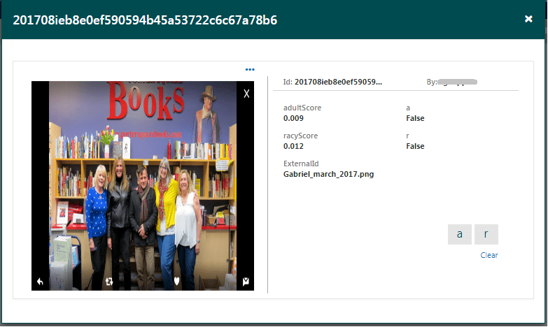

# Let human reviewers review images

After you have signed up for Content Moderation and obtained a subscription key, you can try out the image review features.

1. Open the [human review tool](https://contentmoderator.cognitive.microsoft.com/) and sign in. 
2. Click the Try tab, and upload some images to review.
3. Click the Review tab and select Image.

   

   The images display with any labels that have been assigned by the review tool. The images are not available to other reviewers in your team while you are reviewing them.

4. Move the “Reviews to display” slider (1) to adjust the number of images displayed on the screen. Click on the tagged or untagged buttons (2) to sort the images accordingly. Click on a tag (3) to toggle it on or off.

   
 
5. To see more information about an image, click on the ellipsis on a thumbnail, followed by the **View details** option. To assign the image to a subteam, select the **Move to** option.
 
   

6. Browse the image moderation information on the details page.

   
 
7. Once you have reviewed and updated the tag assignments as needed, click **Next** to submit your reviews.

After you submit, you have about five seconds to click the **Prev** button to return to the previous screen and review images again. After that, the images are no longer in the Submit queue and the **Prev** button is no longer available.

---

### Create reviews

Use the `Review.Create` operation to create the human reviews. You either moderate them elsewhere or use custom logic to assign the moderation tags.

Your inputs to this operation include:

- The content to be reviewed.
- The assigned tags (key value pairs) for review by human moderators.

The following response shows the review identifier:

	[
		"201712i46950138c61a4740b118a43cac33f434",
	]

### Get review status
Use the `Review.Get` operation to get the results after a human review of the moderated image is completed. You get notified via your provided callback endpoint. 

The operation returns two sets of tags: 

* The tags assigned by the moderation service
* The tags after the human review was completed

Your inputs include at a minimum:

- The review team name
- The review identifier returned by the previous operation

The response includes the following information:

- The review status
- The tags (key-value pairs) confirmed by the human reviewer
- The tags (key-value pairs) assigned by the moderation service

You see both the reviewer-assigned tags (**reviewerResultTags**) and the initial tags (**metadata**) in the following sample response:

	{
		"reviewId": "201712i46950138c61a4740b118a43cac33f434",
		"subTeam": "public",
		"status": "Complete",
		"reviewerResultTags": [
    	{
      		"key": "a",
      		"value": "False"
    	},
    	{
      		"key": "r",
      		"value": "True"
    	},
    	{
      		"key": "sc",
      		"value": "True"
    	}
		],
		"createdBy": "{teamname}",
		"metadata": [
    	{
      		"key": "sc",
      		"value": "true"
    	}
		],
		"type": "Image",
		"content": "https://reviewcontentprod.blob.core.windows.net/{teamname}/IMG_201712i46950138c61a4740b118a43cac33f434",
		"contentId": "0",
		"callbackEndpoint": "{callbackUrl}"
	}