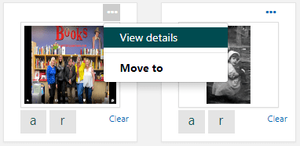

# Create human reviews

In this guide, you'll learn how to set up reviews on the Review tool website. Reviews store and display content for human moderators to assess. Users can alter the applied tags and apply their own custom tags as appropriate. When a user completes a review, the results are sent to a specified callback endpoint, and the content is removed from the site. [TBD link to reviews conceptual](tbd)

## Image reviews

1. Go to the [Content Moderator Review tool](https://contentmoderator.cognitive.microsoft.com/) and sign in.
1. Select the **Try** tab, and upload some images to review.
1. Once the uploaded images have finished processing, go to the **Review** tab and select **Image**.

    

    The images display with any labels that have been assigned by the automatic moderation process. The images you've submitted through the Review tool are not visible to other reviewers.

1. Optionally, move the **Reviews to display** slider (1) to adjust the number of images that are displayed on the screen. Click on the **tagged** or **untagged** buttons (2) to sort the images accordingly. Click on a tag panel (3) to toggle it on or off.

    

1. To see more information on an image, click on the ellipsis in the thumbnail and select **View details**. You can assign an image to a subteam with the **Move to** option (see [TBD subteams doc](tbd) to learn more about subteams).

    

1. Browse the image moderation information on the details page.

    

1. Once you have reviewed and updated the tag assignments as needed, click **Next** to submit your reviews. After you submit, you have about five seconds to click the **Prev** button to return to the previous screen and review images again. After that, the images are no longer in the Submit queue and the **Prev** button is no longer available.

---

### Create reviews

Use the `Review.Create` operation to create the human reviews. You either moderate them elsewhere or use custom logic to assign the moderation tags.

Your inputs to this operation include:

- The content to be reviewed.
- The assigned tags (key value pairs) for review by human moderators.

The following response shows the review identifier:

	[
		"201712i46950138c61a4740b118a43cac33f434",
	]

### Get review status
Use the `Review.Get` operation to get the results after a human review of the moderated image is completed. You get notified via your provided callback endpoint. 

The operation returns two sets of tags: 

* The tags assigned by the moderation service
* The tags after the human review was completed

Your inputs include at a minimum:

- The review team name
- The review identifier returned by the previous operation

The response includes the following information:

- The review status
- The tags (key-value pairs) confirmed by the human reviewer
- The tags (key-value pairs) assigned by the moderation service

You see both the reviewer-assigned tags (**reviewerResultTags**) and the initial tags (**metadata**) in the following sample response:

	{
		"reviewId": "201712i46950138c61a4740b118a43cac33f434",
		"subTeam": "public",
		"status": "Complete",
		"reviewerResultTags": [
    	{
      		"key": "a",
      		"value": "False"
    	},
    	{
      		"key": "r",
      		"value": "True"
    	},
    	{
      		"key": "sc",
      		"value": "True"
    	}
		],
		"createdBy": "{teamname}",
		"metadata": [
    	{
      		"key": "sc",
      		"value": "true"
    	}
		],
		"type": "Image",
		"content": "https://reviewcontentprod.blob.core.windows.net/{teamname}/IMG_201712i46950138c61a4740b118a43cac33f434",
		"contentId": "0",
		"callbackEndpoint": "{callbackUrl}"
	}

---

## Text reviews

You can use Azure Content Moderator to review text by using scores and detected tags. Use the information to determine whether content is appropriate. 

### Select or enter the text to review

In Content Moderator, select the **Try** tab. Then, select the **Text** option to go to the text moderation start screen. Enter any text, or submit the default sample text for automated text moderation. You can enter a maximum of 1,024 characters.

### Get ready to review results

The Review tool first calls the Text Moderation API. Then, it generates text reviews by using the detected tags. The Review tool matches score results for your team's attention.

### Review text results

Detailed results appear in the windows. Results include detected tags and terms that were returned by the Text Moderation API. To toggle a tag's selection status, select the tag. You can also work with any custom tags that you might have created.

