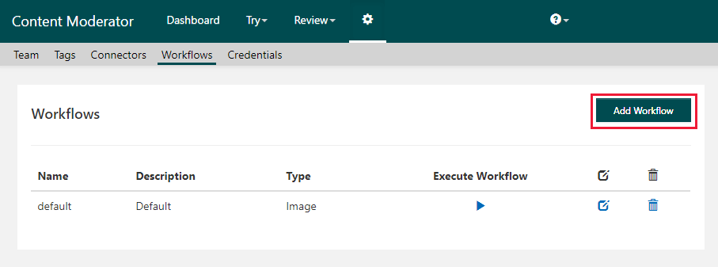

# Defining, testing, and using workflows

In addition to default workflow used for generating reviews, you can define custom workflows and thresholds based on content policies that are specific to your business.

Workflows “connect” to the Content Moderator API using connectors. In addition, you can use other APIs, as long as a connector for that API is available. The example here will use the Content Moderator connector, which is included by default.

## Navigate to the Workflows section

Select Workflows from the Settings tab.

  

## Initiate a new workflow

Click the Add Workflows button.

  

## Assign a name and description

Name your workflow, provide a description, and choose whether the workflow handles images or text.

  

## Define the evaluation criteria (“condition”)

In the following screenshot, you see the fields and the If-Then-Else selections that you need to define for your workflows. Choose a connector (in this example, Content Moderator). The available options for Output change, depending on the connector you choose.

  

After you choose the connector and its output you are interested in, select an Operator and the value for the condition.

## Define the action to be taken

Select the action to be taken along with the condition to be met. The example below creates an image review, assigns a tag **`a`**, and **highlights** it for the condition shown. You can also combine multiple conditions to get the results you want. Optionally, add an alternative (**Else**) path.

  

## Save your workflow

Finally, save the workflow and note the **workflow name**. You need the name to start a moderation job using the Review API.

## Test the workflow

Now that you defined a custom workflow, test it with sample content. 

### Select the corresponding **Execute Workflow** button.

  

### Upload a file.

Save the [sample image](https://moderatorsampleimages.blob.core.windows.net/samples/sample5.png) to your local drive. Select **Choose File(s)** and upload the image to test the workflow.

  

### Track the workflow as it is executed.

  

### Review any images flagged for human moderation

  

## Next steps: Invoke the Workflow from code

Use custom workflows with the Review API as shown in the **Job operation** [API Console quickstart](../try-review-api-job.md) and the [.NET SDK quickstart](../moderation-jobs-quickstart-dotnet.md).
