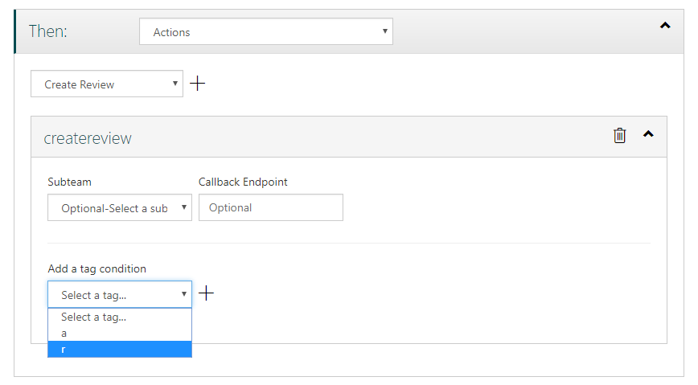

# Define, test, and use moderation workflows

You can use the Azure Content Moderator workflow designer and APIs to define custom workflows and thresholds based on your content policies.

Moderation workflows connect to the Content Moderator API. You can use other APIs if a connector for that API is available. The example here uses the Content Moderator connector that is included by default.

## Browse to the Workflows section

On the **Settings** tab, select **Workflows**.

  

## Start a new workflow

Select **Add Workflow**.

  

## Assign a name and description

Name your workflow, enter a description, and choose whether the workflow handles images or text.

  

## Define the evaluation criteria ("condition")

In the following screenshot, you see the fields and the If-Then-Else selections that you need to define for your workflows. Choose a connector. This example uses **Content Moderator**. Depending on the connector you choose, you will get different options for data output.

Then, choose the desired output to use and set the conditions to check it against.

## Define the action to take

Select the action to take and the condition to meet. The following example creates an image review, assigns a tag `a`, and highlights it for the condition shown. You also can combine multiple conditions to get the results you want. Optionally, add an alternative (Else) path.

  

## Save your workflow

Note the workflow name; you need the name to start a moderation job by using the Review API. Finally, save the workflow using the **Save** button at the top of the page. 

## Test the workflow

Now that you defined a custom workflow, test it with sample content.

Select the corresponding **Execute Workflow** button.

  

### Upload a file

Save this [sample image](https://moderatorsampleimages.blob.core.windows.net/samples/sample3.png) to your local drive. Then select **Choose File(s)** and upload the image.

  

### Track the workflow

Watch the progress of the workflow in the next popup window.

  

### Review any images flagged for human moderation

To see the image review, go to the **Image** tab under **Review**.

  

## Next steps 

To invoke the workflow from code, use custom workflows with the [`Job` API console quickstart](../try-review-api-job.md) and the [.NET SDK quickstart](../moderation-jobs-quickstart-dotnet.md).
