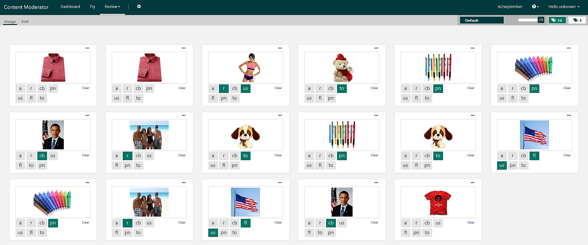
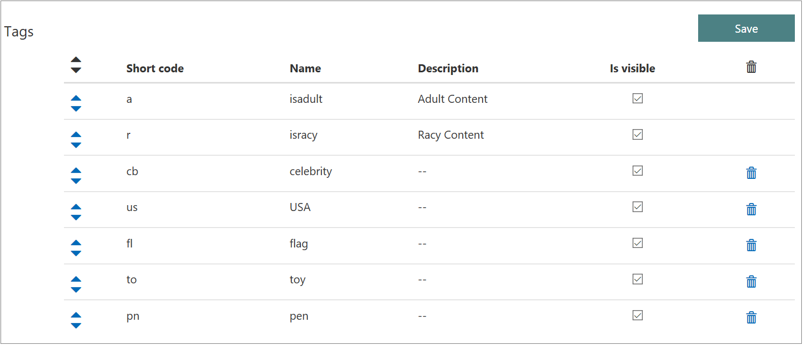
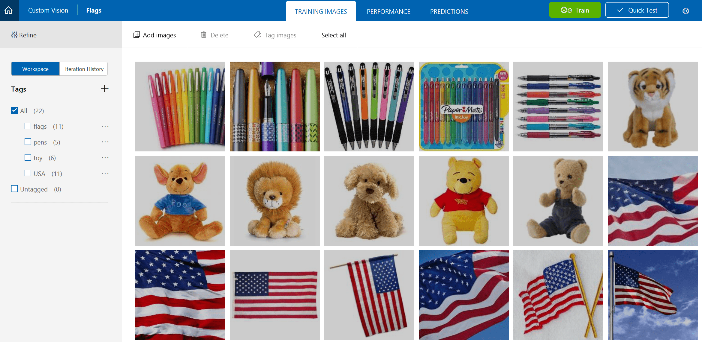

# Tutorial: Moderate e-commerce product images with machine learning

In this tutorial you will learn how to use Azure cognitive services, including Content Moderator, to effectively classify and process product images in an e-commerce scenario. You will use Computer Vision and Custom Vision to detect various types of images, and you will create a workflow that combines Content Moderator's machine-learning-based technologies with human review teams to provide an intelligent moderation system.

This tutorial shows you how to:

> [!div class="checklist"]
> * Sign up for Content Moderator and create a review team.
> * Configure moderation tags (labels) for potential celebrity and flag content.
> * Use Content Moderator's image API to scan for potential adult and racy content.
> * Use the Computer Vision API to scan for potential celebrities.
> * Use the Custom Vision service to scan for possible presence of flags.
> * Present the nuanced scan results for human review and final decision making.

The complete sample code is available in the [Samples eCommerce Catalog Moderation](https://github.com/MicrosoftContentModerator/samples-eCommerceCatalogModeration) repository on GitHub.

If you don’t have an Azure subscription, create a [free account](https://azure.microsoft.com/free/?WT.mc_id=A261C142F) before you begin.

## Prerequisites

- A Content Moderator subscription key. You can get a free trial subscription key from [Try Cognitive Services](https://azure.microsoft.com/try/cognitive-services/?api=face-api). Or, follow the instructions in [Create a Cognitive Services account](https://docs.microsoft.com/azure/cognitive-services/cognitive-services-apis-create-account) to subscribe to the Content Moderator service and get your key.
- A Computer Vision subscription key (same instructions as above).
- A Custom Vision subscription key (same instructions as above).
- Any edition of [Visual Studio 2015 or 2017](https://www.visualstudio.com/downloads/).
- A set of images for each label that the Custom Vision classifier will detect (in this case toys, pens, and US flags).

## Combined workflow 

Use machine-assisted technologies to classify and moderate product images in these categories:

1. Adult (Nudity)
2. Racy (Suggestive)
3. Celebrities
4. US Flags
5. Toys
6. Pens

## Create the review team

Refer to the [Get familiar with Content Moderator](quick-start.md) quickstart to sign up for the Content Moderator Review tool and create a review team. Take note of the **Team ID** value on the **Credentials** page.

## Create custom tags

Next, create custom tags in the Review tool (refer to the [Tags](https://docs.microsoft.com/azure/cognitive-services/content-moderator/review-tool-user-guide/tags) article if you need help with this process). In this case, we will add the following tags: **celebrity**, **USA**, **flag**, **toy**, and **pen**. Note that not all of the tags need to be detectable categories in Computer Vision (like **celebrity**). You can add your own custom tags as long as you train the Custom Vision classifier to detect them later on.

## Create the Visual Studio project

Follow these steps to create a new .NET console application project.

1. In Visual Studio, open the New Project dialog. Expand **Installed**, then **Visual C#**, then select **Console app (.NET Framework)**.
1. Name the application **EcommerceModeration**, then click **OK**.
1. If you are adding this project to an existing solution, select this project as the single startup project.

## List your API keys and endpoints

As mentioned above, this tutorial uses three cognitive services; therefore, it requires three corresponding keys and API endpoints. Your API endpoints are different based on your subscription regions and the Content Moderator Review Team ID.

> [!NOTE]
> The tutorial is designed to use subscription keys in the regions visible in the following endpoints. Be sure to match your API keys with the region Uris otherwise your keys may not work with the following endpoints:

[!code-csharp[define API keys and endpoint URIs](~/samples-eCommerceCatalogModeration/Fusion/Program.cs?range=21-29)]

## Scan for adult and racy content

1. The function takes an image URL and an array of key-value pairs as parameters.
2. It calls the Content Moderator's Image API to get the Adult and Racy scores.
3. If the score is greater than 0.4 (range is from 0 to 1), it sets the value in the **ReviewTags** array to **True**.
4. The **ReviewTags** array is used to highlight the corresponding tag in the review tool.

[!code-csharp[define EvaluateAdultRacy method](~/samples-eCommerceCatalogModeration/Fusion/Program.cs?range=73-113)]

## Scan for celebrities

1. Sign up for a [free trial](https://azure.microsoft.com/try/cognitive-services/?api=computer-vision) of the [Computer Vision API](https://azure.microsoft.com/services/cognitive-services/computer-vision/).
2. Click the **Get API Key** button.
3. Accept the terms.
4. To login, choose from the list of Internet accounts available.
5. Note the API keys displayed on your service page.
    
   
    
6. Refer to the project source code for the function that scans the image with the Computer Vision API.

[!code-csharp[define EvaluateCustomVisionTags method](~/samples-eCommerceCatalogModeration/Fusion/Program.cs?range=115-146)]

## Classify into flags, toys, and pens

1. [Sign in](https://azure.microsoft.com/services/cognitive-services/custom-vision-service/) to the [Custom Vision API preview](https://www.customvision.ai/).
2. Use the [Quickstart](https://docs.microsoft.com/azure/cognitive-services/custom-vision-service/getting-started-build-a-classifier) to build your custom classifier to detect the potential presence of flags, toys, and pens.
   
3. [Get the prediction endpoint URL](https://docs.microsoft.com/azure/cognitive-services/custom-vision-service/use-prediction-api) for your custom classifier.
4. Refer to the project source code to see the function that calls your custom classifier prediction endpoint to scan your image.

[!code-csharp[define EvaluateCustomVisionTags method](~/samples-eCommerceCatalogModeration/Fusion/Program.cs?range=148-171)]
 
## Reviews for human-in-the-loop

1. In the previous sections, you scanned the incoming images for adult and racy (Content Moderator), celebrities (Computer Vision) and Flags (Custom Vision).
2. Based on our match thresholds for each scan, make the nuanced cases available for human review in the review tool.

[!code-csharp[define CreateReview method](~/samples-eCommerceCatalogModeration/Fusion/Program.cs?range=173-196)]

## Submit batch of images

1. This tutorial assumes a "C:Test" directory with a text file that has a list of image Urls.
2. The following code in **Main** checks for the existence of the file and reads all Urls into memory.

[!code-csharp[Main: set up test directory, read lines](~/samples-eCommerceCatalogModeration/Fusion/Program.cs?range=35-51)]

## Initiate all scans

1. This top-level function loops through all image URLs in the text file we mentioned earlier.
2. It scans them with each API and if the match confidence score falls within our criteria, creates a review for human moderators.

[!code-csharp[Main: evaluate each image and create review](~/samples-eCommerceCatalogModeration/Fusion/Program.cs?range=53-70)]

## Next steps

Build and extend the tutorial by using the [project source files](https://github.com/MicrosoftContentModerator/samples-eCommerceCatalogModeration) on GitHub.
