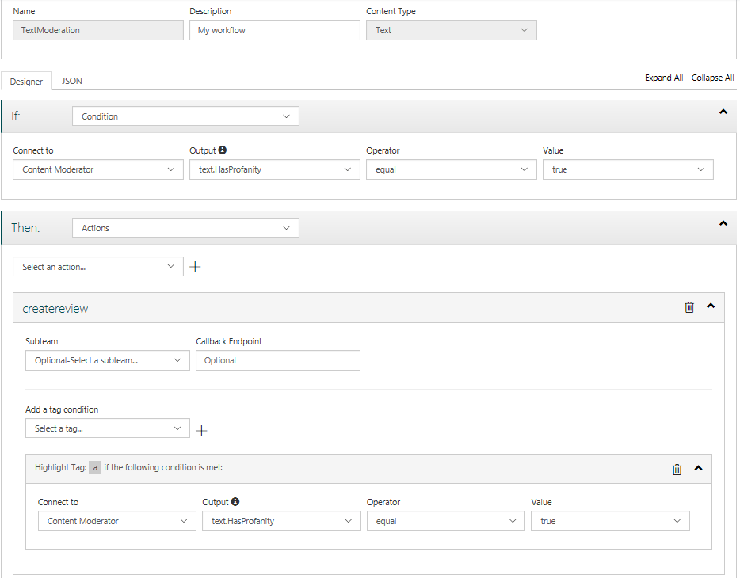

# Moderate images and text on a Facebook page

In this tutorial, we will learn how to use Content Moderator with a sample Facebook page to either take down or allow publishing of images and text by users browsing the Facebook page.

The tutorial will guide you through these steps:

1. Create a Content Moderator team.
2. Create Azure Functions that listen for HTTP events from Content Moderator and Facebook.
3. Create a Facebook Page and App, and connect it to Content Moderator

After we are done, Facebook will send the content posted by the visitors to Content Moderator. Based on the match thresholds, your Content Moderator workflows will either allow publishing the content or block and create reviews within the review tool for for human moderation.

## 1. Create a Content Moderator team

Refer to the [Quickstart](quick-start.md) page to sign up for Content Moderator and create a team.

## 2. Configure image thresholds (workflow)

Refer to the [Workflows](review-tool-user-guide/workflows) page to configure a custom image threshold and workflow. Note the workflow name.

## 3. Configure text thresholds (workflow)

Use steps similar to the [Workflows](review-tool-user-guide/workflows) page to configure a custom text threshold and workflow. Note the workflow name.

Test your workflow by using the "Execute Workflow" button.

## 4. Create Azure Functions

Sign in to the [Azure Management Portal](https://portal.azure.com/) to create your Azure Functions. follow these steps:

1. Create a Azure Function App as shown on the [Azure Functions](https://docs.microsoft.com/en-us/azure/azure-functions/functions-create-function-app-portal) page.
2. Open the newly created Function App.
3. Within the App, navigate to **Platform features -> Application Settings**
4. Define the following [application settings](https://docs.microsoft.com/en-us/azure/azure-functions/functions-how-to-use-azure-function-app-settings#settings).

    | App Setting | Description   | 
    | -------------------- |-------------|
    | cm:TeamId   | Your Content Moderator TeamId  | 
    | cm:SubscriptionKey | Your Content Moderator subscription key - See [Credentials](/review-tool-user-guide/credentials) | 
    | cm:Region | Your Content Moderator region |
    | cm:ImageWorkflow | Name of the workflow to run on Images |
    | cm:TextWorkflow | Name of the workflow to run on Text |
    | cm:CallbackEndpoint | Url for the CMListener Function App that you create later in this guide |
    | fb:VerificationToken | The secret token, also used to subscribe to the Facebook feed events |
    | fb:PageAccessToken | This is a facebook graph api access token that does not expire and allows the function Hide/Delete posts on your behalf. |

5. Create a new HttpTrigger-CSharp function named FBListener. This function receives events from Facebook. Follow these steps to create this function.

    1. Keep the [Azure Functions Creation](https://docs.microsoft.com/en-us/azure/azure-functions/functions-create-function-app-portal) page open for reference.
    2. Click the **"+"** add to create new function.
    3. Instead of the built-in templates, choose the **"Get started on your own/custom function"** option.
    4. Click on the tile that says **"HttpTrigger-CSharp"**
    5. Enter a name "FBListener", the **Authorization Level** field should be set to **"Function"**.
    6. Click **Create**.
    7. Replace the contents of the **run.csx** with the contents from [**FbListener/run.csx**](https://github.com/MicrosoftContentModerator/samples-fbPageModeration/blob/master/FbListener/run.csx).

6. Create a new HttpTrigger-CSharp function named CMListener. This function receives events from Facebook. Follow these steps to create this function.

    1. Keep the [Azure Functions Creation](https://docs.microsoft.com/en-us/azure/azure-functions/functions-create-function-app-portal) page open for reference.
    2. Click the **"+"** add to create new function.
    3. Instead of the built-in templates, choose the **"Get started on your own/custom function"** option.
    4. Click on the tile that says **"HttpTrigger-CSharp"**
    5. Enter a name "CMListener", the **Authorization Level** field should be set to **"Function"**.
    6. Click **Create**.
    7. Replace the contents of the **run.csx** with the contents from [**CMListener/run.csx**](https://github.com/MicrosoftContentModerator/samples-fbPageModeration/blob/master/CmListener/run.csx).

