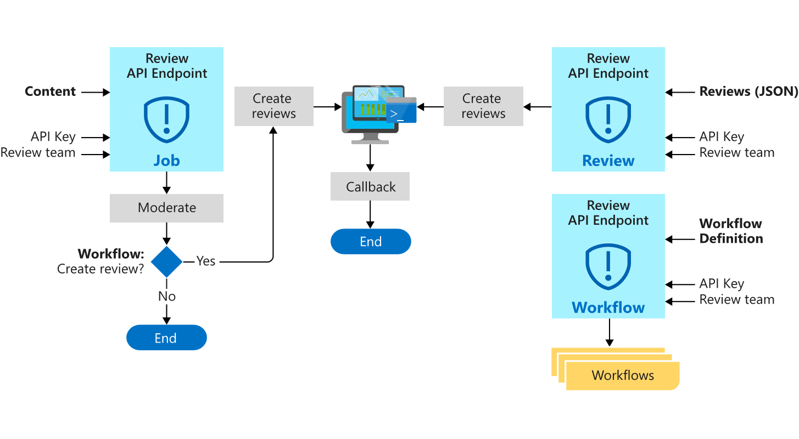

# What is Azure Content Moderator?

The Azure Content Moderator API is a cognitive service that checks text, image, and video content for material that is potentially offensive, risky, or otherwise undesirable. When such material is found, the service applies appropriate labels (flags) to the content. Your app can then handle flagged content in order to comply with regulations or maintain the intended environment for users. See the [Content Moderator APIs](#content-moderator-apis) section to learn more about what the different content flags indicate.

## Where it is used

The following are a few scenarios in which a software developer or team would use Content Moderator:

- Online marketplaces that moderate product catalogs and other user-generated content
- Gaming companies that moderate user-generated game artifacts and chat rooms
- Social messaging platforms that moderate images, text, and videos added by their users
- Enterprise media companies that implement centralized moderation for their content
- K-12 education solution providers filtering out content that is inappropriate for students and educators

## What it includes

The Content Moderator service consists of several web service APIs available through both REST calls and a .NET SDK. It also includes the human review tool, which allows human reviewers to aid the service and improve or fine-tune its moderation function.

## Moderation APIs

The Content Moderator service includes Moderation APIs, which check content for material that is potentially inappropriate or objectionable.

The following table describes the different types of moderation APIs.

| API group | Description |
| ------ | ----------- |
|[**Text moderation**](text-moderation-api.md)| Scans text for offensive content, sexually explicit or suggestive content, profanity, and personal data.|
|[**Custom term lists**](try-terms-list-api.md)| Scans text against a custom list of terms in addition to the built-in terms. Use custom lists to block or allow content according to your own content policies.|  
|[**Image moderation**](image-moderation-api.md)| Scans images for adult or racy content, detects text in images with the Optical Character Recognition (OCR) capability, and detects faces.|
|[**Custom image lists**](try-image-list-api.md)| Scans images against a custom list of images. Use custom image lists to filter out instances of commonly recurring content that you don't want to classify again.|
|[**Video moderation**](video-moderation-api.md)| Scans videos for adult or racy content and returns time markers for said content.|

## Review APIs

The Review APIs let you integrate your moderation pipeline with human reviewers. Use the [Jobs](review-api.md#jobs), [Reviews](review-api.md#reviews), and [Workflow](review-api.md#workflows) operations to create and automate human-in-the-loop workflows with the [Review tool](#the-review-tool).

> [!NOTE]
> The Workflow API is not yet available in the .NET SDK but can be used with the REST endpoint.

## The Review tool

The Content Moderator service also includes the web-based [Review tool](Review-Tool-User-Guide/human-in-the-loop.md), which hosts the content reviews for human moderators to process. The human input does not train the service, but the combined work of the service and human review teams allows developers to strike the right balance between efficiency and accuracy. The Review tool also provides a user-friendly front-end for a variety of Content Moderator resources.

## Data privacy and security

As with all of the Cognitive Services, developers using the Content Moderator service should be aware of Microsoft's policies on customer data. See the [Cognitive Services page](https://www.microsoft.com/trustcenter/cloudservices/cognitiveservices) on the Microsoft Trust Center to learn more.

## Next steps

Get started using the Content Moderator service by following the instructions in [Try Content Moderator on the web](quick-start.md).