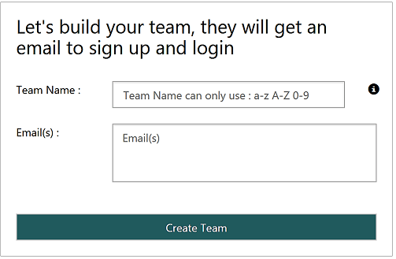

# Quick Start #

There are a few things you need to do before you can try out Content Moderator tools. You will first need to sign up for Content Moderator, then create a review team. After that, you can upload images or submit simple text to try the automated moderation and human review capabilities without writing any code.

## 1. Sign up for Content Moderator
You can either sign up with your Microsoft account or create an account on the Content Moderator web site.
Navigate to the [Content Moderator sign up](http://contentmoderator.cognitive.microsoft.com/) page. Click **Sign Up**.

## 2. Create a review team
You will see a "Create Team" screen. Give your team a name. If you want to invite your colleagues, you can do so by entering their email addresses.

## 3. Upload images or enter text
Click **Try > Image** or **Try > Text**. Upload up to five sample images or enter sample text for moderation.

## 4. Submit for automated moderation
Submit your content for automated moderation. Internally, the review tool calls the moderation APIs to scan your content. Once the scanning is complete, you see a message informing you about the results waiting for your review.

## 5. Review and confirm results
As your business application calls the Moderator APIs, the tagged content starts queuing up, ready to be reviewed by the human review teams. You can quickly review large volumes of content using this approach. You are doing a few different things as part of your moderation workflow such as browsing the tagged content, changing the tags, and submitting your decisions.

