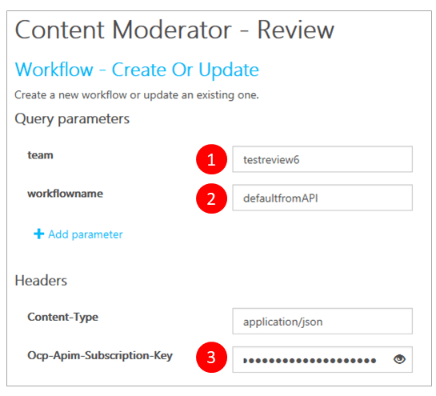
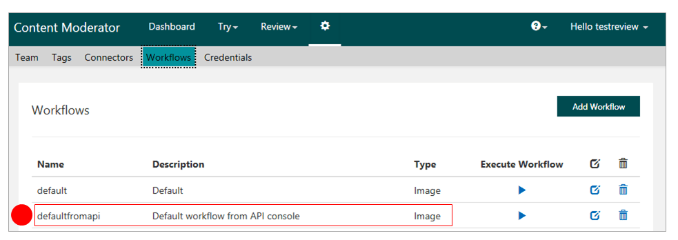
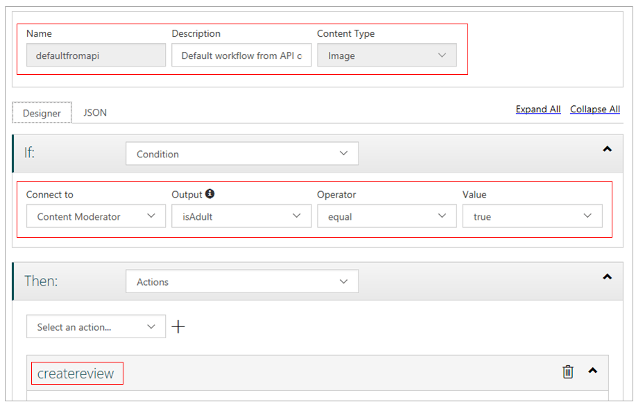
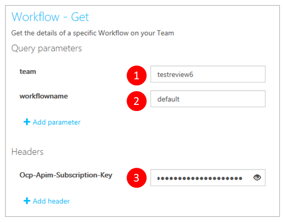

# Define and use moderation workflows (API console)

Workflows are cloud-based customized filters that you can use to handle content more efficiently. Workflows can connect to a variety of services to filter content in different ways and then take the appropriate action. This guide shows you how to use the workflow REST APIs, through the API console, to create and use workflows. Once you understand the structure of the APIs, you can easily port these calls to any REST-compatible platform.

## Prerequisites

- Sign in or create an account on the Content Moderator [Review tool](https://contentmoderator.cognitive.microsoft.com/) site.

## Create a workflow

To create or update a workflow, go to the **[Workflow - Create Or Update](https://westus2.dev.cognitive.microsoft.com/docs/services/580519463f9b070e5c591178/operations/5813b46b3f9b0711b43c4c59)** API reference page and select the button for your key region (you can find this in the Endpoint URL on the **Credentials** page of the [Review tool](https://contentmoderator.cognitive.microsoft.com/)). This starts the API console, where you can easily construct and run REST API calls.


### Enter REST call parameters

Enter values for **team**, **workflowname**, and **Ocp-Apim-Subscription-Key**:

- **team**: The team ID that you created when you set up your [Review tool](https://contentmoderator.cognitive.microsoft.com/) account (found in the **Id** field on your Review tool's Credentials screen).
- **workflowname**: The name of a new workflow to add (or an existing name, if you want to update an existing workflow).
- **Ocp-Apim-Subscription-Key**: Your Content Moderator key. You can find this  on the **Settings** tab of the [Review tool](https://contentmoderator.cognitive.microsoft.com).



### Enter a workflow definition

1. Edit the **Request body** box to enter the JSON request with details for **Description** and **Type** (either `Image` or `Text`).
2. For **Expression**, copy the default workflow JSON expression. Your final JSON string should look like this:

```json
{
  "Description":"<A description for the Workflow>",
  "Type":"Text",
  "Expression":{
    "Type":"Logic",
    "If":{
      "ConnectorName":"moderator",
      "OutputName":"isAdult",
      "Operator":"eq",
      "Value":"true",
      "Type":"Condition"
    },
    "Then":{
      "Perform":[
        {
          "Name":"createreview",
          "CallbackEndpoint":null,
          "Tags":[

          ]
        }
      ],
      "Type":"Actions"
    }
  }
}
```

> [!NOTE]
> You can define simple, complex, and even nested expressions for your workflows using this API. The [Workflow - Create Or Update](https://westus2.dev.cognitive.microsoft.com/docs/services/580519463f9b070e5c591178/operations/5813b46b3f9b0711b43c4c59) documentation has examples of more complex logic.

### Submit your request
  
Select **Send**. If the operation succeeds, the **Response status** is `200 OK`, and the **Response content** box displays `true`.

### Examine the new workflow

In the [Review tool](https://contentmoderator.cognitive.microsoft.com/), select **Settings** > **Workflows**. Your new workflow should appear in the list.



Select the **Edit** option for your workflow and go to the **Designer** tab. Here, you can see an intuitive representation of the JSON logic.



## Get workflow details

To retrieve details about an existing workflow, go to the **[Workflow - Get](https://westus.dev.cognitive.microsoft.com/docs/services/580519463f9b070e5c591178/operations/5813b44b3f9b0711b43c4c58)** API reference page and select the button for your region (the region in which your key is administered).


Enter the REST call parameters as in the above section. Make sure that this time, **workflowname** is the name of an existing workflow.



Select **Send**. If the operation succeeds, the **Response status** is `200 OK`, and the **Response content** box displays the workflow in JSON format, like the following:

```json
{
  "Name":"default",
  "Description":"Default",
  "Type":"Image",
  "Expression":{
    "If":{
      "ConnectorName":"moderator",
      "OutputName":"isadult",
      "Operator":"eq",
      "Value":"true",
      "AlternateInput":null,
      "Type":"Condition"
    },
    "Then":{
      "Perform":[
        {
          "Name":"createreview",
          "Subteam":null,
          "CallbackEndpoint":null,
          "Tags":[

          ]
        }
      ],
      "Type":"Actions"
    },
    "Else":null,
    "Type":"Logic"
  }
}
```

## Next steps

- Learn how to use workflows with [content moderation jobs](try-review-api-job.md).