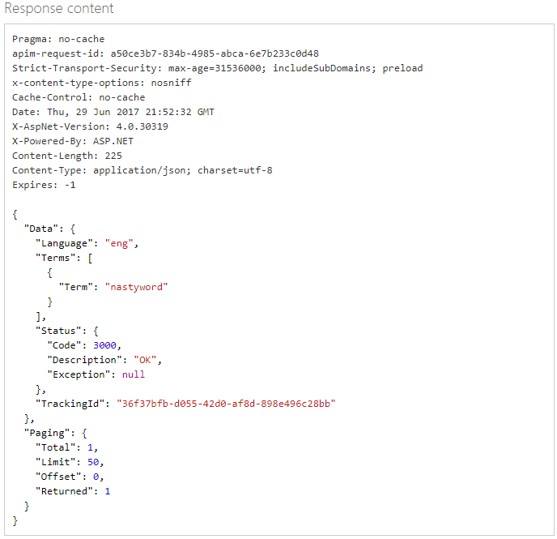
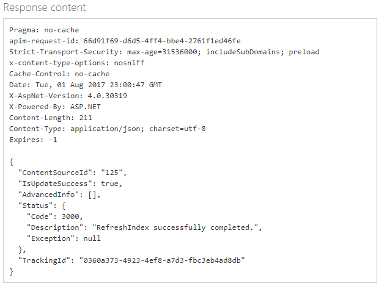

# Try Custom Term Lists with the Text Moderation API #

## About the Terms list management API ##
The default global list of terms is usually sufficient, but you may need to screen against terms that are specific to your business. For example, you may want to tag competitors’ names for further review. The [Terms List API](https://westus.dev.cognitive.microsoft.com/docs/services/57cf755e3f9b070c105bd2c2/operations/57cf755e3f9b070868a1f67f) allows you to create custom lists of terms for use with the Text Moderation API. The **Text - Screen** operation scans your text for profanity, comparing it against custom and/or shared blacklists.

You can also create lists of images to be used with the List Moderation API. This tutorial focuses on lists of terms.

The Terms List management API include these operations:
- Create a list.
- Add terms to your list.
- Screen terms against the ones in the list.
- Delete term or terms from the list.
- Delete the list.
- Edit list information.
- Refresh the index so that changes are found during a scan.

## Try with the API console ##
Before you can test-drive the API from the online console, you will need the **Ocp-Apim-Subscription-Key**. This is found under the Settings tab, as shown below.

## Creating a terms list ##
1.	Navigate to the [Terms list management API reference](https://westus.dev.cognitive.microsoft.com/docs/services/57cf755e3f9b070c105bd2c2/operations/57cf755e3f9b070868a1f67f) page.

2.	You land on the **Term Lists > Create** operation. 

3.	Click the button that most closely describes your location, under **Open API testing console**. The **Term Lists – Create** API Console opens.

  
 
4.	Enter your subscription key.

5.	In the Request Body, type a **Name** for the term list, and a brief **Description**.
  

6.	Use the key-value pair placeholders to assign more descriptive metadata to your list. For example, you could enter something on these lines:
    {
      "Name": "MyExclusionList",
      "Description": "MyListDescription",
      "Metadata": {
      "Category": "Competitors",
      "Type": "Exclude"
      }
    }

  Note that we are adding list metadata as key value pairs, not the actual terms.
 
7.	Click Send. Your list is created. Make note of the Id number that is associated with the new list. You will need this for other List Management functions.

  
 
8.	Now you need to add terms to MyList. On the left, click **Term > Add Term**. Click the button that most closely describes your location, under **Open API testing console**. 
  

9.	The **Term – Add Term** console opens.
 
10.	Enter the **listId** that you have generated above, and select the **language**. Enter your **subscription key** and click **Send**.

  
 
9.	Verify the term has been added by using the **Term > Get All Terms** API. Enter the **listId** and your **subscription key**, and click **Send**.

  
 
10.	Add a few more terms. Now that you have created a custom list of terms, try [scanning some text](try-text-api.md) against it. 

## Deleting terms and lists ##

Deleting a term or a list is straightforward. The API supports these operations:

- Delete a term. **(Term > Delete)**
- Delete all the terms in a list without deleting the list. **(Term > Delete All Terms)**
- Delete the list and all of its contents. **(Term Lists > Delete)**

This example deletes a single term.

1.	On the left, click **Term > Delete**. Click the button that most closely describes your location, under Open API testing console. 

  
 
  The **Term – Delete API** console opens.
 
2.	Enter the **listId** for the list you are concerned with. This is the number **(122)** that was returned with the **Get Details** API for **MyList**, in the section above. Enter the term and choose a language.
 
  

3.	Enter your **subscription key** and click **Send**.

4.	Verify the term has been deleted by using the **Term > Get All Terms** API.

  
 
## Changing a list’s information ##

You can edit a list’s name and description, and add metadata items.

1.	On the left, click **Term Lists > Update** Details. Click the button that most closely describes your location, under **Open API testing console**. The **Term Lists – Update Details** API console opens.

  
 
2.	Enter the **listId** and your **subscription key**.

3.	Make your edits in the **Request Body** field, and click **Send**.

  
 
## Refresh Search Index ##

After you have made changes to a list, its index must be refreshed before subsequent scans will “see” the changes. This is similar to how a search engine on your desktop (if enabled) or a web search engine continually refreshes its index to include new files or pages.

1.	On the left, click **Term Lists > Refresh** Search Index. Click the button that most closely describes your location, under **Open API testing console**. The **Term Lists – Refresh Search Index** API console opens.

  

2.	Enter the **listId** and your **subscription key**, and click **Send**.

## Next steps ##

To learn how to use the image list management API, see the [Try Image List Management](try-image-list-api.md) article.
