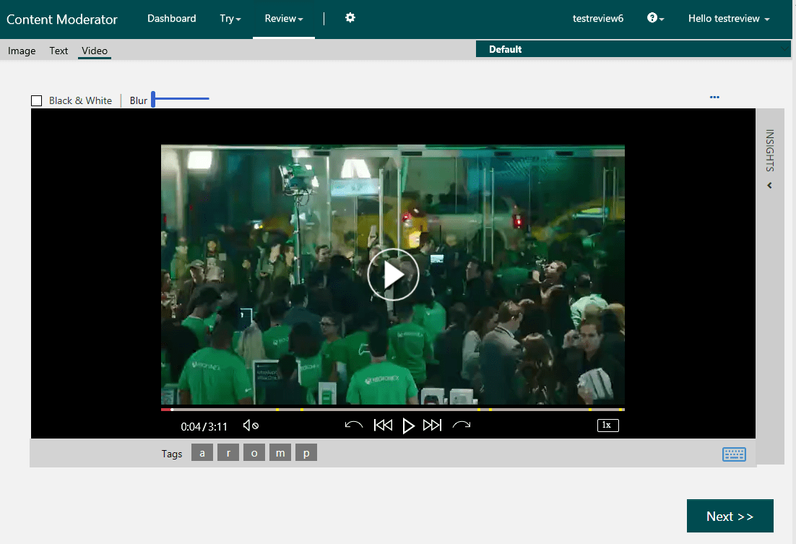
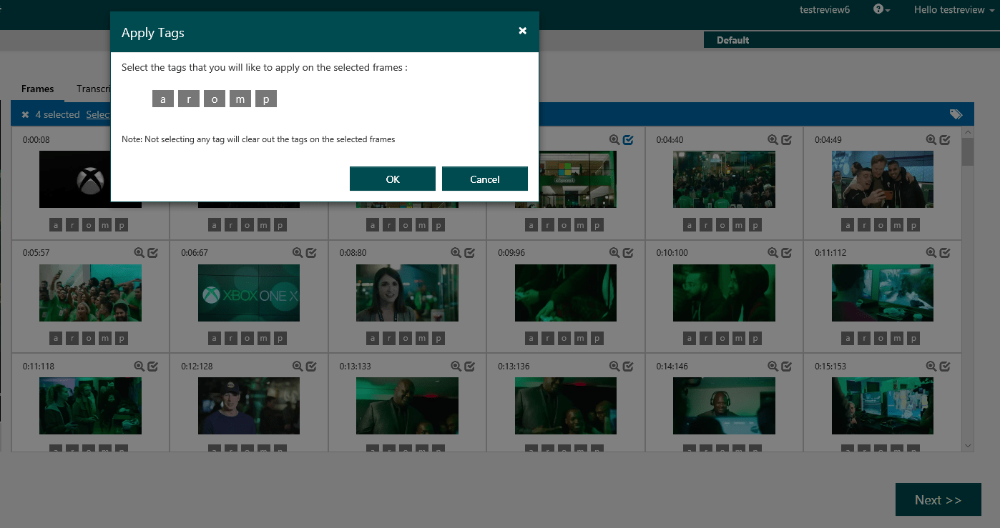

# Video moderation with the Review tool

Use Content Moderator's machine-assisted [video moderation](video-moderation-api.md) and [Review tool](Review-Tool-User-Guide/human-in-the-loop.md) to moderate videos and transcripts for adult (explicit) and racy (suggestive) content to get the best results for your business.

## View a video under review

On the dashboard, select any of the review queues within the video content type. This will start a review and open the video content moderation page.

### Review count

Use the slider in the upper right to set the number of reviews you'd like to display on the page.

### Toggle content-obscuring effects

Use the **Blur all** and **Black and white** toggles to set these content-obscuring effects. They are turned on by default.

### Set the view type

You can view the different content entries as tiles or in a detailed view. The **Detail** view will allow you to see key frames and other information about the selected video.

Instead of outputting frames at regular intervals, the video moderation service identifies and outputs only potentially complete (good) frames. The feature allows efficient frame generation for frame-level adult and racy analysis.


### Enlarge the view

Use the expand button above the video frame to enlarge the video and hide the keyframes tiles.

## Apply tags

### Bulk functionality

The bulk tag toolbar lets you add tags to multiple selected videos. Select one or more videos, then select the tags you would like to apply and click **submit**.   

### Tag video key frames

You can add moderation tags to specific keyframes. Select the frames from the tile view, and then select **Keyframe tags +** to apply the desired tags.

> [!NOTE]
> If the service couldn't extract key frames, the keyframe tile pane will show **No frames available** and the option to select key frames will be grayed out. In this case, you can only apply tags to the video as a whole.

### Add reviewer notes

You can add custom notes to videos in addition to the applied tags. Select the **Notes** tab and enter your note in the textbox.

### Review video transcripts

The service automatically extracts a transcript of the speech in the video, and you can view this on the **Transcript** tab. When you click a section of text, the video player will jump to that part.

### Video metadata

You can view metadata of the video on the **Details** tab.

## Submit a review

After you've applied your tags, you select the **Submit** button. If you tagged multiple videos, you have the option to submit them under a single review, or as separate reviews.

## Limbo

After you've submitted a review, the video is moved to the **Limbo** category, which you'll see in a new pane on the right. Videos remain in the Limbo state for a preconfigured amount of time, or until they're reviewed again.

Once the videos expire from limbo, they are marked as competed.

---

## Video-trained classifier

Machine-assisted video classification is either achieved with image trained models or video trained models. Unlike image-trained video classifiers, Microsoft's adult and racy video classifier is trained with videos. This method results in better match quality.


## Key frame detection

The following extract shows a partial response with potential shots, key frames, and adult and racy scores:

```json
"fragments":[  
  {  
    "start":0,
    "duration":18000
  },
  {  
    "start":18000,
    "duration":3600,
    "interval":3600,
    "events":[  
      [  
        {  
          "reviewRecommended":false,
          "adultScore":0.00001,
          "racyScore":0.03077,
          "index":5,
          "timestamp":18000,
          "shotIndex":0
        }
      ]
    ]
  },
  {  
    "start":18386372,
    "duration":119149,
    "interval":119149,
    "events":[  
      [  
        {  
          "reviewRecommended":true,
          "adultScore":0.00000,
          "racyScore":0.91902,
          "index":5085,
          "timestamp":18386372,
          "shotIndex":62
        }
      ]
    ]
```

## Player view for video-level review

Video-level binary decisions are made possible with a video player view that shows potential adult and racy frames. The human reviewers navigate the video with various speed options to examine the scenes. They confirm their decisions by toggling the tags.



## Frames view for detailed reviews

A detailed video review for frame-by-frame analysis is made possible with a frame-based view. The human reviewers review and select one or more frames and toggle tags to confirm their decisions. An optional next step is redaction of the offensive frames or content.




## Next steps

- Get started with the [video moderation quickstart](video-moderation-api.md).
- Learn how to generate [video reviews](video-reviews-quickstart-dotnet.md) for your human reviewers from your moderated output.
- Add [video transcript reviews](video-transcript-reviews-quickstart-dotnet.md) to your video reviews.
- Check out the detailed tutorial on how to develop a [complete video moderation solution](video-transcript-moderation-review-tutorial-dotnet.md).