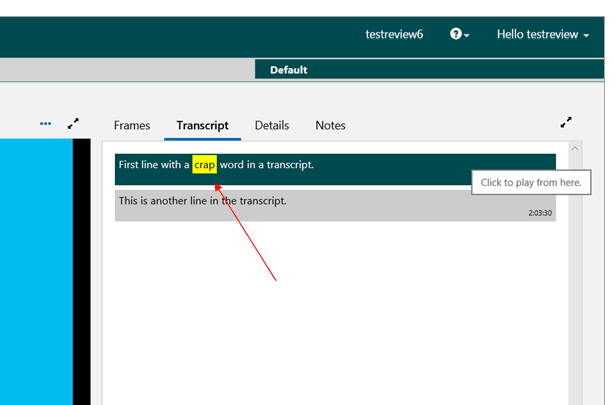

# Video moderation solution

Use Content Moderator’s machine-assisted [video moderation](video-moderation-api.md) and [human review tool](Review-Tool-User-Guide/human-in-the-loop.md) to moderate videos and transcripts for adult (explicit) and racy (suggestive) content.

## Video-trained classifier

Machine-assisted Video classification is achieved with either image trained models, a more commonly prevalent method, or with true video trained models.
Unlike image-trained video classifiers, Microsoft's explicit and suggestive video classifiers are trained on video clips resulting in better match quality.

## Shot detection

When outputting the classification details, additional video intelligence helps with more flexibility in analyzing videos. Instead of outputting just the frames, Microsoft's video moderation service provides shot-level information too. You now have the option to analyze your videos at the short level or at the frame level depending on your business needs.
 
## Key frame detection

Instead of outputting frames at regular intervals, the video moderation service identifies and outputs only potential complete frames. This allows for efficient frame generation for frame-level adult and racy analysis.

The following extract shows a partial response with potential shots, key frames and adult and racy content:

	"fragments": [
    {
      "start": 0,
      "duration": 18000
    },
    {
      "start": 18000,
      "duration": 3600,
      "interval": 3600,
      "events": [
        [
          {
            "reviewRecommended": false,
            "adultScore": 0.00001,
            "racyScore": 0.03077,
            "index": 5,
            "timestamp": 18000,
            "shotIndex": 0
          }
        ]
      ]
    },
    {
      "start": 18386372,
      "duration": 119149,
      "interval": 119149,
      "events": [
        [
          {
            "reviewRecommended": true,
            "adultScore": 0.00000,
            "racyScore": 0.91902,
            "index": 5085,
            "timestamp": 18386372,
            "shotIndex": 62
          }
        ]
      ]

## Visualization for human reviews

While machine-assisted moderation technology helps save time and costs, for more nuanced cases, businesses need a human review solution for rendering the video, its frames and machine-assisted tags. The human moderators reviewing videos and frames should be able to get a complete view of the insights, change tags, and submit their decisions.

## Player view for video-level review

Video-level binary decision making (block or pass video) is made possible with a video player view that shows potential adult and racy frames. The human reviewers navigate the video with various speed options to examine the scenes. They confirm their decisions by toggling the tags.

## Frames view for detailed reviews

A detailed video review for frame-by-frame analysis is made possible with a frame-based view. The human reviewers review and select one or more frames and toggle tags to confirm their decisions. An optional next step is redaction of the offensive frames or content.

## Transcript moderation

Videos typically have voice over that needs moderation as well for offensive speech. You use the Azure Media Indexer service to convert speech to text and use Content Moderator's review API to submit the transcript for text moderation within the review tool.

## Next steps

Get started with the [video moderation QuickStart](video-moderation-api.md), the [video review .NET QuickStart](video-review-quickstart-dotnet.md) and the [video transcript review .NET QuickStart](video-transcript-review-quickstart-dotnet.md).
