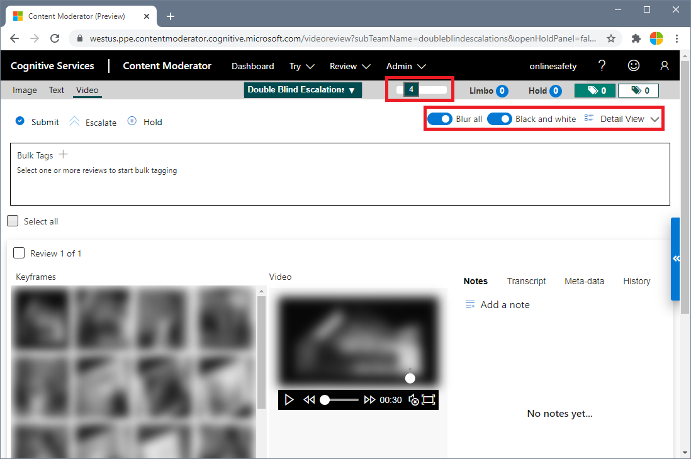
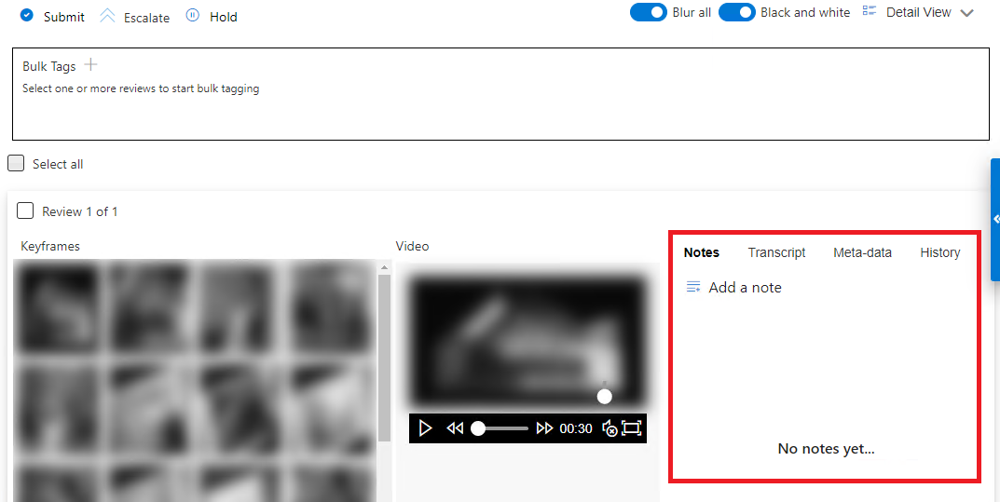
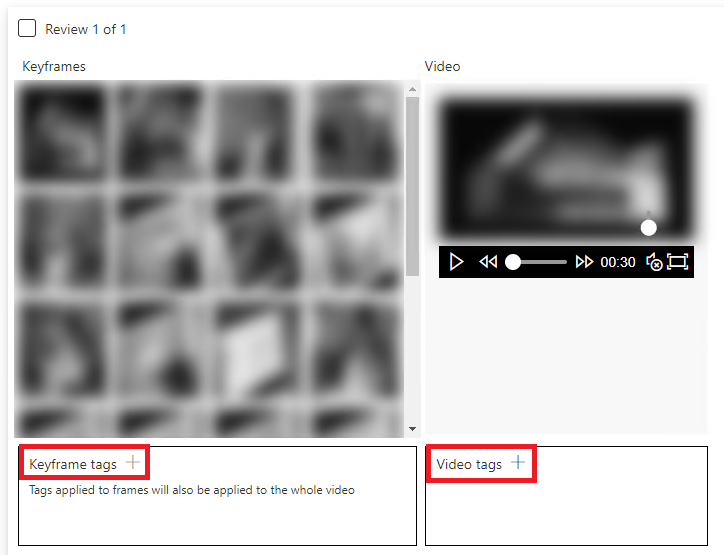
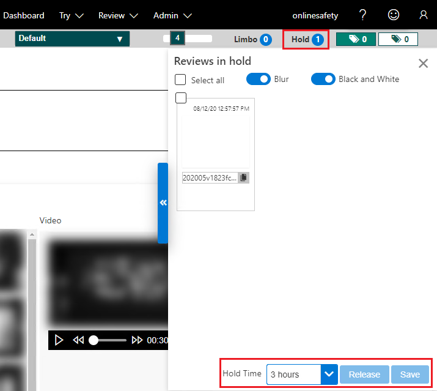

# Video moderation with the Review tool

Use Content Moderator's machine-assisted [video moderation](video-moderation-api.md) and [Review tool](Review-Tool-User-Guide/human-in-the-loop.md) to moderate videos and transcripts for adult (explicit) and racy (suggestive) content to get the best results for your business.

## View videos under review

On the dashboard, select any of the review queues within the video content type. This will start a review and open the video content moderation page.

> [!div class="mx-imgBorder"]
> 

### Review count

Use the slider in the upper right to set the number of reviews you'd like to display on the page.

### View type

You can view the different content entries as tiles or in a detailed view. The **Detail** view will allow you to see key frames and other information about the selected video. 

> [!NOTE]
> Instead of outputting frames at regular intervals, the video moderation service identifies and outputs only potentially complete (good) frames. This feature allows efficient frame generation for frame-level adult and racy analysis.

The **Tiled** view will show each video as a single tile. Select the the expand button above a video frame to enlarge that video and hide the others.

### Content-obscuring effects

Use the **Blur all** and **Black and white** toggles to set these content-obscuring effects. They are turned on by default. In the **Tiled** view, you can toggle the effects individually for each video.

## Check video details

In the **Detail** view, the right pane will show several tabs that give you details about the video.

* Select the **Notes** tab to add custom notes to videos in addition to the applied tags.
* Select the **Transcript** tab to see the video transcript&mdash;the service automatically extracts a transcript of any speech in the video. When you click a section of text, the video player will jump to that part of the video.
* Select the **Meta-data** tab to view video file metadata.
* Select the **History** tab to see the history of the review, such as when it was created and how it was modified.

> [!div class="mx-imgBorder"]
> 

## Apply moderation tags

The main task of a video review is to apply or remove moderation tags on videos or parts of videos.

### Bulk tagging

The **Bulk Tags** toolbar lets you add tags to multiple selected videos at once. Select one or more videos, then select the tags you would like to apply and click **submit**. 

> [!div class="mx-imgBorder"]
> 

### Key frame tagging

You can also add moderation tags to specific key frames. Select the frames from the key frame tile pane, and then select **Keyframe tags +** to apply the desired tags.

> [!NOTE]
> If the service couldn't extract key frames, the key frame tile pane will show **No frames available** and the option to select key frames will be grayed out. In this case, you can only apply tags to the video as a whole (using the **Video tags +** button).

> [!div class="mx-imgBorder"]
> 

## Put a review on hold

The **Hold** button at the bottom of the video pane lets you put a review on hold so you can retrieve it and complete it later. You may do this for a review that requires a consult from another team member or manager who is currently unavailable. 

You can view the videos on hold by clicking the **Hold** button at the top of the screen. The Hold pane appears on the right. From here, you can select multiple reviews on hold and either release them back into the queue, or save them with updates. After a preconfigured amount of time (which you can change in the menu at the bottom), reviews on hold are released back to the queue.

> [!div class="mx-imgBorder"]
> 

## Submit a review

After you've applied your tags, select the **Submit** button at the bottom of the video pane. If you've tagged multiple videos, you have the option to submit them under a single review or as separate reviews.

## Limbo state

After you've submitted a review, the video is moved to the **Limbo** state, which you can view by selecting the **Limbo** button at the top of the screen. Videos remain in the Limbo state for a preconfigured amount of time (which you can change in the menu at the bottom), or until they're reviewed again or manually submitted.

Once the videos expire from limbo, their reviews are marked as complete.

## Next steps

- Get started with the [video moderation quickstart](video-moderation-api.md).
- Learn how to generate [video reviews](video-reviews-quickstart-dotnet.md) for your human reviewers from your moderated output.
- Add [video transcript reviews](video-transcript-reviews-quickstart-dotnet.md) to your video reviews.
- Check out the detailed tutorial on how to develop a [complete video moderation solution](video-transcript-moderation-review-tutorial-dotnet.md).