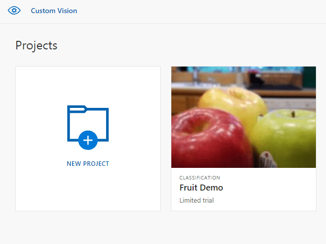
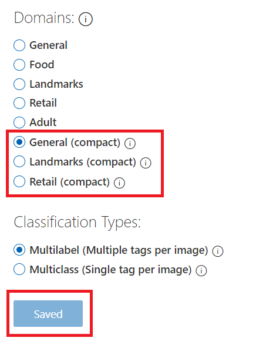

# Export your model for use with mobile devices

Custom Vision Service allows classifiers to be exported to run offline. You can embed your exported classifier into an application and run it locally on a device for real-time classification.

Custom Vision Service supports the following exports:

* __Tensorflow__ for __Android__.
* __CoreML__ for __iOS11__.
* __ONNX__ for __Windows ML__.
* A Windows or Linux __container__. The container includes a Tensorflow model and service code to use the Custom Vision Service API. 

> [!IMPORTANT]
> Custom Vision Service only exports __compact__ domains. The models generated by compact domains are optimized for the constraints of real-time classification on mobile devices. Classifiers built with a compact domain may be slightly less accurate than a standard domain with the same amount of training data.
>
> For information on improving your classifiers, see the [Improving your classifier](getting-started-improving-your-classifier.md) document.

## Convert to a compact domain

> [!NOTE]
> The steps in this section only apply if you have an existing classifier that is not set to compact domain.

To convert the domain of an existing classifier, use the following steps:

1. From the [Custom vision page](https://customvision.ai), select the __Home__ icon to view a list of your projects. You can also use the [https://customvision.ai/projects](https://customvision.ai/projects) to see your projects.

    

2. Select a project, and then select the __Gear__ icon in the upper right of the page.

    

3. In the __Domains__ section, select a __compact__ domain. Select __Save Changes__ to save the changes.

    

4. From the top of the page, select __Train__ to retrain using the new domain.

## Export your model

To export the model after retraining, use the following steps:

1. Go to the **Performance** tab and select __Export__. 

    

    > [!TIP]
    > If the __Export__ entry is not available, then the selected iteration does not use a compact domain. Use the __Iterations__ section of this page to select an iteration that uses a compact domain, and then select __Export__.

2. Select the export format, and then select __Export__ to download the model.

## Next steps

Integrate your exported model into an application by exploring one of the following articles or samples:

* [Use your Tensorflow model with Python](export-model-python.md)
* [Use your ONNX model with Windows Machine Learning](custom-vision-onnx-windows-ml.md)
* See the sample for [CoreML model in an iOS application](https://go.microsoft.com/fwlink/?linkid=857726) for real-time image classification with Swift.
* See the sample for [Tensorflow model in an Android application](https://github.com/Azure-Samples/cognitive-services-android-customvision-sample) for real-time image classification.
* See the sample for [CoreML model with Xamarin](https://github.com/xamarin/ios-samples/tree/master/ios11/CoreMLAzureModel) for real-time image classification in a Xamarin iOS app.
