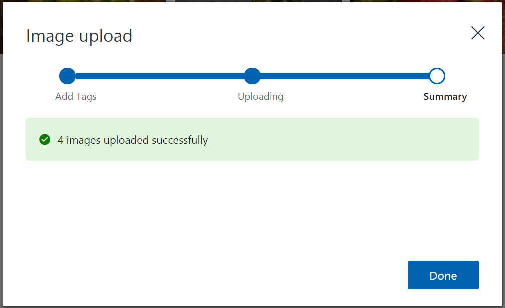
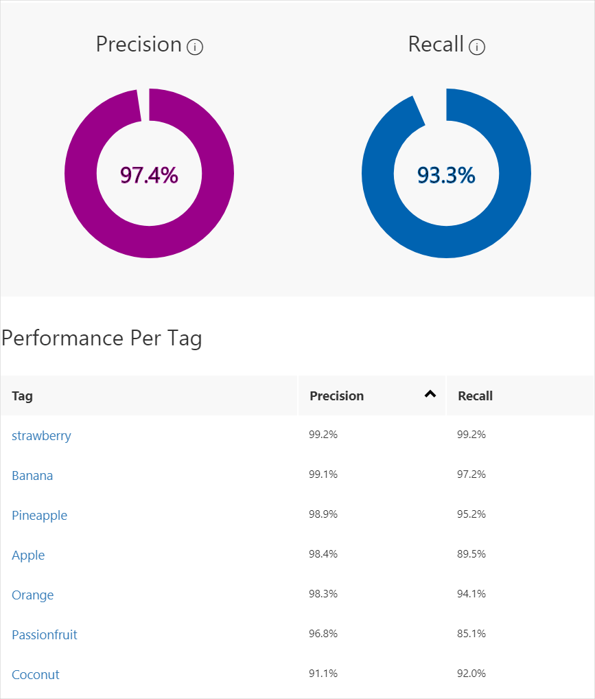

# How to: build a classifier with Custom Vision

To use the Custom Vision Service, you must first build a classifier. In this document, learn how to build a classifier through your web browser.

## Prerequisites

To build a classifier, you must first have:

- A valid [Microsoft account](https://account.microsoft.com/account) or an Azure Active Directory OrgID ("work or school account"), so you can sign into customvision.ai and get started.

    > [!IMPORTANT] 
    > The OrgID login for Azure Active Directory (Azure AD) users from [national clouds](https://www.microsoft.com/en-us/trustcenter/cloudservices/nationalcloud) is not currently supported.

- A series of images to train your classifier (with a minimum of 30 images per tag).

- A few images to test your classifier after the classifier is trained.

- Optional: An Azure subscription associated with your Microsoft Account or OrgID. If you don’t have an Azure subscription, you can create a [free account](https://azure.microsoft.com/free/?WT.mc_id=A261C142F) before you begin.

    >! [IMPORTANT]
    > Without an Azure subscription, you will only be able to create __limited trial__ projects. If you have an Azure subscription, you will be prompted to create Custom Vision Service Training and Prediction resources in the [Azure portal](https://portal.azure.com/?microsoft_azure_marketplace_ItemHideKey=microsoft_azure_cognitiveservices_customvision#create/Microsoft.CognitiveServicesCustomVision) during project creation.   

## Create a new project

To create a new project, use the following steps:

1. In your web browser, navigate to the [Custom Vision web page](https://customvision.ai). Select __Sign in__ to begin using the service.

    

    > [!NOTE]
    > After you sign in to Custom Vision Service, you are presented with a list of projects. Outside of two "limited trial" projects for testing, projects are associated with an Azure Resource. If you are an Azure user, you will see all the projects associated with [Azure Resources](https://docs.microsoft.com/azure/guides/developer/azure-developer-guide#grant-access-to-resources) to which you have access. 

2. To create your first project, select **New Project**. For your first project, you are asked to agree to the Terms of Service. Select the check box, and then select the **I agree** button. The **New project** dialog box appears.

    

3. Enter a name and a description for the project. Then select one of the available domains. Each domain optimizes the classifier for specific types of images, as described in the following table:

    |Domain|Purpose|
    |---|---|
    |__Generic__| Optimized for a broad range of image classification tasks. If none of the other domains are appropriate, or you are unsure of which domain to choose, select the Generic domain. |
    |__Food__|Optimized for photographs of dishes as you would see them on a restaurant menu. If you want to classify photographs of individual fruits or vegetables, use the Food domain.|
    |__Landmarks__|Optimized for recognizable landmarks, both natural and artificial. This domain works best when the landmark is clearly visible in the photograph. This domain works even if the landmark is slightly obstructed by people in front of it.|
    |__Retail__|Optimized for images that are found in a shopping catalog or shopping website. If you want high precision classifying between dresses, pants, and shirts, use this domain.|
    |__Adult__|Optimized to better define adult content and non-adult content. For example, if you want to block images of people in bathing suits, this domain allows you to build a custom classifier to do that.|
    |__Compact domains__| Optimized for the constraints of real-time classification on mobile devices. The models generated by compact domains can be exported to run locally.|

    You can change the domain later if you want.

4. Select a Resource Group. The Resource Group dropdown shows you all of your Azure Resource Groups that include a Custom Vision Service Resource. You can also create select __limited trial__. The limited trial entry is the only resource group a non-Azure user will be able to choose from.

    Select __Create project__ to create the project.

## Upload and tag images

1. To add images to the classifier, use the __Add images__ button and then select __Browse local files__. Select __Open__ to move to tagging.

    > [!TIP]
    > After selecting images, you must tag them. The tag is applied to the group of images you have selected to upload, so it may be easier to upload images by the tags you plan to use. You can also change the tag for selected images after they have been tagged and uploaded.

    > [!TIP]
    > Upload images with different camera angles, lighting, background, types, styles, groups, sizes, etc. Use a variety of photo types to ensure that your classifier is not biased  and can generalize well.

    Custom Vision Service accepts training images in .jpg, .png, and .bmp format, up to 6 MB per image. (Prediction images can be up to 4 MB per image.) We recommend that images be 256 pixels on the shortest edge. Any images shorter than 256 pixels on the shortest edge are scaled up by Custom Vision Service.

    

    

    >[!NOTE] 
    > The REST API can be used to load training images from URLs.

2. To set the tag, enter text in the __My Tags__ field and then use the __+__ button. To upload the images and tag them, use the __Upload [number] files__ button. You can add more than one tag to the images. 

    > [!NOTE]
    > The upload time varies by the number and size of images you have selected.

    

3. Select __Done__ once the images have been uploaded.

    

4. To upload another set of images, return to step 1. For example, if you want to distinguish between dogs and ponies, upload and tag images of ponies.

## Train and evaluate the classifier

To train the classifier, select the **Train** button.

It only takes a few minutes to train the classifier. During this time, information about the training process is displayed.

After training, the __Performance__ is displayed. The precision and recall indicators tell you how good your classifier is, based on automatic testing. Custom Vision Service uses the images that you submitted for training to calculate these numbers, by using a process called [k-fold cross validation](https://en.wikipedia.org/wiki/Cross-validation_(statistics)).

> [!NOTE] 
> Each time you select the **Train** button, you create a new iteration of your classifier. You can view all your old iterations in the **Performance** tab, and you can delete any that might be obsolete. When you delete an iteration, you end up deleting any images that are uniquely associated with it.

The classifier uses all the images to create a model that identifies each tag. To test the quality of the model, the classifier tries each image on the model to see what the model finds.

The qualities of the classifier results are displayed.

|Term|Definition|
|---|---|
|Precision|When you classify an image, how likely is your classifier to correctly classify the image? Out of all images that are used to train the classifier (dogs and ponies), what percent did the model get correct? 99 correct tags out of 100 images gives a precision of 99%.|
|Recall|Out of all images that should have been classified correctly, how many did your classifier identify correctly? A recall of 100% means that if there are 38 dog images in the images that were used to train the classifier, the classifier found 38 dogs.|

## Next steps

[Custom Vision API C# tutorial](csharp-tutorial.md)
