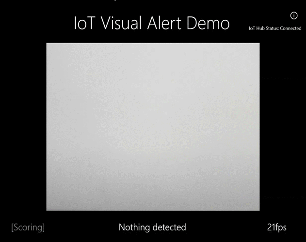
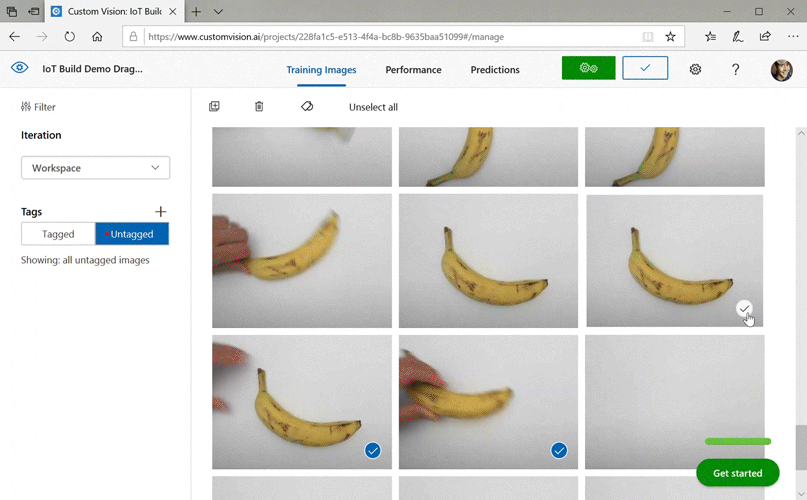

# Tutorial: IoT Visual Alert sample

This sample illustrates how to use Azure Custom Vision to train a device with a camera to detect specific visual states. You can run this detection pipeline offline directly on the device through an ONNX model exported from Custom Vision.

A visual state could be something like an empty room or a room with people, an empty driveway or a driveway with a truck, etc. In this case below, you can see
it in action detecting when a banana or an apple is placed in front of the camera.



This tutorial will show you how to:
> [!div class="checklist"]
> * step 1
> * step 2

If you don't have an Azure subscription, create a [free account](https://azure.microsoft.com/free/) before you begin. 

## Prerequisites

* [Visual Studio 2015 or later](https://www.visualstudio.com/downloads/)
* IoT Hub and Custom Vision resources
* Optionally, an IoT device running Windows 10 IoT Core version 17763 or higher. You can run the app directly from your PC as well.
   * If you need help setting up a new device, see [Setting up your device](https://docs.microsoft.com/en-us/windows/iot-core/tutorials/quickstarter/devicesetup) on the Windows IoT documentation. For Raspberry Pi 2s and 3s, you can do it easily directly from the IoT Dashboard app, while for a device such as DrangonBoard, you will need to flash it using the [eMMC method](https://docs.microsoft.com/en-us/windows/iot-core/tutorials/quickstarter/devicesetup#flashing-with-emmc-for-dragonboard-410c-other-qualcomm-devices).

## Application structure

This applicaiton runs in a continuous loop, following a state machine with four states:

* **No Model**: A no-op state. The app will sleep for one second and check again.
* **Capturing Training Images**: In this state, the app captures a picture and uploads it as a training image to the target Custom Vision project. The app then sleeps for 500ms and repeats the procedure until the set maximum number of images are captured.
* **Waiting For Trained Model**: In this state, the app calls the Custom Vision API every second to check whether the target project contains a trained iteration. When it finds one, it exports the corresponding ONNX model to a local file and switches to the **Scoring** state.
* **Scoring**: In this state, the app uses Windows ML to evaluate a single frame from the camera against the exported ONNX model. The resulting image classification is displayed on the screen and sent as a message to the IoT Hub. The app then sleeps for one second before scoring a new frame.

## Source code structure

The following files handle the main functionality of the app.

| File | Description |
|-------------|-------------|
| [MainPage.xaml](https://github.com/Azure-Samples/Cognitive-Services-Vision-Solution-Templates/blob/master/IoTVisualAlerts/MainPage.xaml) | XAML UI for the demo UI. It hosts the web camera control and contains the several labels used for status updates.|
| [MainPage.xaml.cs](https://github.com/Azure-Samples/Cognitive-Services-Vision-Solution-Templates/blob/master/IoTVisualAlerts/MainPage.xaml.cs) | Code behind for the XAML UI for the demo. It contains the state machine processing code.|
| [CustomVision\CustomVisionServiceWrapper.cs](https://github.com/Azure-Samples/Cognitive-Services-Vision-Solution-Templates/blob/master/IoTVisualAlerts/CustomVision/CustomVisionServiceWrapper.cs) | This is a wrapper class that facilitates integration with the Custom Vision Service.|
| [CustomVision\CustomVisionONNXModel.cs](https://github.com/Azure-Samples/Cognitive-Services-Vision-Solution-Templates/blob/master/IoTVisualAlerts/CustomVision/CustomVisionONNXModel.cs) | This is a wrapper class that facilitates integration with Windows ML for loading an ONNX model and scoring images against it.|
| [IoTHub\IotHubWrapper.cs](https://github.com/Azure-Samples/Cognitive-Services-Vision-Solution-Templates/blob/master/IoTVisualAlerts/IoTHub/IotHubWrapper.cs) | This is a wrapper class that facilitates integration with IoT Hub.|

## Setup

1. Clone or download the IoTVisualAlerts sample on [GitHub](https://github.com/Azure-Samples/Cognitive-Services-Vision-Solution-Templates/tree/master/IoTVisualAlerts).
1. Open the solution IoTVisualAlerts.sln in Visual Studio
1. **Custom Vision setup**:
    * In CustomVision\CustomVisionServiceWrapper.cs, update ```ApiKey = "{The training key for your Custom Vision Service instance}"``` 
      with your api key.
    * In CustomVision\CustomVisionServiceWrapper.cs, update ```Endpoint = "https://westus2.api.cognitive.microsoft.com"``` with the 
      corresponding endpoint for your key.
    * In CustomVision\CustomVisionServiceWrapper.cs, update ```targetCVSProjectGuid = "{Your Custom Vision Service target project id}"``` 
      with the corresponding Guid for the Custom Vision project that should be used by the app during the visual state learning 
      workflow. **Important:** This needs to be a Compact image classification project, since we will be exporting the model to ONNX later.
1. **IoT Hub setup**:
    * In IoTHub\IotHubWrapper.cs, update ```s_connectionString = "Enter your device connection string here"``` with the proper 
      connection string for your device. Using the Azure portal, load up your IoT Hub instance, click on IoT devices under Explorers, click on
      your target device (or create one if needed), and find the connection string under Primary Connection String. The format should be similar
      to ```HostName={your iot hub name}.azure-devices.net;DeviceId={your device id};SharedAccessKey={your access key}```

## Run the sample

If you are running the sample in your own development PC, just select x64 or x86 for the target platform, Local Machine for the target device and hit F5 in Visual Studio. The app should start and show the live feed from the camera, as well as a status message. 

If deploying to a IoT device running ARM, you will need to select ARM as the target platform, Remote Machine as the target device and provide the Ip Address of your device when asked (it must be on the same network). You can get the Ip Address from the Windows IoT default app once you boot into the device and connect 
it to the network.

### Learning new visual states

When running for the first time the app won't have any knowledge of any visual states. As a result it won't be doing much, and simply display a status message that there is no model available. To change that, we need to transition the app to the Capturing Training Images state. 

#### Capturing training images

To enter the Capturing Training Images state and start collecting training images, you have two options:
  * Via the button on the top right corner of the UI
  * Via a Direct Method call to the device via IoT Hub. The method for this is called EnterLearningMode, and you can send it via the device entry
    in the IoT Hub blade in Azure, or via a tool such as [IoT Hub Device Explorer](https://github.com/Azure/azure-iot-sdk-csharp/tree/master/tools/DeviceExplorer).
 
Once in this state, the app will capture images at about 2fps until the desired number of images has been captured. By default it will 30 images, but this parameter can be changed by simply passing the desired number as a parameter to the EnterLearningMode IoT Hub method. 

While pictures are being taken, just expose the camera to the types of visual states that you would like to be detected (e.g. empty room, room with
people, empty desk, desk with a toy truck, etc).

#### Building a model with Custom Vision

Once the app has finished uploading training images, it will switch to the Waiting For Trained Model state. This is where you now need to go to the
Custom Vision portal and build a new model based on the training images uploaded earlier. Here is an animation showing this in action to label a few 
photos with a Banana tag:



To repeat this with your own scenario:
1. Log-in to the [Custom Vision](http://customvision.ai) portal
1. Find your target project, which by now should have all the training images that the app uploaded 
1. Start tagging based on your desired visual states:
    * For example, if this is a classifier to detect between an empty room and a room with people in it, we recommend tagging 5 or more images with
      people as a new class (let's say People), and tagging 5 or more images without people as the Negative tag. This will help the model better 
      differentiate between the two states, given that there will be a lot of similarities between them in this case.
    * As another example, let's say the goal is to approximate how full a shelf with products is, then you might want to create tags such as EmptyShelf,
      PartiallyFullShelf and FullShelf.
1. Hit the Train button
1. Once training is complete, the app will detect that a trained iteration is available and will start the process of exporting the trained model to 
   ONNX and downloading it to the device.

#### Scoring against the trained model

As soon as the trained model is downloaded from the previous state, the app will switch to the Scoring state and start scoring images from the camera in a continuous loop. 

The top tag with each scoring will be displayed on the screen (or No Matches will be displayed in case no classes, or the Negative class, is detected).
These results are also sent to IoT Hub as messages, and in the case of a class being detected, the message will include the label, the confidence and a property called `detectedClassAlert` which could be used from IoT Hub clients interested in doing fast message routing based on properties. 

In addition, the sample uses a Sense HAT [library](https://github.com/emmellsoft/RPi.SenseHat) to detect when running on a Raspberry Pi with a Sense HAT unit, and to use it as an output display by setting all display lights to red whenever a class is detected, or to blank when nothing is detected.

## Additional info

* If you would like to reset the app back to the original state, you can do so by clicking on the button on the top-right corner of the UI, or by invoking the method `DeleteCurrentModel` via IoT Hub.
* If after going through the process of uploading training images you realized that the images aren't good enough for your needs, you can repeat the flow by issuing the `EnterLearningMode` method again. This method also can take as argument a number that indicates how many images to upload, in case the default value (30) is not good enough.
* If you are running the app from an IoT device, it can be handy to know its Ip Address to do things such as establishing a remote connection via the [Windows IoT Remote Client](https://www.microsoft.com/en-us/p/windows-iot-remote-client/9nblggh5mnxz#activetab=pivot:overviewtab). For this, the app comes with a handy `GetIpAddress` method that can be called through IoT Hub. This Ip Address is also displayed under the Information menu on the top-right corner of the app UI.

## Clean up resources


## Next steps

> [!div class="nextstepaction"]
> [tbd](tbd)

* Create a Power BI Dashboard to visualize those IoT Hub alerts sent by the sample when visual alerts are detected. There is a good tutorial [here](https://docs.microsoft.com/en-us/azure/iot-hub/iot-hub-live-data-visualization-in-power-bi).
* Create a Logic App that responds to those IoT Hub alerts when visual alerts are detected. There is a good tutorial [here](https://docs.microsoft.com/en-us/azure/iot-hub/iot-hub-monitoring-notifications-with-azure-logic-apps) that shows how to do things such as sending an email.
* Add an IoT Hub method to the sample that makes it switch directly to the ```WaitingForTrainingModel``` state. The idea here is to enable you to build the model with images that go beyond the images captured by the sample itself, so you can simply push that model to the device with a command.