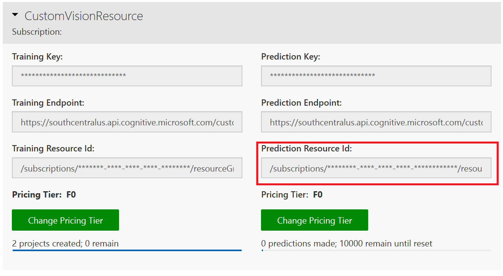

# Migrating to the 3.0 SDK

We have reached General Availability and updated our APIs. You can view the full [Release Notes](release-notes.md)

## Overview of changes

With the release of the latest SDK we've introduced a few new features and a few breaking changes:
* Prediction API is now split based on the project type.
* VAIDK export options requires creating a project in a specific way.
* Default iterations have been removed in favor of a publish / unpublish a named iteration.

## Changes to Prediction API

### Per project type APIs
2.x APIs didn't differentiate on project type. Both project type's iterations were acceptable to PredictImage and PredictImageUrl. Starting with 3.0 we have split this API such that you need to match the project type to the call.
* ClassifyImage and ClassifyImageUrl are for projects that perform image classification.
* DetectImage and DetectImageUrl are for projects that perform object detection.

### Removing of default or specifying iteration ID
2.x APIs would make use of default iterations or take an iteration ID to specify the iteration to use for the prediction. Starting in 3.0 we have adopted a publish flow whereby you publish an iteration from the training API first, giving the iteration a name. This name is then passed to the prediction methods to specify which iteration to use.

## Changes to the Training API

### Publishing an iteration
Once an iteration is trained you can make it available for prediction using the PublishIteration method to publish to a specific prediction resource. The prediction resource ID is available in the CustomVision portal's settings page, and in the Azure portal.

### How to retrieve the prediction resource ID

> [!TIP]
> You can also get this information from the [Azure Portal](https://portal.azure.com) by going to the Custom Vision Prediction resource and clicking on Properties.

### Additional Export options

With the 3.0 APIs we are exposing two additional export targets: ARM and Vision AI Dev Kit.
* To use ARM, you just need to pick a Compact domain and then choose DockerFile and then ARM as the export options.
* For Vision AI Dev Kit, the project must be created with the __General (Compact)__ domain as well as specifying VAIDK in the target export platforms argument.

### Updating default iterations

The 3.0 APIs do not support default iterations, but if an iteration needs to be marked default you can still use the 2.x APIs to update the default iteration. This is done the same as before, calling the UpdateIteration method marking the iteration default, as desired.

## Next steps

* [View the full Training API documentation](https://go.microsoft.com/fwlink/?linkid=865446)
* [View the full Prediction API documentation](https://go.microsoft.com/fwlink/?linkid=865445)