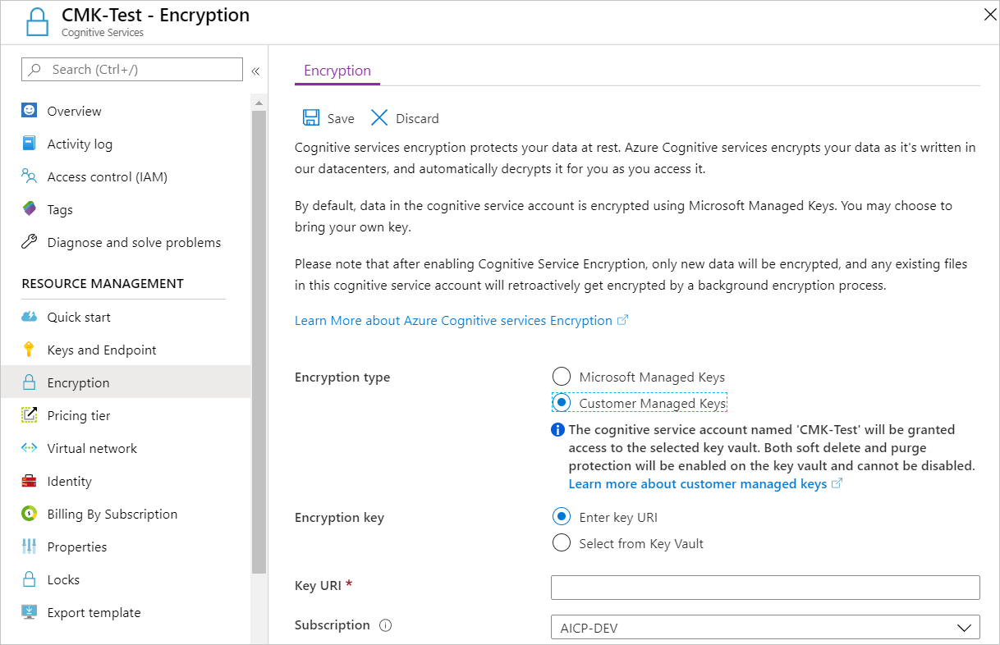
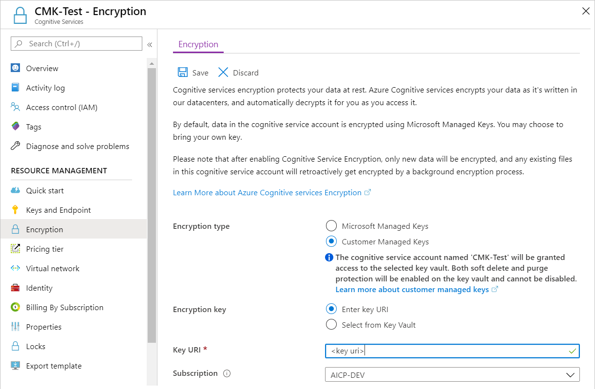
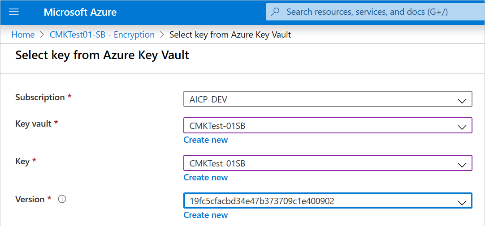

# Configure customer-managed keys with Azure Key Vault by using the Azure portal

You must use Azure Key Vault to store your customer-managed keys. You can either create your own keys and store them in a key vault, or you can use the Azure Key Vault APIs to generate keys. The Cognitive Services resource and the key vault must be in the same region and in the same Azure Active Directory (Azure AD) tenant, but they can be in different subscriptions. For more information about Azure Key Vault, see [What is Azure Key Vault?](https://docs.microsoft.com/azure/key-vault/key-vault-overview).

This article shows how to configure an Azure Key Vault with customer-managed keys using the [Azure portal](https://portal.azure.com/). To learn how to create a key vault using the Azure portal, see [Quickstart: Set and retrieve a secret from Azure Key Vault using the Azure portal](../../key-vault/quick-create-portal.md).

## Configure Azure Key Vault

Using customer-managed keys requires that two properties be set on the key vault, **Soft Delete** and **Do Not Purge**. These properties are not enabled by default, but can be enabled using either PowerShell or Azure CLI on a new or existing key vault.

> [!IMPORTANT]
> If you do not have the **Soft Delete** and **Do Not Purge** properties enabled and you delete your key, you won't be able to recover the data in your Cognitive Service resource. 

To learn how to enable these properties on an existing key vault, see the sections titled **Enabling soft-delete** and **Enabling Purge Protection** in one of the following articles:

- [How to use soft-delete with PowerShell](https://docs.microsoft.com/azure/key-vault/key-vault-soft-delete-powershell).
- [How to use soft-delete with CLI](https://docs.microsoft.com/azure/key-vault/key-vault-soft-delete-cli).

Only RSA keys of size 2048 are supported with Azure Storage encryption. For more information about keys, see **Key Vault keys** in [About Azure Key Vault keys, secrets and certificates](https://docs.microsoft.com/azure/key-vault/about-keys-secrets-and-certificates#key-vault-keys).

## Enable customer-managed keys

To enable customer-managed keys in the Azure portal, follow these steps:

1. Navigate to your Cognitive Services resource.
1. On the **Settings** blade for your Cognitive Services resource, click **Encryption**. Select the **Customer Managed Keys** option, as shown in the following figure.

    
  
## Specify a key

After you enable customer-managed keys, you'll have the opportunity to specify a key to associate with the Cognitive Services resource.

### Specify a key as a URI

To specify a key as a URI, follow these steps:

1. To locate the key URI in the Azure portal, navigate to your key vault, and select the **Keys** setting. Select the desired key, then click the key to view its versions. Select a key version to view the settings for that version.
1. Copy the value of the **Key Identifier** field, which provides the URI.

    

1. In the **Encryption** settings for your storage account, choose the **Enter key URI** option.
1. Paste the URI that you copied into the **Key URI** field.

   

1. Specify the subscription that contains the key vault.
1. Save your changes.

### Specify a key from a key vault

To specify a key from a key vault, first make sure that you have a key vault that contains a key. To specify a key from a key vault, follow these steps:

1. Choose the **Select from Key Vault** option.
1. Select the key vault containing the key you want to use.
1. Select the key from the key vault.

   

1. Save your changes.

## Update the key version

When you create a new version of a key, update the Cognitive Services resource to use the new version. Follow these steps:

1. Navigate to your Cognitive Services resource and display the **Encryption** settings.
1. Enter the URI for the new key version. Alternately, you can select the key vault and the key again to update the version.
1. Save your changes.

## Use a different key

To change the key used for encryption, follow these steps:

1. Navigate to your Cognitive Services resource and display the **Encryption** settings.
1. Enter the URI for the new key. Alternately, you can select the key vault and choose a new key.
1. Save your changes.

## Disable customer-managed keys

When you disable customer-managed keys, your Cognitive Services resource is then encrypted with Microsoft-managed keys. To disable customer-managed keys, follow these steps:

1. Navigate to your Cognitive Services resource and display the **Encryption** settings.
1. Deselect the checkbox next to the **Use your own key** setting.

## Next steps

* [What is Azure Key Vault](https://docs.microsoft.com/azure/key-vault/key-vault-overview)?
* [Cognitive Services Customer-Managed Key Request Form](https://aka.ms/cogsvc-cmk)
* [Encryption of data at rest for the Face service](../Face/face-encryption-of-data-at-rest.md)
