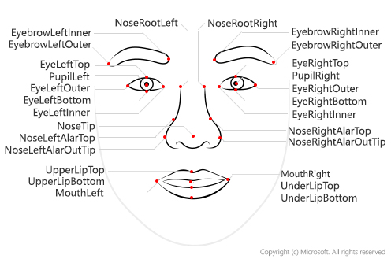

# Get face detection data

This guide will demonstrate how to use face detection to extract attributes like gender, age, or pose from a given image. The code snippets in this guide are written in C# using the Face API client library, but the same functionality is available through the [REST API](https://westus.dev.cognitive.microsoft.com/docs/services/563879b61984550e40cbbe8d/operations/563879b61984550f30395236).

This guide will show you how to:

- Get the locations and dimensions of faces in an image.
- Get the locations of various face landmarks (pupils, nose, mouth, and so on) in an image.
- Guess the gender, age, and emotion, and other attributes of a detected face.

## Setup

This guide assumes you have already constructed a **[FaceClient](https://docs.microsoft.com/dotnet/api/microsoft.azure.cognitiveservices.vision.face.faceclient?view=azure-dotnet)** object, named `faceClient`, with a Face subscription key and endpoint URL. From here, you can use the face detection feature by calling either **[DetectWithUrlAsync](https://docs.microsoft.com/dotnet/api/microsoft.azure.cognitiveservices.vision.face.faceoperationsextensions.detectwithurlasync?view=azure-dotnet)** (used in this guide) or **[DetectWithStreamAsync](https://docs.microsoft.com/dotnet/api/microsoft.azure.cognitiveservices.vision.face.faceoperationsextensions.detectwithstreamasync?view=azure-dotnet)**. See the [Detect Faces quickstart for C#](../quickstarts/csharp-detect-sdk.md) for instructions on how to set this up.

This guide will focus on the specifics of the Detect call&mdash;what arguments you can pass and what you can do with the returned data. We recommend only querying for the features you need, as each operation takes additional time to complete.

## Get basic face data

To find faces and get their locations in an image, call the method with the _returnFaceId_ parameter set to **true** (default).

```csharp
IList<DetectedFace> faces = await faceClient.Face.DetectWithUrlAsync(imageUrl, true, false, null);
```

The returned **[DetectedFace](https://docs.microsoft.com/dotnet/api/microsoft.azure.cognitiveservices.vision.face.models.detectedface?view=azure-dotnet)** objects can be queried for their unique IDs and a rectangle which gives the pixel coordinates of the face.

```csharp
foreach (var face in faces)
{
    string id = face.FaceId.ToString();
    FaceRectangle rect = face.FaceRectangle;
}
```

See **[FaceRectangle](https://docs.microsoft.com/dotnet/api/microsoft.azure.cognitiveservices.vision.face.models.facerectangle?view=azure-dotnet)** for information on how to parse the location and dimensions of the face. Usually, this rectangle contains the eyes, eyebrows, nose, and mouth; the top of head, ears, and chin are not necessarily included. If you intend to use the face rectangle to crop a complete head or mid-shot portrait (a photo ID type image), you may want to expand the rectangle by a certain margin in each direction.

## Get face landmarks

Face landmarks are a set of easy-to-find points on a face such as the pupils or the tip of nose. You can get face landmark data by setting the _returnFaceLandmarks_ parameter to **true**.

```csharp
IList<DetectedFace> faces = await faceClient.Face.DetectWithUrlAsync(imageUrl, true, true, null);
```

By default, there are 27 predefined landmark points. The following figure shows all 27 points:



The points returned are in units of pixels, just like the face rectangle frame. The following code demonstrates how you might retrieve the locations of the nose and pupils:

```csharp
foreach (var face in faces)
{
    var landmarks = face.FaceLandmarks;

    double noseX = landmarks.NoseTip.X;
    double noseY = landmarks.NoseTip.Y;

    double leftPupilX = landmarks.PupilLeft.X;
    double leftPupilY = landmarks.PupilLeft.Y;

    double rightPupilX = landmarks.PupilRight.X;
    double rightPupilY = landmarks.PupilRight.Y;
}
```

Face landmarks data can also be used to accurately calculate the direction of the face. For example, we can define the rotation of the face as a vector from the center of the mouth to the center of the eyes. The code below calculates this vector:

```csharp
var upperLipBottom = landmarks.UpperLipBottom;
var underLipTop = landmarks.UnderLipTop;

var centerOfMouth = new Point(
    (upperLipBottom.X + underLipTop.X) / 2,
    (upperLipBottom.Y + underLipTop.Y) / 2);

var eyeLeftInner = landmarks.EyeLeftInner;
var eyeRightInner = landmarks.EyeRightInner;

var centerOfTwoEyes = new Point(
    (eyeLeftInner.X + eyeRightInner.X) / 2,
    (eyeLeftInner.Y + eyeRightInner.Y) / 2);

Vector faceDirection = new Vector(
    centerOfTwoEyes.X - centerOfMouth.X,
    centerOfTwoEyes.Y - centerOfMouth.Y);
```

Knowing the direction of the face, you can then rotate the rectangular face frame to align it more properly. If you want to crop faces in an image, you can programmatically rotate the image so that the faces always appear upright.

## Get face attributes

Besides face rectangles and landmarks, the face detection API can analyze several conceptual attributes of a face. These include:

- Age
- Gender
- Smile intensity
- Facial hair
- Glasses
- 3D head pose
- Emotion

> [!IMPORTANT]
> These attributes are predicted through the use of statistical algorithms and may not always be accurate. Use caution when making decisions based on attribute data.
>

To analyze face attributes, set the _returnFaceAttributes_ parameter to a list of **[FaceAttributeType Enum](https://docs.microsoft.com/dotnet/api/microsoft.azure.cognitiveservices.vision.face.models.faceattributetype?view=azure-dotnet)** values.

```csharp
var requiredFaceAttributes = new FaceAttributeType[] {
    FaceAttributeType.Age,
    FaceAttributeType.Gender,
    FaceAttributeType.Smile,
    FaceAttributeType.FacialHair,
    FaceAttributeType.HeadPose,
    FaceAttributeType.Glasses
};
var faces = await faceClient.DetectWithUrlAsync(imageUrl, true, false, requiredFaceAttributes);
```

Then, get references to the returned data and do further operations according to your needs.

```csharp
foreach (var face in faces)
{
    var attributes = face.FaceAttributes;
    var age = attributes.Age;
    var gender = attributes.Gender;
    var smile = attributes.Smile;
    var facialHair = attributes.FacialHair;
    var headPose = attributes.HeadPose;
    var glasses = attributes.Glasses;
}
```

To learn more about each of the attributes, refer to the [Glossary](../Glossary.md).

## Next steps

In this guide you learned how to use the various functionalities of face detection. Next, see the [Glossary](../Glossary.md) for a more detailed look at the face data you've retrieved.

## Related Topics

- [Reference documentation (REST)](https://westus.dev.cognitive.microsoft.com/docs/services/563879b61984550e40cbbe8d/operations/563879b61984550f30395236)
- [Reference documentation (.NET SDK)](https://docs.microsoft.com/dotnet/api/overview/azure/cognitiveservices/client/face?view=azure-dotnet)
