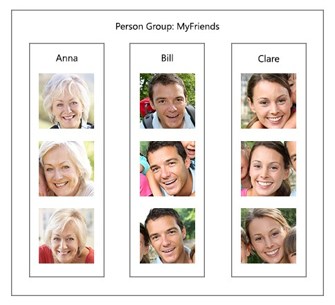
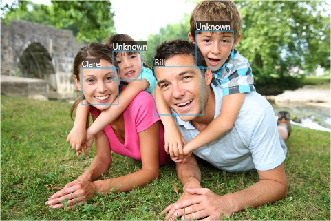

# Example: Identify faces in images

This guide demonstrates how to identify unknown faces by using PersonGroup objects, which are created from known people in advance. The samples are written in C# by using the Azure Cognitive Services Face client library.

This sample demonstrates:

- How to create a PersonGroup. This PersonGroup contains a list of known people.
- How to assign faces to each person. These faces are used as a baseline to identify people. We recommend that you use clear frontal views of faces. An example is a photo ID. A good set of photos includes faces of the same person in different poses, clothing colors, or hairstyles.

## Prerequisites
* The current version of [.NET Core](https://dotnet.microsoft.com/download/dotnet-core).
* Azure subscription - [Create one for free](https://azure.microsoft.com/free/cognitive-services/)
* Once you have your Azure subscription, <a href="https://portal.azure.com/#create/Microsoft.CognitiveServicesFace"  title="Create a Face resource"  target="_blank">create a Face resource <span class="docon docon-navigate-external x-hidden-focus"></span></a> in the Azure portal to get your key and endpoint. After it deploys, click **Go to resource** and copy your key.
* A few photos with the faces of identified people. [Download sample photos](https://github.com/Microsoft/Cognitive-Face-Windows/tree/master/Data) for Anna, Bill, and Clare.
* A series of test photos. The photos might or might not contain the faces of the identified persons. Use some images from the sample photos link.

## Setting up

### Create a new C# application

Create a new .NET Core application in your preferred editor or IDE. 

In a console window (such as cmd, PowerShell, or Bash), use the `dotnet new` command to create a new console app with the name `face-identify`. This command creates a simple "Hello World" C# project with a single source file: *Program.cs*. 

```dotnetcli
dotnet new console -n face-quickstart
```

Change your directory to the newly created app folder. You can build the application with:

```dotnetcli
dotnet build
```

The build output should contain no warnings or errors. 

```output
...
Build succeeded.
 0 Warning(s)
 0 Error(s)
...
```

## Step 1: Authorize the API call

Every call to the Face API requires a subscription key. This key can be either passed through a query string parameter or specified in the request header. When you use a client library, the subscription key is passed in through the constructor of the FaceClient class. Add the following code to the **main** method of the *Program.cs* file.
 
```csharp 
private readonly IFaceClient faceClient = new FaceClient(
    new ApiKeyServiceClientCredentials("<subscription key>"),
    new System.Net.Http.DelegatingHandler[] { });
```

## Step 2: Create the PersonGroup

In this step, a PersonGroup named "MyFriends" contains Anna, Bill, and Clare. Each person has several faces registered. The faces must be detected from the images. After all of these steps, you have a PersonGroup like the following image:



### Step 2.1: Define people for the PersonGroup
A person is a basic unit of identify. A person can have one or more known faces registered. A **PersonGroup** is a collection of people. Each person is defined within a particular **PersonGroup**. Identification is done against a **PersonGroup**. The task is to create a **PersonGroup**, and then create the people in it, such as Anna, Bill, and Clare.

First, create a new **PersonGroup** by using the [PersonGroup - Create](https://westus.dev.cognitive.microsoft.com/docs/services/563879b61984550e40cbbe8d/operations/563879b61984550f30395244) API. The corresponding client library API is the **CreatePersonGroupAsync** method for the **FaceClient** class. The group ID that's specified to create the group is unique for each subscription. You also can get, update, or delete **PersonGroup**s by using other **PersonGroup** APIs. 

After a group is defined, you can define people within it by using the [PersonGroup Person - Create](https://westus.dev.cognitive.microsoft.com/docs/services/563879b61984550e40cbbe8d/operations/563879b61984550f3039523c) API. The client library method is **CreatePersonAsync**. You can add a face to each person after they're created.

```csharp 
// Create an empty PersonGroup
string personGroupId = "myfriends";
await faceClient.PersonGroup.CreateAsync(personGroupId, "My Friends");
 
// Define Anna
CreatePersonResult friend1 = await faceClient.PersonGroupPerson.CreateAsync(
    // Id of the PersonGroup that the person belonged to
    personGroupId,    
    // Name of the person
    "Anna"            
);
 
// Define Bill and Clare in the same way
```
### <a name="step2-2"></a> Step 2.2: Detect faces and register them to the correct person
Detection is done by sending a "POST" web request to the [Face - Detect](https://westus.dev.cognitive.microsoft.com/docs/services/563879b61984550e40cbbe8d/operations/563879b61984550f30395236) API with the image file in the HTTP request body. When you use the client library, face detection is done through one of the Detect..Async methods of the FaceClient class.

For each face that's detected, call [PersonGroup Person – Add Face](https://westus.dev.cognitive.microsoft.com/docs/services/563879b61984550e40cbbe8d/operations/563879b61984550f3039523b) to add it to the correct person.

The following code demonstrates the process of how to detect a face from an image and add it to a person:

```csharp 
// Directory contains image files of Anna
const string friend1ImageDir = @"D:\Pictures\MyFriends\Anna\";
 
foreach (string imagePath in Directory.GetFiles(friend1ImageDir, "*.jpg"))
{
    using (Stream s = File.OpenRead(imagePath))
    {
        // Detect faces in the image and add to Anna
        await faceClient.PersonGroupPerson.AddFaceFromStreamAsync(
            personGroupId, friend1.PersonId, s);
    }
}
// Do the same for Bill and Clare
``` 
If the image contains more than one face, only the largest face is added. You can add other faces to the person. Pass a string in the format of "targetFace = left, top, width, height" to [PersonGroup Person - Add Face](https://westus.dev.cognitive.microsoft.com/docs/services/563879b61984550e40cbbe8d/operations/563879b61984550f3039523b) API's targetFace query parameter. You also can use the targetFace optional parameter for the AddPersonFaceAsync method to add other faces. Each face added to the person is given a unique persisted face ID. You can use this ID in [PersonGroup Person – Delete Face](https://westus.dev.cognitive.microsoft.com/docs/services/563879b61984550e40cbbe8d/operations/563879b61984550f3039523e) and [Face – Identify](https://westus.dev.cognitive.microsoft.com/docs/services/563879b61984550e40cbbe8d/operations/563879b61984550f30395239).

## Step 3: Train the PersonGroup

The PersonGroup must be trained before an identification can be performed by using it. The PersonGroup must be retrained after you add or remove any person or if you edit a person's registered face. The training is done by the [PersonGroup – Train](https://westus.dev.cognitive.microsoft.com/docs/services/563879b61984550e40cbbe8d/operations/563879b61984550f30395249) API. When you use the client library, it's a call to the TrainPersonGroupAsync method:
 
```csharp 
await faceClient.PersonGroup.TrainAsync(personGroupId);
```
 
Training is an asynchronous process. It might not be finished even after the TrainPersonGroupAsync method returns. You might need to query the training status. Use the [PersonGroup - Get Training Status](https://westus.dev.cognitive.microsoft.com/docs/services/563879b61984550e40cbbe8d/operations/563879b61984550f30395247) API or GetPersonGroupTrainingStatusAsync method of the client library. The following code demonstrates a simple logic of waiting for PersonGroup training to finish:
 
```csharp 
TrainingStatus trainingStatus = null;
while(true)
{
    trainingStatus = await faceClient.PersonGroup.GetTrainingStatusAsync(personGroupId);
 
    if (trainingStatus.Status != TrainingStatusType.Running)
    {
        break;
    }
 
    await Task.Delay(1000);
} 
``` 

## Step 4: Identify a face against a defined PersonGroup

When the Face service performs identifications, it computes the similarity of a test face among all the faces within a group. It returns the most comparable persons for the testing face. This process is done through the [Face - Identify](https://westus.dev.cognitive.microsoft.com/docs/services/563879b61984550e40cbbe8d/operations/563879b61984550f30395239) API or the IdentifyAsync method of the client library.

The testing face must be detected by using the previous steps. Then the face ID is passed to the identification API as a second argument. Multiple face IDs can be identified at once. The result contains all the identified results. By default, the identification process returns only one person that matches the test face best. If you prefer, specify the optional parameter maxNumOfCandidatesReturned to let the identification process return more candidates.

The following code demonstrates the identification process:

```csharp 
string testImageFile = @"D:\Pictures\test_img1.jpg";

using (Stream s = File.OpenRead(testImageFile))
{
    var faces = await faceClient.Face.DetectWithStreamAsync(s);
    var faceIds = faces.Select(face => face.FaceId.Value).ToArray();
 
    var results = await faceClient.Face.IdentifyAsync(faceIds, personGroupId);
    foreach (var identifyResult in results)
    {
        Console.WriteLine("Result of face: {0}", identifyResult.FaceId);
        if (identifyResult.Candidates.Length == 0)
        {
            Console.WriteLine("No one identified");
        }
        else
        {
            // Get top 1 among all candidates returned
            var candidateId = identifyResult.Candidates[0].PersonId;
            var person = await faceClient.PersonGroupPerson.GetAsync(personGroupId, candidateId);
            Console.WriteLine("Identified as {0}", person.Name);
        }
    }
}
``` 

After you finish the steps, try to identify different faces. See if the faces of Anna, Bill, or Clare can be correctly identified according to the images uploaded for face detection. See the following examples:



## Step 5: Request for large scale

A PersonGroup can hold up to 10,000 persons based on the previous design limitation. For more information about up to million-scale scenarios, see [How to use the large-scale feature](how-to-use-large-scale.md).

## Summary

In this guide, you learned the process of creating a PersonGroup and identifying a person. The following features were explained and demonstrated:

- Detect faces by using the [Face - Detect](https://westus.dev.cognitive.microsoft.com/docs/services/563879b61984550e40cbbe8d) API.
- Create PersonGroups by using the [PersonGroup - Create](https://westus.dev.cognitive.microsoft.com/docs/services/563879b61984550e40cbbe8d/operations/563879b61984550f30395244) API.
- Create persons by using the [PersonGroup Person - Create](https://westus.dev.cognitive.microsoft.com/docs/services/563879b61984550e40cbbe8d/operations/563879b61984550f3039523c) API.
- Train a PersonGroup by using the [PersonGroup – Train](https://westus.dev.cognitive.microsoft.com/docs/services/563879b61984550e40cbbe8d/operations/563879b61984550f30395249) API.
- Identify unknown faces against the PersonGroup by using the [Face - Identify](https://westus.dev.cognitive.microsoft.com/docs/services/563879b61984550e40cbbe8d/operations/563879b61984550f30395239) API.

## Related topics

- [Face recognition concepts](../concepts/face-recognition.md)
- [Detect faces in an image](HowtoDetectFacesinImage.md)
- [Add faces](how-to-add-faces.md)
- [Use the large-scale feature](how-to-use-large-scale.md)
