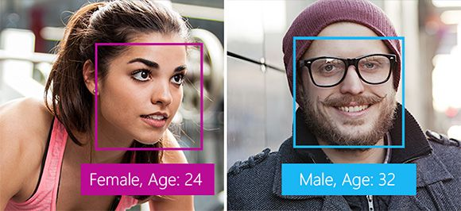

# What is the Azure Face API?

The Azure Face API is a cognitive service that provides algorithms for detecting, recognizing, and analyzing human faces in images. This page outlines the different kinds of tasks that the Face API can perform.

## What it does
The Face API has two main functions: face detection with attributes and face recognition.

### Face detection

The Face API can detect up to 64 human faces and return the locations of faces in an image with high precision. 

Optionally, face detection can extract a series of face-related attributes such as pose, gender, age, head pose, facial hair, and glasses. For more information, see the [Detect API](https://westus.dev.cognitive.microsoft.com/docs/services/563879b61984550e40cbbe8d/operations/563879b61984550f30395236).

### Face recognition

The ability to identify human faces is important in many scenarios including security, natural user interface, image content analysis and management, mobile apps, and robotics. The Face API service provides four face recognition functions: face verification, finding similar faces, face grouping, and person identification.

#### Face verification

The Verify API performs an authentication against two detected faces or from one detected face to one person object. Practically, it evaluates whether two faces belong to the same person. For more information, see the [Verify API](https://westus.dev.cognitive.microsoft.com/docs/services/563879b61984550e40cbbe8d/operations/563879b61984550f3039523a).

#### Finding similar faces

The Find Similar API takes a target face and a set of candidate faces and finds a smaller set of faces that look most similar to the target face. Two working modes, **matchPerson** and **matchFace** are supported. **matchPerson** mode returns similar faces after filtering for the same person (using the [Verify API](https://westus.dev.cognitive.microsoft.com/docs/services/563879b61984550e40cbbe8d/operations/563879b61984550f3039523a)). **matchFace** mode ignores the same-person filter and returns a list of similar candidate faces that may or may not belong to the same person. In the following example, this is the target face:

And these are the candidate faces:

To find four similar faces, **matchPerson** mode would return (a) and (b), which depict the same person as the target face. **matchFace** mode returns (a), (b), (c) and (d)&mdash;exactly four candidates, even if some are not the same person as the target or have low similarity. For more information, see the [Find Similar API](https://westus.dev.cognitive.microsoft.com/docs/services/563879b61984550e40cbbe8d/operations/563879b61984550f30395237).

#### Face grouping

The Group API divides a set of unknown faces into several groups based on similarity. Each group is a disjoint proper subset of the original set of faces. All of the faces in a group are likely to belong to the same person, but there can be several different groups for a single person (differentiated by another factor, such as expression for example). For more information, see the [Group API](https://westus.dev.cognitive.microsoft.com/docs/services/563879b61984550e40cbbe8d/operations/563879b61984550f30395238).

#### Person identification

The Identify API can be used to identify a detected face against a database of people. You create this database in advance, and it can be edited over time.

The following image depicts an example of a database named "myfriends." Each group may contain up to 1,000,000/10,000 different person objects. Each person object can have up to 248 faces registered.

After a database has been created and trained, identification can be performed against the group with a new detected face. If the face is identified as a person in the group, the person object is returned.

For more information about person identification, see the [Identify API](https://westus.dev.cognitive.microsoft.com/docs/services/563879b61984550e40cbbe8d/operations/563879b61984550f30395239).

## Sample apps

The following sample applications showcase a few ways that the Face API can be used.

- [Microsoft Face API: Windows Client Library & Sample](https://github.com/Microsoft/Cognitive-Face-Windows) - a WPF app that demonstrates several scenarios of Face detection, analysis and identification.
- [FamilyNotes UWP app](https://github.com/Microsoft/Windows-appsample-familynotes) - a Universal Windows Platform (UWP) app that uses face identification along with speech, Cortana, ink, and camera in a family note-sharing scenario.

## Next steps

Follow a quickstart to implement a simple face detection scenario.
- [Quickstart: Detect faces in an image using the .NET SDK with C#](quickstarts/csharp.md) (other languages available)
