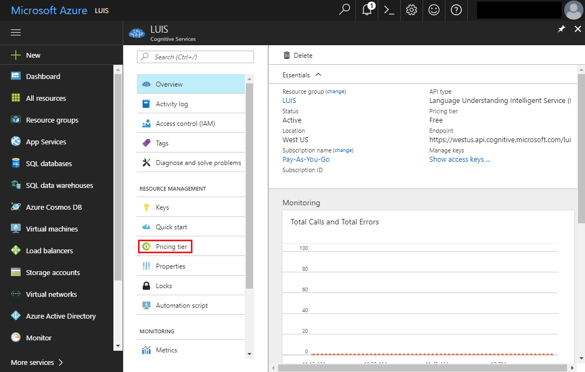
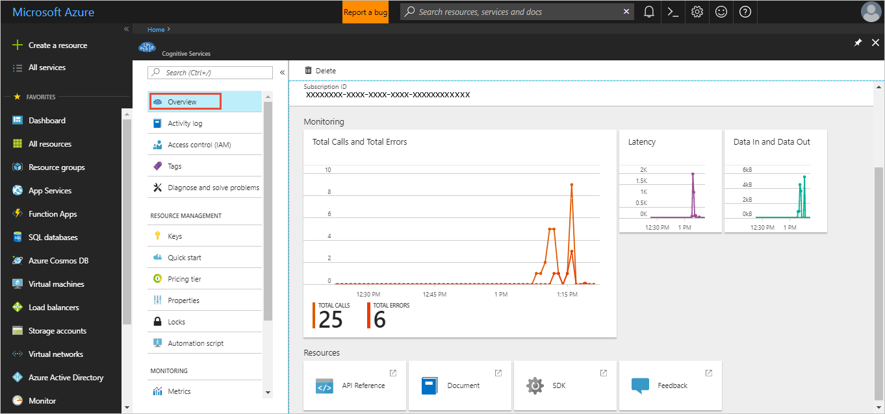

# Manage Azure subscription keys

For authoring, testing and prototype only, use the free (F0) tier. For production systems, use a [paid](https://aka.ms/luis-price-tier) tier. When using the paid tier, LUIS scales to the number of endpoint transactions your application needs.

## Create LUIS endpoint key

1. Sign in to **[Microsoft Azure](https://ms.portal.azure.com/)** 
2. Click the green **+** sign in the upper left-hand panel and search for “LUIS” in the marketplace, then click on **Language Understanding** and follow the **create experience** to create a LUIS subscription account. 

     

3. Configure the subscription with settings including account name, pricing tiers, etc. 

     

4. Once you create the LUIS service, you can view the access keys generated in **Resource Management->Keys**.  

    

    > [!Note] 
    > * Log into your region's [LUIS](luis-reference-regions.md) website and [add the new LUIS endpoint key](Manage-Keys.md#assign-endpoint-key). 
    > * You need to remember the name of the Azure service you created in order to select it on the region's [LUIS](luis-reference-regions.md) publish page.  

## Change LUIS pricing tier

1.  In [Azure](https://portal.azure.com), find your LUIS subscription. Click the LUIS subscription.
    
2.  Click **Pricing tier** in order to see the available pricing tiers. 
    
3.  Click the pricing tier and click **Select** to save your change. 
    
4.  When the pricing change is complete, a pop-up window verifies the new pricing tier. 
    

## Exceed pricing tier usage
Each tier allows endpoint requests to your LUIS account at a specific rate. If the rate of requests is higher than the allowed rate of your metered account per minute or per month, requests receive an HTTP error of "429: Too Many Requests."

Each tier allows accumulative requests per month. If the total requests are higher than the allowed rate, requests receive an HTTP error of "403: forbidden".  

## Viewing summary usage
You can view LUIS usage information in Azure. The **Overview** page shows recent summary information including calls and errors. If you make a LUIS endpoint request, then immediately watch the **Overview page**, allow up to five minutes for the usage to show up.

## Customizing usage charts
Metrics provides a more detailed view into the data.

You can configure your metrics charts for time period and metric type. 

## Total transactions threshold alert
If you would like to know when you have reached a certain transaction threshold, for example 10,000 transactions, you can create an alert. 

Add a metric alert for the **total calls** metric for a certain time period. Add email addresses of all people that should receive the alert. Add webhooks for all systems that should receive the alert. You can also run a logic app when the alert is triggered. 

## Next steps

Learn how to use [versions](luis-how-to-manage-versions.md) to manage changes to your LUIS app.