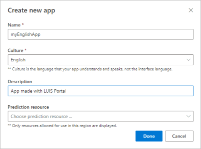
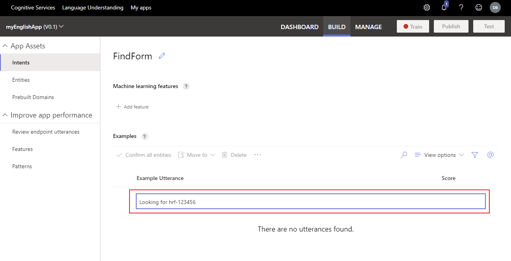
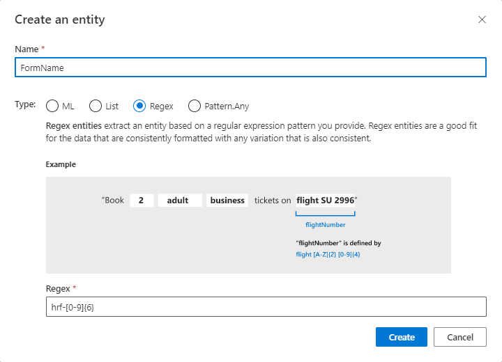

# Quickstart: Create new app in LUIS portal

The first step to using LUIS is to build a LUIS app. The LUIS portal is the most common method, but you can also use programmatic methods. Creating the app in the portal begins with setting the name and language, then adding intents with example utterances. If there is data in the utterances that need to be extracted, this needs to be tagged with entities. 

In this quickstart, you create an app, create an intent, add an example utterance and create an entity to extract that entity. The [LUIS portal](https://www.luis.ai) is free to use and doesn't require a Cognitive Service or Language Understanding key. 

If you don’t have a free LUIS portal account, you can create the free account the first time you visit the LUIS portal.  

## Create app 

1. Open the LUIS portal in a browser and sign in. 

1. Select **Create new app** from the context toolbar.

    [](./media/get-started-portal-build-app/create-app-in-portal.png#lightbox)

1. In the pop-up window, configure the app with the settings then select **Done**.

    |Setting name| Value | Purpose|
    |--|--|--|
    |Name|`myEnglishApp`|Unique LUIS app name, required|
    |Culture|**English**|Language of utterances from users, **en-us**, required|
    |Description|`App made with LUIS Portal`|Description of app, optional|

    


## Create intent 

After the app is created, the next step is to create intents. Intents are a way to categorize text from users. If you have a human resources app that has two functions: first to help people find and apply for jobs and second to find forms to apply for jobs, these two different _intentions_ align to the following custom intents:

|Intent|Example text from user<br>known as an _utterance_|
|--|--|
|ApplyForJob|`I want to apply for the new software engineering position in Cairo.`|
|FindForm|`Where is the job transfer form hrf-123456?`|

1. After the app is created, you are on the **Intents** page of the **Build** section. Select **Create new intent**. 

    [](./media/get-started-portal-build-app/create-new-intent-button.png#lightbox)

1. Enter the intent name, `FindForm` and select **Done**.

    

## Add example utterance 

After creating the intent, the next step is to add example utterances. This is text, entered by the user in a chat bot or other client application, that maps a user's intention to a LUIS intent. 

For this `FindForm` intent, example utterances need to include the form number, for example: `hrf-123456`. The text hrf is an abbreviation for `human resources form`. The form number is important information within the utterance that the client application needs in order to fullfil the user's request. 

Add the following fifteen example utterances to the `FindForm` intent. 

|#|Example utterances|
|--|--|
|1|Looking for hrf-123456|
|2|Where is the human resources form hrf-234591?|
|3|hrf-345623, where is it|
|4|Is it possible to send me hrf-345794|
|5|Do I need hrf-234695 to apply for an internal job?|
|6|Does my manager need to know I'm applying for a job with hrf-234091|
|7|Where do I send hrf-234918? Do I get an email response it was received?|
|8|hrf-234555|
|9|When was hrf-234987 updated?|
|10|Do I use form hrf-876345 to apply for engineering positions|
|11|Was a new version of hrf-765234 submitted for my open req?|
|12|Do I use hrf-234234 for international jobs?|
|13|hrf-234598 spelling mistake|
|14|will hrf-234567 be edited for new requirements|
|15|hrf-123456, hrf-123123, hrf-234567|

[](./media/get-started-portal-build-app/add-example-utterance.png#lightbox)

## Create regular expression entity 

In order to get the form number as part of the runtime prediction response, the form has to be marked as an entity. Since the form number text is highly structured, it can be marked using a regular expression entity. Create the entity with the following steps. 

1. Select **Entities** from the left-navigation menu. 

1. Select **Create new entity** on the Entities page.

1. Enter the name `Human Resources Form Number`, select the **Regex** entity type, and enter the regular expression, `hrf-[0-9]{6}`. This matches the literal characters, `hrf-` and allows for exactly 6 digits. 



1. Select **Done**. 

## Add example utterances to None intent

The **None** intent is the fallback intent and shouldn't be left empty. This intent should have 1 utterance for every 10 in the rest of the intents. 

Good example utterances for the None intent should not have utterances that you intend to capture in the other intents. None intent utterances should be outside of your client application domain. 

A LUIS app developer should have enough knowledge about the app domain to be able to select utterances that are outside the domain. 

1. Select **Intents** from the left menu, then select **None**.

1. Add the following example utterances to the intent:

    |None intent example utterances|
    |--|
    |Barking dogs are annoying|
    |Order a pizza for me|
    |Penguins in the ocean|

## Train the app

1. In the top-right navigation, select **Train** to apply the intent and entity model changes to the current version of the app. 

1. Verify the entity is found in the FindForm intent. Select **Intents** from left menu, then select **FindForm** intent. 

    The entity is marked where it appears in the example utterances. 

    [](./media/get-started-portal-build-app/all-example-utterances-marked-with-entities.png#lightbox)

## Test new app

Use the interactive Test pane in the LUIS portal to validate the entity is extracted from new utterances.

1. Select **Test** from the top-right menu.

1. Add a new utterance then press Enter:

    ```Is there a form named hrf-234098```

    

## Clean up resources
When you are done with this quickstart, select **My apps** from the top navigation menu. Then select the app's left-hand checkbox from the list, and select  **Delete** from the context toolbar above the list. 

[](./media/get-started-portal-build-app/delete-app.png#lightbox)

## Next Steps

> [!div class="nextstepaction"]
> [Deploy model](get-started-portal-deploy-model.md)