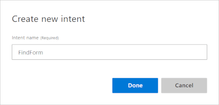

# Quickstart: Create new app in LUIS portal

The first step to using LUIS is to build a LUIS app. The LUIS portal is the most common method, but you can also use programmatic methods. Creating the app in the portal begins with setting the name and language, then adding intents with example utterances. If there is data in the utterances that need to be extracted, this needs to be tagged with entities. 

In this quickstart, you create an app, create an intent, add an example utterance and create an entity to extract that entity. The [LUIS portal](https://www.luis.ai) is free to use and doesn't require a Cognitive Service or Language Understanding key. 

If you don’t have a free LUIS portal account, you can create the free account the first time you visit the LUIS portal.  

## Create app 

1. Open the LUIS portal in a browser and sign in. 

1. Select **Create new app** in the contextual toolbar.

    

1. In the pop-up window, configure the app with the settings then select **Done**.

    |Setting name| Value | Purpose|
    |--|--|--|
    |Name|`myEnglishApp`|Unique LUIS app name, required|
    |Culture|**English**|Language of utterances from users, **en-us**, required|
    |Description|`App made with LUIS Portal`|Description of app, optional|

    

## Create intent 

After the app is created, the next step is to create intents. Intents are categories of user utterances. If you have a human resources app that has two functions: to help people find and apply for jobs and find forms to apply for jobs, these two different _intentions_ align to the following custom intents:

|Intent|
|--|
|ApplyForJob|
|FindForm|

1. After the app is created, you are on the **Intents** page of the **Build** section. Select **Create new intent**. 

    

1. Enter the intent name, `FindForm` and select **Done**.

    

## Add example utterance 

After creating the intent, the next step is to add example utterances. These are words and phrases that map a user's intention to this intent. Add fifteen or more utterances, making sure to vary the utterance length, word choice, verb tense, punctuation, any any other variations you expect to receive in real-world utterances. For this intent, the form will be formatted text of text and a form number, for example: hrf-123456. The text hrf is an abbreviation for `human resources form`. 

Enter the following example utterances:

    |#|Example utterances|
    |--|--|
    |1|Looking for hrf-123456|
    |2|Where is the human resources form hrf-234591?|
    |3|hrf-345623, where is it|
    |4|Is it possible to send me hrf-345794|
    |5|Do I need hrf-234695 to apply for an internal job?|
    |6|Does my manager need to know I'm applying for a job with hrf-234091|
    |7|Where do I send hrf-234918? Do I get an email response it was received?|
    |8|hrf-234555|
    |9|When was hrf-234987 updated?|
    |10|Do I use form hrf-876345 to apply for engineering positions|
    |11|Was a new version of hrf-765234 submitted for my open req?|
    |12|Do I use hrf-234234 for international jobs?|
    |13|hrf-234598 spelling mistake|
    |14|will hrf-234567 be edited for new requirements|
    |15|hrf-123456, hrf-123123, hrf-234567|

    [!Enter example utterances for the FindForm intent](./media/get-started-portal-build-app/add-example-utterance.png)

## Create regular expression entity 

Tag entity in example utterance
`HRF-number regular express

// add example utterance with 1 entity to intent

## Next Steps

> [!div class="nextstepaction"]
> [Deploy model](./get-started-portal-deploy-model.md)