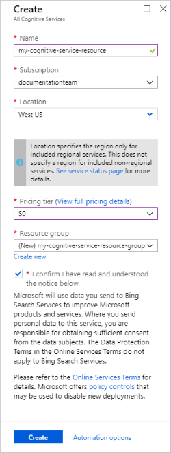

# Quickstart: 2. Deploy app in LUIS portal

Once the app is ready to return predictions for utterances to a client application, such as a chat bot, you need to deploy the app to the prediction endpoint. 

In this quickstart, you learn to deploy an application by creating a prediction endpoint runtime key, assigning the key to the app, training the app, and publishing the app. 

## Prerequisites

* [Azure subscription](https://azure.microsoft.com/free).
* Complete the [previous portal quickstart](get-started-portal-build-app.md) which builds the app used in this quickstart or [download and import the app](https://github.com/Azure-Samples/cognitive-services-language-understanding/blob/master/documentation-samples/quickstarts/in-portal/build-portal-app.json). Remember to train the imported app before beginning this quickstart. 

## Create prediction endpoint runtime resource

The prediction endpoint runtime resource is created in the Azure portal. This resource should only be used for endpoint prediction queries. Do not use this resource for authoring changes to the app. 

1. Sign in to the **[Azure portal](https://ms.portal.azure.com/)**. 

1. Select the green **+** sign in the upper left-hand panel and search for `Cognitive Services` in the marketplace, then select it and follow the **Create experience** to create a resource. 

1. Configure the subscription with settings including account name, pricing tiers, etc. 

     

1. Once you create the resource, you can view the access keys under the **Resource Management** section in the **Keys** page. The next section will show you how to connect this new resource to a LUIS app in the LUIS portal. You need the name of the LUIS resource from step 3.

    

## Assign resource key to LUIS app in LUIS Portal

1. Sign in to the [LUIS portal](https://www.luis.ai), choose the **myEnglishApp** app from the apps list.

1. Select **Manage** in the top-right menu, then select **Keys and endpoints**.

    

1. In order to add the LUIS, select **Assign Resource +**.

    

1. Select a Tenant in the dialog associated with the email address you used to sign in with to the LUIS website.  

1. Choose the **Subscription Name** associated with the Azure resource you want to add.

1. Select the **LUIS resource name** you created in the previous section. 

1. Select **Assign resource**. 

1. Find the new row in the table and copy the endpoint URL. It is correctly constructed to make an HTTP GET request to the LUIS endpoint for a prediction. 

## Train the app

## Publish the app 

Tag entity in example utterance
`HRF-number regular express

// add example utterance with 1 entity to intent

## Next Steps

> [!div class="nextstepaction"]
> [Identify common intents and entities](/luis-tutorial-prebuilt-intents-entities.md)