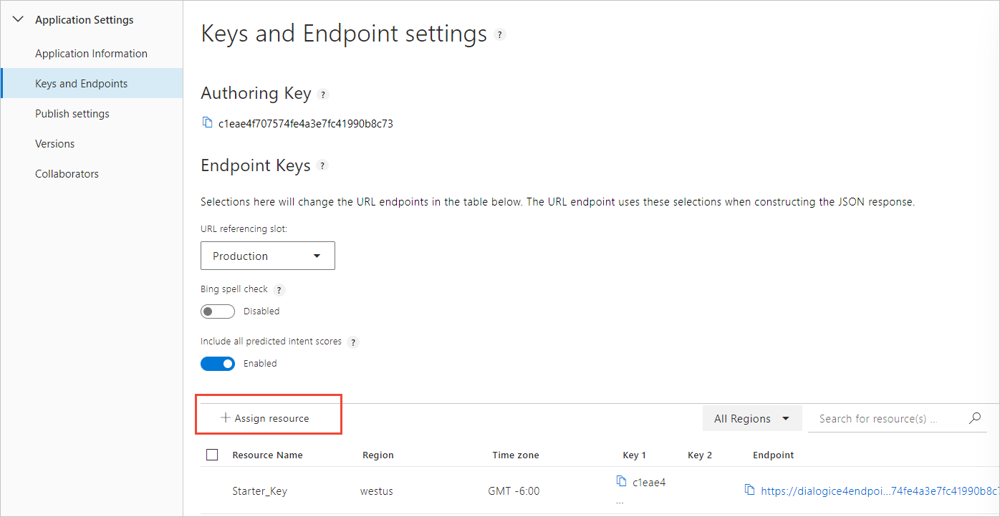
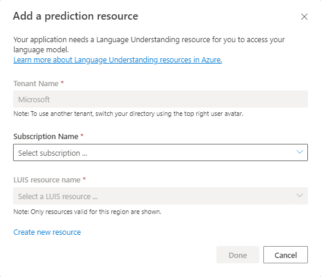

# Quickstart: Deploy an app in the LUIS portal

After the app is ready to return utterance predictions to a client application, such as a chat bot, you need to deploy the app to the prediction endpoint. 

In this quickstart, you learn to deploy an application by creating a prediction endpoint resource, assigning the resource to the app, training the app, and publishing the app. 

## Prerequisites

* [Azure subscription](https://azure.microsoft.com/free).
* Complete the [previous portal quickstart](get-started-portal-build-app.md) or [download and import the app](https://github.com/Azure-Samples/cognitive-services-language-understanding/blob/master/documentation-samples/quickstarts/in-portal/build-portal-app.json). 


## Create the endpoint resource

You create the prediction endpoint resource in the Azure portal. This resource should only be used for endpoint prediction queries. Do not use this resource for authoring changes to the app. 

1. Sign in to the **[Azure portal](https://ms.portal.azure.com/)**. 

1. Select the green **+** sign in the upper left-hand panel and search for `Cognitive Services` in the marketplace, then select it. 

1. Configure the subscription with the following settings:

    |Setting|Value|Purpose|
    |--|--|--|
    |Name|`my-cognitive-service-resource`|The name of the Azure resource. You need this name when you assign the resource to the app in the LUIS portal.|
    |Subscription|Your subscription|Select one of the subscriptions associated with your account.|
    |Location|**West US**|The azure region for this resource.|
    |Pricing tier|**S0**|The default pricing tier for this resource.|
    |Resource group|`my-cognitive-service-resource-group`|Create a new resource group for all your cognitive service resources. When you are done with the resources, you can delete the resource group to clean up your subscription. | 

     

1. Select **Create** to create the Azure resource. 

    In the next section, you learn how to connect this new resource to a LUIS app in the LUIS portal. 

## Assign the resource key to the LUIS app in the LUIS portal

Every time you create a new resource for LUIS, you need to assign the resource to the LUIS app. Once it is assigned, you won't need to do this step again unless you create a new resource. You might create a new resource to expand the regions of your app or to support a higher number of prediction queries. 

1. Sign in to the [LUIS portal](https://www.luis.ai), choose the **myEnglishApp** app from the apps list.

1. Select **Manage** in the top-right menu, then select **Keys and endpoints**.

1. In order to add the LUIS, select **Assign Resource +**.

    [](./media/get-started-portal-deploy-app/assign-resource-button.png#lightbox)

1. Select your tenant, subscription, and resource name then select **Assign resource**. 

    

1. Find the new row in the table and copy the endpoint URL. It is correctly constructed to make an HTTP GET request to the LUIS API endpoint for a prediction. 

## Train and publish the app 

You should train whenever you are ready to test it. You should publish the app whenever you want the currently trained version to be available to client applications from the prediction endpoint runtime. 

1. If the app is untrained, select **Train** from the top, right menu.

1. Select **Publish** from the top, right menu. Accept the default environment settings, and select **Publish**.

1. When the green success notification bar appears at the top of the browser window, select the **Refer to the list of endpoints** link. 

    

1. This takes you to the **Keys and Endpoint settings** page. The list of assigned resources and corresponding endpoint URLs is at the bottom of the page. 

1. Select the endpoint URL associated with your new resource name. This opens a web browser with a correctly constructed URL to make a **GET** request to the prediction endpoint runtime. 

1. The `q=` at the end of the URL is short for **query** and is where the user's utterance is appended to the GET request. After the `q=`, enter the same user utterance used at the end of the previous quickstart:

    ```Is there a form named hrf-234098```

    The browser response is the same JSON your client application will receive:

    ```JSON
    {
    "query": "Is there a form named hrf-234098",
    "topScoringIntent": {
        "intent": "FindForm",
        "score": 0.9768753
    },
    "intents": [
        {
        "intent": "FindForm",
        "score": 0.9768753
        },
        {
        "intent": "None",
        "score": 0.0216071066
        }
    ],
    "entities": [
        {
        "entity": "hrf-234098",
        "type": "Human Resources Form Number",
        "startIndex": 22,
        "endIndex": 31
        }
      ]
    }
    ```

    This response gives you more information than the default **Test** pane in the previous tutorial. If you want to see this same level of information in the Test pane, the app must be published. Then, in the Test pane, select **Compare with published**. Use **Show JSON view** in the publised test pane to see the same JSON as the previous step. This allows you to compare the current app you are working on and the app that is published to the endpoint.

    [](./media/get-started-portal-deploy-app/compare-test-pane.png#lightbox)


## Clean up resources
When you are done with this quickstart, select **My apps** from the top navigation menu. Then select the app's left-hand checkbox from the list, and select  **Delete** from the context toolbar above the list. 

[](./media/get-started-portal-build-app/delete-app.png#lightbox)

## Next steps

> [!div class="nextstepaction"]
> [Identify common intents and entities](luis-tutorial-prebuilt-intents-entities.md)