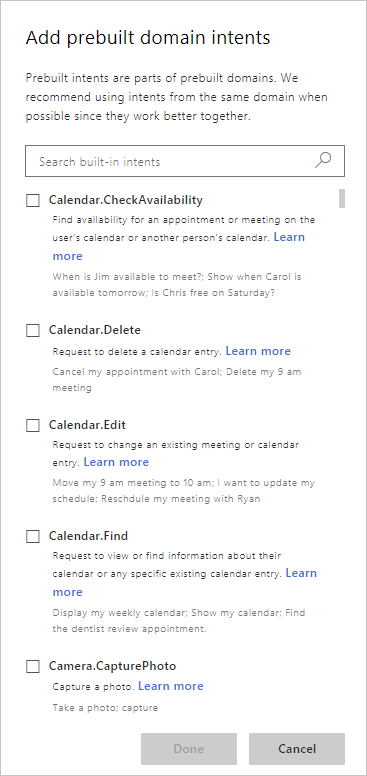
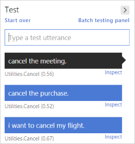
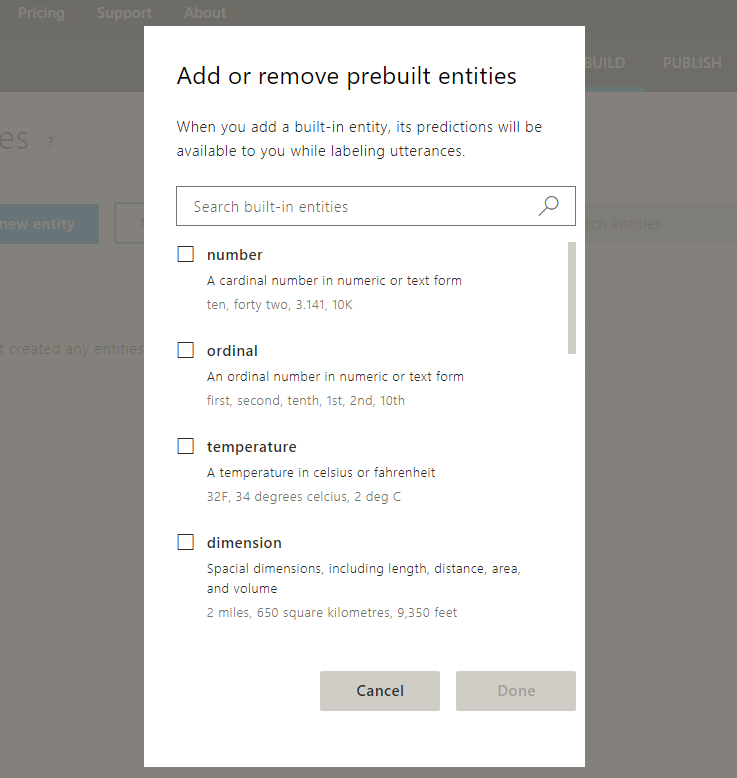

# Add prebuilt models for common usage scenarios 

LUIS includes a set of prebuilt intents from the prebuilt domains for quickly adding common intents and utterances. This is a quick and easy way to add abilities to your conversational client app without having to design the models for those abilities. 

## Add a prebuilt domain

1. On the **My Apps** page, select your app. This opens your app to the **Build** section of the app. 

1. On the **Intents** page, select **Add prebuilt domains** from the bottom, left toolbar. 

1. Select the **Calendar** intent then select **Add domain** button.

    

1. Select **Intents** in the left navigation to view the Calendar intents. Each intent from this domain is prefixed with `Calendar.`. Along with utterances, two entities for this domain are added to the app: `Calendar.Location` and `Calendar.Subject`. 

### Train and publish

1. After the domain is added, train the app by selecting **Train** in the top, right toolbar. 

1. In the top toolbar, select **Publish**. Publish to **Production**. 

1. When the green success notification appears, select the **Refer to the list of endpoints** link to see the endpoints.

1. Select an endpoint. A new browser tab opens to that endpoint. Keep the browser tab open and continue to the **Test** section.

### Test

Test the new intent at the endpoint by added a value for the **q** parameter: `Schedule a meeting with John Smith in Seattle next week`.

LUIS returns the correct intent and meeting subject:

```json
{
  "query": "Schedule a meeting with John Smith in Seattle next week",
  "topScoringIntent": {
    "intent": "Calendar.Add",
    "score": 0.824783146
  },
  "entities": [
    {
      "entity": "a meeting with john smith",
      "type": "Calendar.Subject",
      "startIndex": 9,
      "endIndex": 33,
      "score": 0.484055847
    }
  ]
}
```

## Add a prebuilt intent

1. On the **My Apps** page, select your app. This opens your app to the **Build** section of the app. 

1. On the **Intents** page, select **Add prebuilt intent** from the toolbar above the intents list. 

1. Select the **Utilities.Cancel** intent from the pop-up dialog. 

    

1. Select the **Done** button.

### Train and test

1. After the intent is added, train the app by selecting **Train** in the top, right toolbar. 

1. Test the new intent by selecting **Test** in the right toolbar. 

1. In the textbox, enter utterances for canceling:

    |Test utterance|Prediction score|
    |--|:--|
    |I want to cancel my flight.|0.67|
    |Cancel the purchase.|0.52|
    |Cancel the meeting.|0.56|

    

## Add a prebuilt entity

1. Open your app by clicking its name on **My Apps** page, and then click **Entities** in the left side. 

1. On the **Entities** page, click **Add prebuilt entity**.

1. In **Add prebuilt entities** dialog box, select the datetimeV2 prebuilt entity. 

    

1. Select **Done**. After the entity is added, you do not need to train the app. 

## Publish to view prebuilt model from prediction endpoint

The easiest way to view the value of a prebuilt model is to query from the published endpoint. 

## Marking entities containing a prebuilt entity token
 If you have text, such as `HH-1234`, that you want to mark as a custom entity _and_ you have [Prebuilt Number](luis-reference-prebuilt-number.md) added to the model, you won't be able to mark the custom entity in the LUIS portal. You can mark it with the API. 

 In order to mark this type of token, where part of it is already marked with a prebuilt entity, remove the prebuilt entity from the LUIS app. You don't need to train the app. Then mark the token with your own custom entity. Then add the prebuilt entity back to the LUIS app.

 For another example, consider the utterance as a list of class preferences: `I want first year spanish, second year calculus, and fourth year english lit.` If the LUIS app has the Prebuild Ordinal added, `first`, `second`, and `fourth` will already be marked with ordinals. If you want to capture the ordinal and the class, you can create a composite entity and wrap it around the Prebuilt Ordinal and the custom entity for class name.

## Next steps
> [!div class="nextstepaction"]
> [Build model from .csv with REST APIs](./luis-tutorial-node-import-utterances-csv.md)
