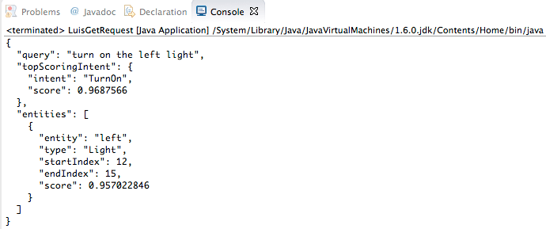

## Prerequisites

* [JDK SE](https://aka.ms/azure-jdks)  (Java Development Kit, Standard Edition)
* [Visual Studio Code](https://code.visualstudio.com/) or your favorite IDE
* Public app ID: df67dcdb-c37d-46af-88e1-8b97951ca1c2

[!INCLUDE [Use authoring key for endpoint](../../../../includes/cognitive-services-luis-qs-endpoint-luis-repo-note.md)]

## Get LUIS key

[!INCLUDE [Use authoring key for endpoint](../../../../includes/cognitive-services-luis-qs-endpoint-get-key-para.md)]

## Get intent programmatically

You can use Java to access the same results you saw in the browser window in the previous step. Be sure to add the Apache libraries to your project.

1. Copy the following code to create a class in a file named `LuisGetRequest.java`:

   [!code-java[Console app code that calls a LUIS endpoint](~/samples-luis/documentation-samples/quickstarts/analyze-text/java/call-endpoint.java)]

2. Replace the value of the `YOUR-KEY` variable with your LUIS key.

3. Replace with your file path and compile the java program from a command line: `javac -cp .;<FILE_PATH>\* LuisGetRequest.java`.

4. Replace with your file path and run the application from a command line: `java -cp .;<FILE_PATH>\* LuisGetRequest.java`. It displays the same JSON that you saw earlier in the browser window.

    
    

## LUIS keys

[!INCLUDE [Use authoring key for endpoint](../../../includes/cognitive-services-luis-qs-endpoint-key-usage-para.md)]

## Clean up resources

When you are finished with this quickstart, close the Visual Studio project and remove the project directory from the file system. 

## Next steps

> [!div class="nextstepaction"]
> [Add utterances and train with Java](luis-get-started-java-add-utterance.md)