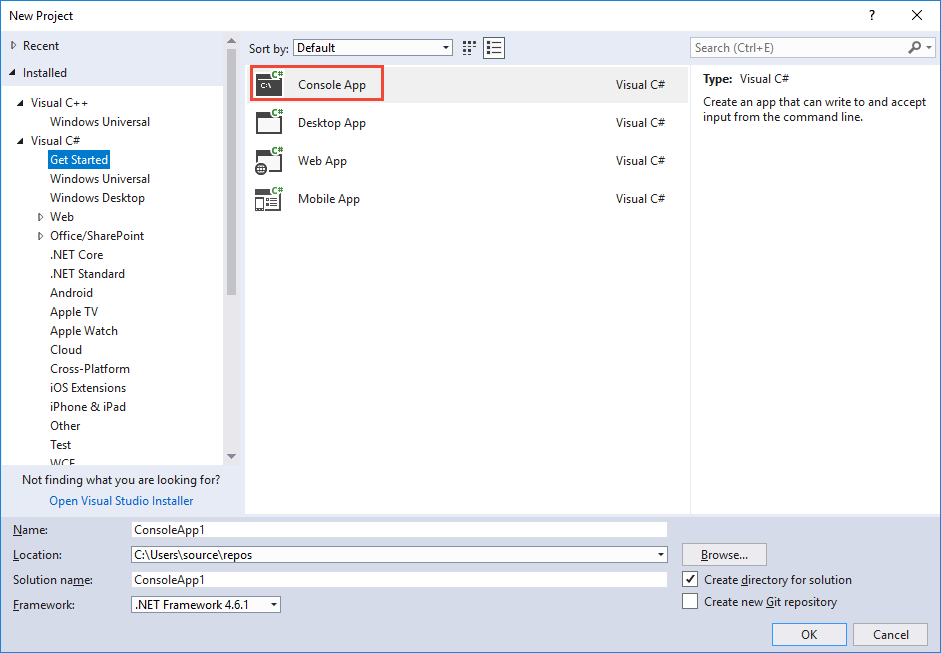
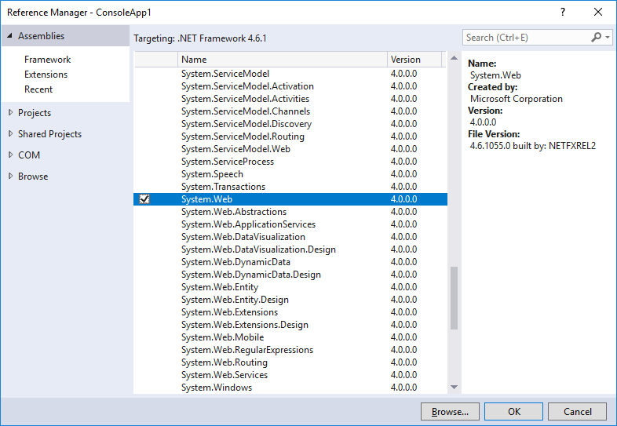

## Prerequisites

* Starter key.
Import the TravelAgent app from the cognitive-services-language-understanding GitHub repository.
The LUIS application ID for the imported TravelAgent app. The application ID is shown in the application dashboard.
The utterances.json file containing the example utterances to import.
The version ID within the application that receives the utterances. The default ID is "0.1".

dotnet add package CommandLineParser --version 2.6.0

dotnet add package JsonFormatterPlus --version 1.0.2

[!INCLUDE [Use authoring key for endpoint](../../../../includes/cognitive-services-luis-qs-endpoint-luis-repo-note.md)]

## Get LUIS key

[!INCLUDE [Use authoring key for endpoint](../../../../includes/cognitive-services-luis-qs-endpoint-get-key-para.md)]

## Get intent programmatically

Use C# to query the prediction endpoint GET [API](https://westus.dev.cognitive.microsoft.com/docs/services/5819c76f40a6350ce09de1ac/operations/5819c77140a63516d81aee78) to get the same results as you saw in the browser window in the previous section. 

1. Create a new console application in Visual Studio. 

    

2. In the Visual Studio project, in the Solutions Explorer, select **Add reference**, then select **System.Web** from the Assemblies tab.

    

3. Overwrite Program.cs with the following code:
    
   [!code-csharp[Console app code that calls a LUIS endpoint](~/samples-luis/documentation-samples/quickstarts/analyze-text/csharp/Program.cs)]

4. Replace the value of `YOUR_KEY` with your LUIS key.

5. Build and run the console application. It displays the same JSON that you saw earlier in the browser window.

    

## LUIS keys

[!INCLUDE [Use authoring key for endpoint](../../../../includes/cognitive-services-luis-qs-endpoint-key-usage-para.md)]

## Clean up resources

When you are finished with this quickstart, close the Visual Studio project and remove the project directory from the file system. 

## Next steps

> [!div class="nextstepaction"]
> [Add utterances and train with C#](../luis-get-started-cs-add-utterance.md)

