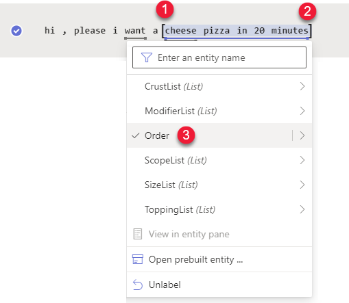
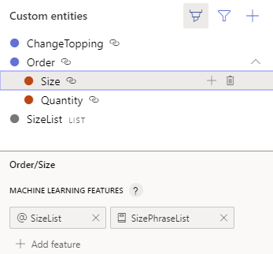
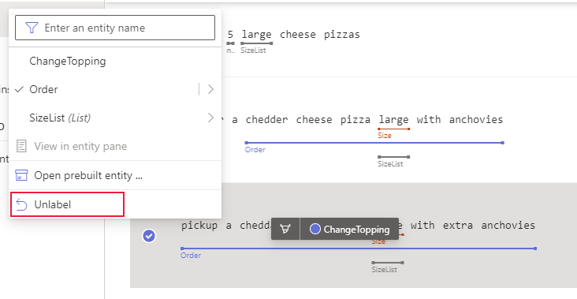
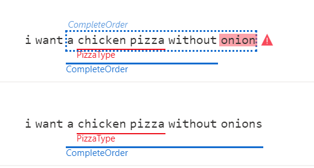

# Label machine-learned entity in an example utterance

Labeling an entity in an example utterance gives LUIS an example of what the entity is and where the entity can appear in the utterance.

## Label example utterances from the Intent detail page

1. Sign in to the [LUIS portal](https://www.luis.ai), and select your **Subscription** and **Authoring resource** to see the apps assigned to that authoring resource.
1. Open your app by selecting its name on **My Apps** page.
1. Select the Intent that has the example utterances you want to label for extraction with an entity.
1. Select the text you want to label then select the entity.

## Label with the Entity Palette visible

After you've planned your schema with entities, keep the **Entity palette** visible while labeling. The **Entity palette** is a reminder of what your entities you planned to extract.

To access the **Entity Palette**, select the **@** symbol in the contextual toolbar above the example utterance list.

> [!div class="mx-imgBorder"]
> 

## Label entity from in-place menu

Consider the example utterance, `hi, please I want a cheese pizza in 20 minutes`.

1. Select the left-most text, then select the right-most text of the entity, then from the in-place menu, pick the entity you want to label with.

    > [!div class="mx-imgBorder"]
    > 

## Label entity from Entity Palette

The entity palette offers an alternative to the previous labeling experience. It allows you to brush over text to instantly label it with an entity.

1. Open the entity palette by selecting on the **@** symbol at the top right of the utterance table.

2. Select the entity from the palette that you want to label. This action is visually indicated with a new cursor. The cursor follows the mouse as you move in the LUIS portal.

3. In the example utterance, _paint_ the entity with the cursor.

    > [!div class="mx-imgBorder"]
    > 

## Adding entity as a feature from the Entity Palette

The Entity Palette's lower section allows you to add features to the currently selected entity. You can select from all existing entities and phrase lists or create a new phrase list.

> [!div class="mx-imgBorder"]
> 

## Labeling entity roles

Entity roles are labeled using the **Entity palette**.

1. In the Intent detail page, select the **Entity palette** from the context toolbar.
1. After the Entity palette opens, select the entity from the list of entity.
1. Below the list of entities, select an existing role.
1. In the example utterance text, label the text with the entity role.

## Review labeled text

After labeling, review the example utterance and ensure the selected span of text has been underlined with the chosen entity. The solid line indicates the text has been labeled.

> [!div class="mx-imgBorder"]
> 

## Confirm predicted entity

If there is a dotted-lined box around the span of text, it indicates the text is predicted but _not labeled yet_. To turn the prediction into a label, select the utterance row, then select **Confirm entities** from the contextual toolbar.

## Relabeling over existing entities

If you relabel text that is already labeled, LUIS may split or merge existing labels.

## Labeling for punctuation

You do not need to label for punctuation. Use [application settings](luis-reference-application-settings.md) _word forms_ to control if punctuation impacts utterance predictions.

## Unlabel entities

> [!NOTE]
> Only machine learned entities can be unlabeled.

To unlabel an entity, select the entity and select **Unlabel** from the in-place menu.

> [!div class="mx-imgBorder"]
> 

## Automatic labeling for parent and child entities

If you are labeling a parent entity, any subentity that can be predicted based on the currently trained version, will be labeled.

If you are labeling for a subentity, the parent will be labeled automatically.

## Automatic labeling for non-machine learned entities

Non-machine learned entities include prebuilt entities, regular expression entities, list entities, and pattern.any entities. These are automatically labeled by LUIS so they are not required to be manually labeled by users.

## Entity prediction errors

Entity prediction errors indicate the predicted entity doesn't match the labeled entity. This is visualized with a caution indicator next to the utterance.

> [!div class="mx-imgBorder"]
> 

## Next steps

Use the [dashboard](luis-how-to-use-dashboard.md) and [review endpoint utterances](luis-how-to-review-endpoint-utterances.md) to improve the prediction quality of your app.