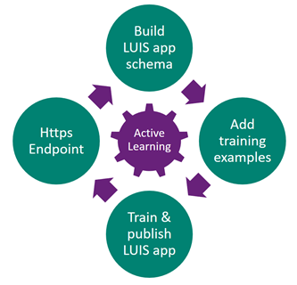

# Authoring cycle for your LUIS app

Your LUIS app learns best in an iterative cycle of app schema changes, utterance examples, publishing, and gathering data from endpoint queries. 

## Building a LUIS schema

The app schema's purpose is to define what the user is asking for (the intention or intent) and what parts of the question provide details (entities) that help determine the answer. 

The app schema needs to be specific to the app domain in order to determine words and phrases that are relevant as well as typical word ordering. 

The schema requires intents, and _should have_ entities. 

## Add example utterances to intents

LUIS needs example utterances in each **intent**. The example utterances need enough variation of word choice and word order to be able to determine which intent the utterance is meant for. Each example utterance needs to have any **required data to extract** designed and labeled with **entities**. 

|Key element|Purpose|
|--|--|
|Intent|**Classify** user utterances into a single intention, or action. Examples include `BookFlight` and `GetWeather`.|
|Entity|**Extract** data from utterance required to complete intention. Examples include date and time of travel, and location.|

You design your LUIS app to ignore utterances that are not relevant to your app's domain by assigning the utterance to the **None** intent. 

## Train and publish the app

Once you have 15 to 30 different example utterances in each intent, with the required entities labeled, you need to [train](luis-how-to-train.md) then [publish](luis-how-to-publish-app.md). Make sure you create and publish your app so that it is available in the [endpoint regions](luis-reference-regions.md) you need. 

## Test your published app

You can test your published LUIS app from the HTTPS prediction endpoint. Testing from the prediction endpoint allows LUIS to choose any utterances with low-confidence for [review](luis-how-to-review-endpoint-utterances.md).  

## Clone the app for the next authoring cycle

Consider [cloning](luis-concept-version.md#clone-a-version) the current version into a new version, then begin your authoring changes in the new version. 

## Review endpoint utterances to begin the new authoring cycle

When you are done with a cycle of authoring, you can begin again. Start with [reviewing prediction endpoint utterances](luis-how-to-review-endpoint-utterances.md) LUIS marked with low-confidence. Check these utterances for both correct predicted intent and correct and complete entity extracted. Once you review and accept changes, the review list should be empty.  

## Batch testing

[Batch testing](luis-concept-batch-test.md) is a way to see how example utterances are predicted by your LUIS app. The examples should be new to LUIS and should be correctly labeled with intent and entities you want your LUIS app to find. The test results indicate how well LUIS would perform on that set of utterances. 

## Next steps

Learn concepts about [collaboration](luis-concept-keys.md).
