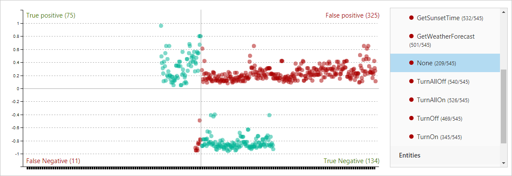
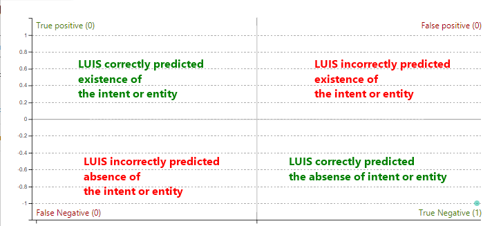

# Batch testing in LUIS

Batch testing validates your [active](luis-concept-verion.md#active-version) trained model to measure its prediction accuracy. A batch test helps you view the accuracy of each intent and entity in your current trained model in a chart. Review the batch test results to take appropriate action to improve accuracy, such as adding more example utterances to an intent if your app frequently fails to identify the correct intent.

## Datasets
Submit a batch file of utterances, known as a *dataset*, for batch testing. The dataset is a JSON-formatted file containing a maximum of 1,000 labeled **non-duplicate** utterances. You can test up to ten datasets in an app. If you need to test more, delete a dataset and then add a new one.

Use utterances LUIS has not seen before in either the model or the endpoint for best results. 

|**Rules**|
|--|
|*No duplicate utterances|
|No hierarchical entity children|
|1000 utterances or less|

*Duplicates are considered exact string matches, not matches that are tokenized first. 

## Batch file format

## Batch test results
The batch test result is a comparison of the utterances in the file and the current model's predicted intent and entities. This difference helps you find utterances that LUIS predicts incorrectly based on its current training. The results can be broken up in to intents, entities, and you can select individual points on the graph to review the utterance information.

It is important that utterances used for batch testing are new to LUIS. If you have a dataset of utterances, divide the utterances into three sets: utterances add to the model, utterances received from the published endpoint, and utterances used to batch test LUIS after it is trained. 

If there are errors in the batch testing, you can either add more labels to help LUIS make the discrimination between intents or add a [phrase list](luis-concept-feature.md) feature with domain-specific vocabulary to help LUIS learn faster. 

## Example batch file
An example of the JSON in the batch file follows:

   [!code-json[Valid batch test](~/samples-luis/documentation-samples/batch-testing/travel-agent-1.json)]

## Common errors importing a batch
Common errors include: 

> * more than 1,000 utterances
> * an utterance JSON object that doesn't have an entities property

**Successful predictions** are utterances where the intent in the batch file is the same intent predicted in the test.

In the preceding screenshot:
 
 - **State** includes ready to run, erroring results, or successful results. 
 - **Size** is the total number of utterances included in the dataset file.
 - **Last Run** is the date of the latest test run for this dataset. 
 - **Last Result** displays the number of successful predictions in the last test run.

## Access batch test result details in a visualized view
 Select the **See results** link that appears after you run the test. A scatter graph known as an error matrix displays. The data points represent the utterances in the dataset. 

Green points indicate correct prediction, and red ones indicate incorrect prediction.

The filtering panel on the right side of the screen displays a list of all intents and entities in the app, with a green point for intents/entities that were predicted correctly in all dataset utterances, and a red point for those items with errors. Also, for each intent/entity, you can see the number of correct predictions out of the total utterances.

 

## Sections of the results chart
Data points on the **[False Positive][false-positive]** and **[False Negative][false-negative]** sections indicate errors, which should be investigated. If all data points are on the **[True Positive][true-positive]** and **[True Negative][true-negative]** sections, then your application's performance is perfect on this dataset.

The graph indicates [F-measure][f-measure], [recall][recall], and [precision][precision]. 

## Best practice - three sets of data
Developers should have three sets of test data. The first is for building the model, the second is for testing the model at the endpoint. The third is used in [batch testing](luis-how-to-batch-test.md). The first set is not used in training the application nor sent on the endpoint. 

## Next steps

* Learn how to [test a batch](luis-how-to-batch-test.md)