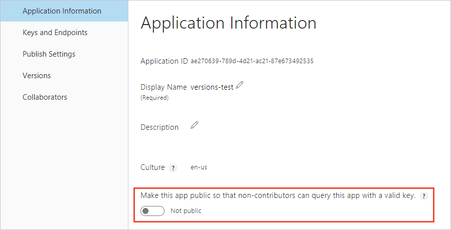

# Authoring and endpoint user access
Authoring access is available for owners and collaborators. For a private app, endpoint access is available for owners and collaborators. For a public app, endpoint access is available to everyone that has their own LUIS account and has the public app's ID. 

## Access to authoring
Access to the app from the [LUIS](luis-reference-regions.md#luis-website) website or the [authoring APIs](https://aka.ms/luis-authoring-apis) is controlled by the owner of the app. 

The owner and all collaborators have access to author the app. 

|Authoring access includes|Notes|
|--|--|
|Add or remove endpoint keys||
|Exporting version||
|Export endpoint logs||
|Importing version||
|Make app public|When an app is public, anyone with an authoring or endpoint key can query the app.|
|Modify model|
|Publish|
|Review endpoint utterances for [active learning](luis-how-to-review-endoint-utt.md)|
|Train|

## Access to endpoint
Access to query the endpoint is controlled by a setting on the **Application Information** page in the **Manage** section. 

|[Private endpoint](#private-app-endpoint-security)|[Public endpoint](#public-app-endpoint-access)|
|:--|:--|
|Available to owner and collaborators|Available to owner, collaborators, and anyone else that knows app ID|

### Private app endpoint security
A private app's endpoint is only available to the following:

|Key and user|Explanation|
|--|--|--|
|Owner's authoring key| Up to 1000 endpoint hits|
|Collaborators' authoring keys| Up to 1000 endpoint hits|
|Any key assigned to LUIS by an author or collaborator|Based on key usage tier|

#### Microsoft user accounts
Authors and collaborators can assign keys to a private LUIS app. The Microsoft user account that creates the LUIS key in the Azure portal needs to be either the app owner or an app collaborator. You can't assign a key to a private app from another Azure account.

See [Azure Active Directory tenant user](luis-how-to-collaborate.md#azure-active-directory-tenant-user) to learn more about Active Directory user accounts. 

### Public app endpoint access
Once an app is configured as public, _any_ valid LUIS authoring key or LUIS endpoint key can query your app, as long as the key has not used the entire endpoint quota.

A user who is not an owner or collaborator, can only access a public app if given the app ID. LUIS doesn't have a public _market_ or other way to search for a public app.  

## Microsoft user accounts
Authors and collaborators can add keys to LUIS on the Publish page. The Microsoft user account that creates the LUIS key in the Azure portal needs to be either the app owner or an app collaborator. 

See [Azure Active Directory tenant user](luis-how-to-collaborate.md#azure-active-directory-tenant-user) to learn more about Active Directory user accounts. 

<!--
### Individual consent
If the Microsoft user account is part of an Azure Active Directory (AAD), and the active directory doesn't allow users to give consent, then you can provide individual consent as part of the login process. 

### Administrator consent
If the Microsoft user account is part of an Azure Active Directory (AAD), and the active directory doesn't allow users to give consent, then the administrator can give individual consent via the method discussed in this [blog](https://blogs.technet.microsoft.com/tfg/2017/10/15/english-tips-to-manage-azure-ad-users-consent-to-applications-using-azure-ad-graph-api/). 
-->

## Securing the endpoint 
You can control who can see your LUIS endpoint key by calling it in a server-to-server environment. If you are using LUIS from a bot, the connection between the bot and LUIS is already secure. If you are calling the LUIS endpoint directly, you should create a server-side API (such as an Azure [function](https://azure.microsoft.com/services/functions/)) with controlled access (such as [AAD](https://azure.microsoft.com/services/active-directory/)). When the server-side API is called and authentication and authorization are verified, pass the call on to LUIS. While this strategy doesn’t prevent man-in-the-middle attacks, it obfuscates your endpoint from your users, allows you to track access, and allows you to add endpoint response logging (such as [Application Insights](https://azure.microsoft.com/services/application-insights/)).  

## Security Compliance
 
[!include[LUIS Free account](../../../includes/cognitive-services-luis-security-compliance.md)]

## Next steps

See [Best Practices](luis-concept-best-practices.md) to learn how to use intents and entities for the best predictions.
