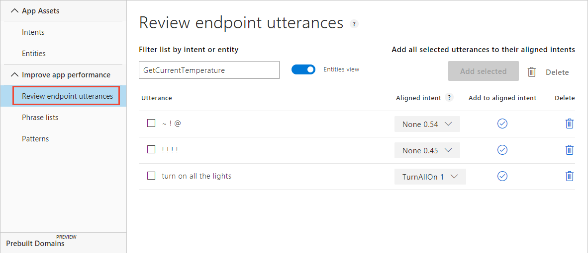

# Testing in LUIS

Testing is the process of providing sample utterances to LUIS and getting a response of LUIS-recognized intents and entities. 

You can [test](Train-Test.md) LUIS interactively, one utterance at a time, or provide a batch of utterances. In the interactive test, you can compare the current active model to the published model. 

## A test score
A test score is between zero (0) and one (1). An example of a highly confident LUIS score is 0.99. An example of a score of low confidence is 0.01. 

|Score value|Score confidence|
|--|--|
|0.99|✔|
|0.01|X|

When an utterance results in a low-confidence score, LUIS highlights that in the website intent page, with the identified **labeled-intent** outlined with red. 

## Score all intents
A test score can also include all intents. This configuration is set on the **[Publish](Publishapp.md)** page or with the `verbose=true` query string addition to the [endpoint](https://aka.ms/v1-endpoint-api-docs). Reviewing the scores for all intents is a good way to verify that not only is the correct intent identified but that the next identified intent's score is significantly lower. 

## E (exponent) notation

Test scores can use exponent notation, *appearing* above the 0-1 range, such as `9.910309E-07`. This score is an indication of a very **small** number.

|E notation score |Actual score|
|--|--|
|9.910309E-07|.0000009910309|

## Interactive testing
Interactive testing is done from the **Test panel** of the website. You can quickly enter utterances to see how intents and entities are identified and scored. If LUIS isn't predicting the intents and entities as you expect on an utterance in the testing pane, copy it to the Intent page as a new utterance. Then label the parts of that utterance, and train LUIS. 

## Batch testing
Batch testing allows LUIS to test up to 1,000 utterances and score the batch in a graphical manner so you can see the results as a group. The results can be broken up in to intents, entities, and you can select individual points on the graph to review the utterance information. 

## Endpoint testing
You can test using the endpoint with a maximum of two versions of your app. With your main or live version of your app set as the production endpoint, add a second version to the staging endpoint. This approach gives you three versions of an utterance: the current model in the Test pane of the LUIS website, and the two versions at the two different endpoints. 

All endpoint testing counts against your usage quota. 

## Do not log tests
If you test against an endpoint, and do not want the utterance logged, remember to use the `logging=false` query string configuration.

## Where to find utterances
LUIS stores all logged utterances in the query log, available for download on the LUIS website applications list page, as well as the LUIS authoring APIs. 

Any utterances LUIS is unsure of are listed in the **[Review endpoint utterances](label-suggested-utterances.md)** page of the LUIS website. 

 
## Remember to train
Remember to train LUIS after you make changes to the model. Changes to the LUIS app are not seen in testing until the app is trained. 

## Next steps

* Learn more about [testing](Train-Test.md) your utterances.