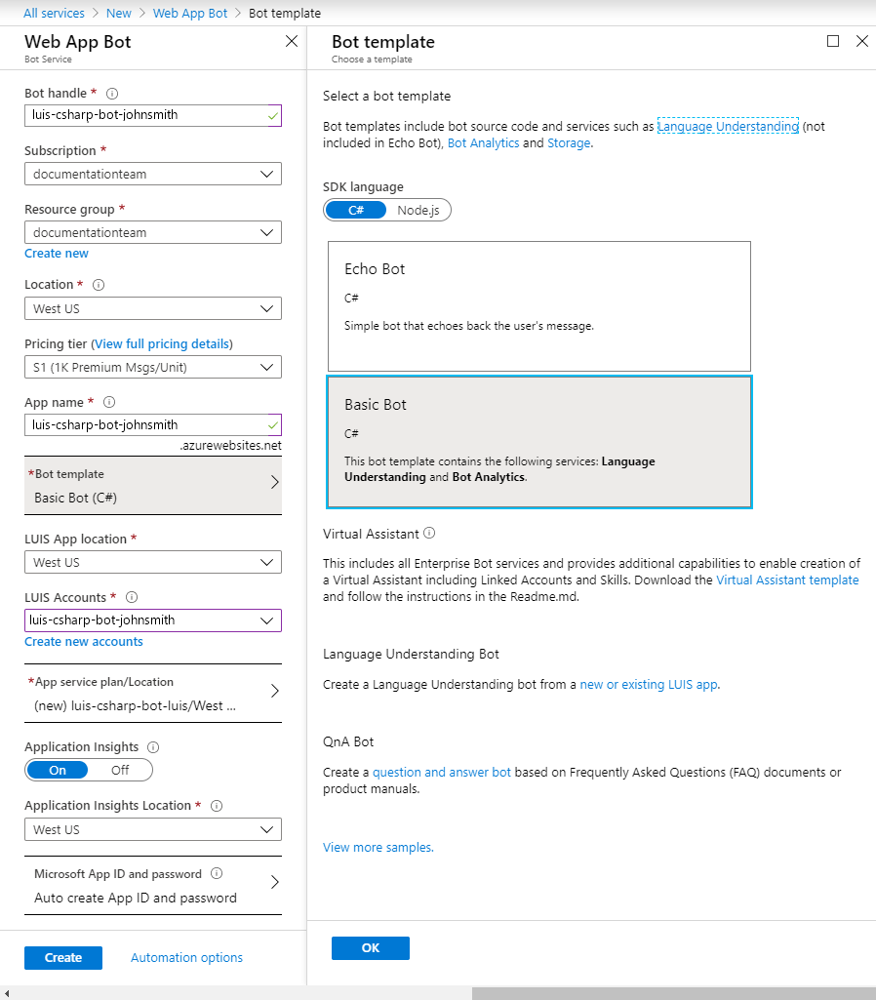
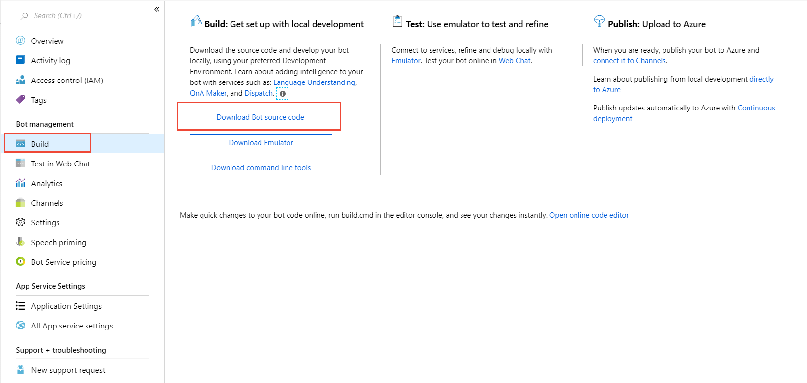
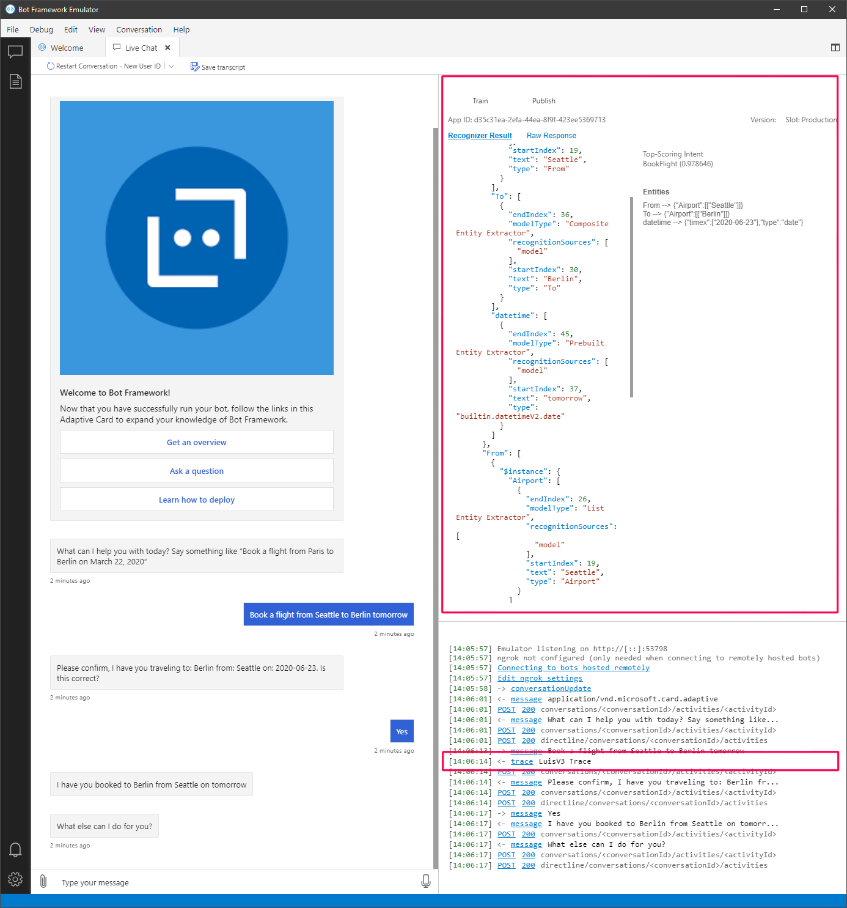

# Tutorial: Use a Web App Bot enabled with Language Understanding in C#

Use C# to build a chat bot integrated with language understanding (LUIS). The bot is built with the Azure [Web app bot](https://docs.microsoft.com/azure/bot-service/) resource and [Bot Framework version](https://github.com/Microsoft/botbuilder-dotnet) V4.

**In this tutorial, you learn how to:**

> [!div class="checklist"]
> * Create a web app bot. This process creates a new LUIS app for you.
> * Download the bot project created by the Web bot service
> * Start bot & emulator locally on your computer
> * View utterance results in bot

## Prerequisites

* [Bot emulator](https://aka.ms/abs/build/emulatordownload)
* [Visual Studio](https://visualstudio.microsoft.com/downloads/)


## Create a web app bot resource

1. In the [Azure portal](https://portal.azure.com), select **Create new resource**.

1. In the search box, search for and select **Web App Bot**. Select **Create**.

1. In **Bot Service**, provide the required information:

    |Setting|Purpose|Suggested setting|
    |--|--|--|
    |Bot name|Resource name|`luis-csharp-bot-` + `<your-name>`, for example, `luis-csharp-bot-johnsmith`|
    |Subscription|Subscription where to create bot.|Your primary subscription.
    |Resource group|Logical group of Azure resources|Create a new group to store all resources used with this bot, name the group `luis-csharp-bot-resource-group`.|
    |Location|Azure region - this doesn't have to be the same as the LUIS authoring or publishing region.|`westus`|
    |Pricing tier|Used for service request limits and billing.|`F0` is the free tier.
    |App name|The name is used as the subdomain when your bot is deployed to the cloud (for example, humanresourcesbot.azurewebsites.net).|`luis-csharp-bot-` + `<your-name>`, for example, `luis-csharp-bot-johnsmith`|
    |Bot template|Bot framework settings - see next table|
    |LUIS App location|Must be the same as the LUIS resource region|`westus`|
    |App service plan/Location|Do not change from provided default value.|
    |Application Insights|Do not change from provided default value.|
    |Microsoft App ID and password|Do not change from provided default value.|

1. In the **Bot template**, select the following, then choose the **Select** button under these settings:

    |Setting|Purpose|Selection|
    |--|--|--|
    |SDK version|Bot framework version|**SDK v4**|
    |SDK language|Programming language of bot|**C#**|
    |Bot|Type of bot|**Basic bot**|
    
1. Select **Create**. This creates and deploys the bot service to Azure. Part of this process creates a LUIS app named `luis-csharp-bot-XXXX`. This name is based on the /Azure Bot Service app name.

    [](./media/bfv4-csharp/create-web-app-service.png#lightbox)

    Wait until the bot service is created before continuing.

## The bot has a Language Understanding model

The bot service creation process also creates a new LUIS app with intents and example utterances. The bot provides intent mapping to the new LUIS app for the following intents: 

|Basic bot LUIS intents|example utterance|
|--|--|
|Book flight|`Travel to Paris`|
|Cancel|`bye`|
|GetWeather|`what's the weather like?`|
|None|Anything outside the domain of the app.|

## Test the bot in Web Chat

1. While still in the Azure portal for the new bot, select **Test in Web Chat**. 
1. In the **Type your message** textbox, enter the text `Book a flight from Seattle to Berlin tomorrow`. The bot responds with verification that you want to book a flight. 

    

    You can use the test functionality to quickly testing your bot. For more complete testing, including debugging, download the bot code and use Visual Studio. 

## Download the web app bot source code
In order to develop the web app bot code, download the code and use on your local computer. 

1. In the Azure portal, select **Build** from the **Bot management** section. 

1. Select **Download Bot source code**. 

    [](../../../includes/media/cognitive-services-luis/bfv4/download-code.png#lightbox)

1. When the pop-up dialog asks **Include app settings in the downloaded zip file?**, select **Yes**.

1. When the source code is zipped, a message will provide a link to download the code. Select the link. 

1. Save the zip file to your local computer and extract the files. Open the project with Visual Studio. 

## Review code to send utterance to LUIS and get response

1. To send the user utterance to the LUIS prediction endpoint, open the **FlightBookingRecognizer.cs** file. This is where the user utterance entered into the bot is sent to LUIS. The response from LUIS is returned from the **RecognizeAsync** method.  

    ```csharp
    using System.Threading;
    using System.Threading.Tasks;
    using Microsoft.Bot.Builder;
    using Microsoft.Bot.Builder.AI.Luis;
    using Microsoft.Extensions.Configuration;
    
    namespace Microsoft.BotBuilderSamples
    {
        public class FlightBookingRecognizer : IRecognizer
        {
            private readonly LuisRecognizer _recognizer;
    
            public FlightBookingRecognizer(IConfiguration configuration)
            {
                var luisIsConfigured = !string.IsNullOrEmpty(configuration["LuisAppId"]) && !string.IsNullOrEmpty(configuration["LuisAPIKey"]) && !string.IsNullOrEmpty(configuration["LuisAPIHostName"]);
                if (luisIsConfigured)
                {
                    var luisApplication = new LuisApplication(
                        configuration["LuisAppId"],
                        configuration["LuisAPIKey"],
                        "https://" + configuration["LuisAPIHostName"]);
    
                    _recognizer = new LuisRecognizer(luisApplication);
                }
            }
    
            // Returns true if luis is configured in the appsettings.json and initialized.
            public virtual bool IsConfigured => _recognizer != null;
    
            public virtual async Task<RecognizerResult> RecognizeAsync(ITurnContext turnContext, CancellationToken cancellationToken)
                => await _recognizer.RecognizeAsync(turnContext, cancellationToken);
    
            public virtual async Task<T> RecognizeAsync<T>(ITurnContext turnContext, CancellationToken cancellationToken)
                where T : IRecognizerConvert, new()
                => await _recognizer.RecognizeAsync<T>(turnContext, cancellationToken);
        }
    }
    ````

1. Open **Dialogs -> MainDialog.cs** captures the utterance and sends it to the executeLuisQuery in the actStep method. 

    ```csharp
    public class MainDialog : ComponentDialog
    {
        private readonly FlightBookingRecognizer _luisRecognizer;

        ...

        public MainDialog(FlightBookingRecognizer luisRecognizer, BookingDialog bookingDialog, ILogger<MainDialog> logger)
                    : base(nameof(MainDialog))
        {
            _luisRecognizer = luisRecognizer;
            ...
        }

        private async Task<DialogTurnResult> ActStepAsync(WaterfallStepContext stepContext, CancellationToken cancellationToken)
        {
            if (!_luisRecognizer.IsConfigured)
            {
                // LUIS is not configured, we just run the BookingDialog path with an empty BookingDetailsInstance.
                return await stepContext.BeginDialogAsync(nameof(BookingDialog), new BookingDetails(), cancellationToken);
            }

            // Call LUIS and gather any potential booking details. (Note the TurnContext has the response to the prompt.)
            var luisResult = await _luisRecognizer.RecognizeAsync<FlightBooking>(stepContext.Context, cancellationToken);
            switch (luisResult.TopIntent().intent)
            {
                case FlightBooking.Intent.BookFlight:
                    await ShowWarningForUnsupportedCities(stepContext.Context, luisResult, cancellationToken);

                    // Initialize BookingDetails with any entities we may have found in the response.
                    var bookingDetails = new BookingDetails()
                    {
                        // Get destination and origin from the composite entities arrays.
                        Destination = luisResult.ToEntities.Airport,
                        Origin = luisResult.FromEntities.Airport,
                        TravelDate = luisResult.TravelDate,
                    };

                    // Run the BookingDialog giving it whatever details we have from the LUIS call, it will fill out the remainder.
                    return await stepContext.BeginDialogAsync(nameof(BookingDialog), bookingDetails, cancellationToken);

                case FlightBooking.Intent.GetWeather:
                    // We haven't implemented the GetWeatherDialog so we just display a TODO message.
                    var getWeatherMessageText = "TODO: get weather flow here";
                    var getWeatherMessage = MessageFactory.Text(getWeatherMessageText, getWeatherMessageText, InputHints.IgnoringInput);
                    await stepContext.Context.SendActivityAsync(getWeatherMessage, cancellationToken);
                    break;

                default:
                    // Catch all for unhandled intents
                    var didntUnderstandMessageText = $"Sorry, I didn't get that. Please try asking in a different way (intent was {luisResult.TopIntent().intent})";
                    var didntUnderstandMessage = MessageFactory.Text(didntUnderstandMessageText, didntUnderstandMessageText, InputHints.IgnoringInput);
                    await stepContext.Context.SendActivityAsync(didntUnderstandMessage, cancellationToken);
                    break;
            }

            return await stepContext.NextAsync(null, cancellationToken);
        }
        
        ...

    }
    ```

## Start the bot code in Visual Studio

In Visual Studio 2019, start the bot. A browser window opens with the web app bot's web site at `http://localhost:3978/`. A home page displays with information about your bot.


## Use the bot emulator to test the bot

1. Begin the Bot Emulator and select **Open Bot**.
1. In the **Open a bot** pop-up dialog, enter your bot URL, such as `http://localhost:3978/api/messages`. The `/api/messages` route is the web address for the bot.
1. Enter the **Microsoft App ID** and **Microsoft App password**, found in the **appsettings.json** file in the root of the bot code you downloaded.


1. In the bot emulator, enter `Book a flight from Seattle to Berlin tomorrow` and get the same response for the basic bot as you received in the **Test in Web Chat**.

    [](./media/bfv4-nodejs/ask-bot-emulator-a-question-and-get-response.png#lightbox)

1. Select **Yes**. The bot responds with a summary of its actions. 
1. From the log of the bot emulator, select the line that includes `Luis Trace`. This displays the JSON response from LUIS for the intent and entities of the utterance.

    [](./media/bfv4-nodejs/ask-luis-book-flight-question-get-json-response-in-bot-emulator.png#lightbox)


[!INCLUDE [Bot Information](../../../includes/cognitive-services-qnamaker-luis-bot-info.md)]


## Next steps

See more [samples](https://github.com/microsoft/botframework-solutions) with conversational bots. 

> [!div class="nextstepaction"]
> [Build a Language Understanding app with a custom subject domain](luis-quickstart-intents-only.md)
