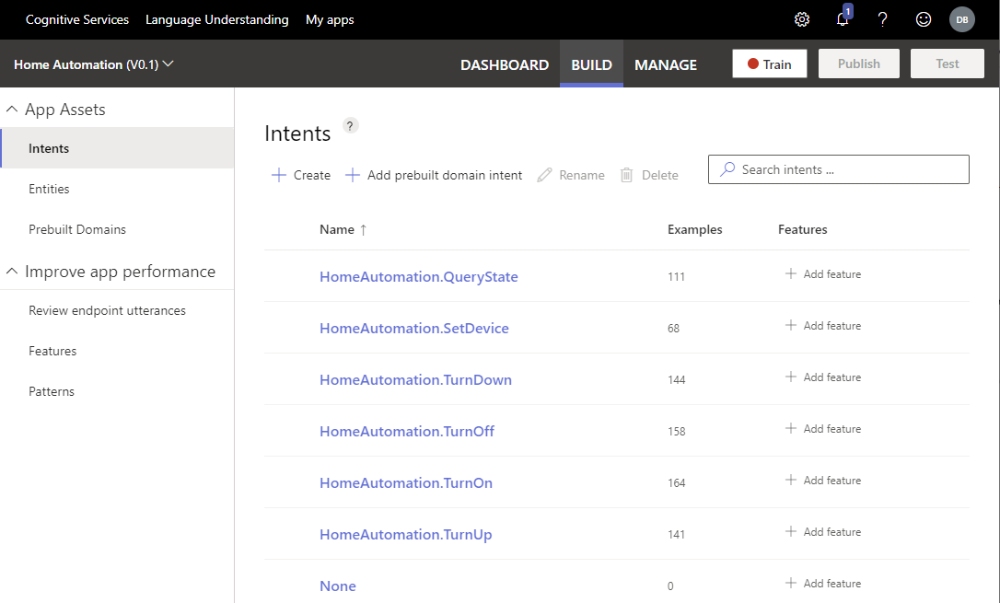
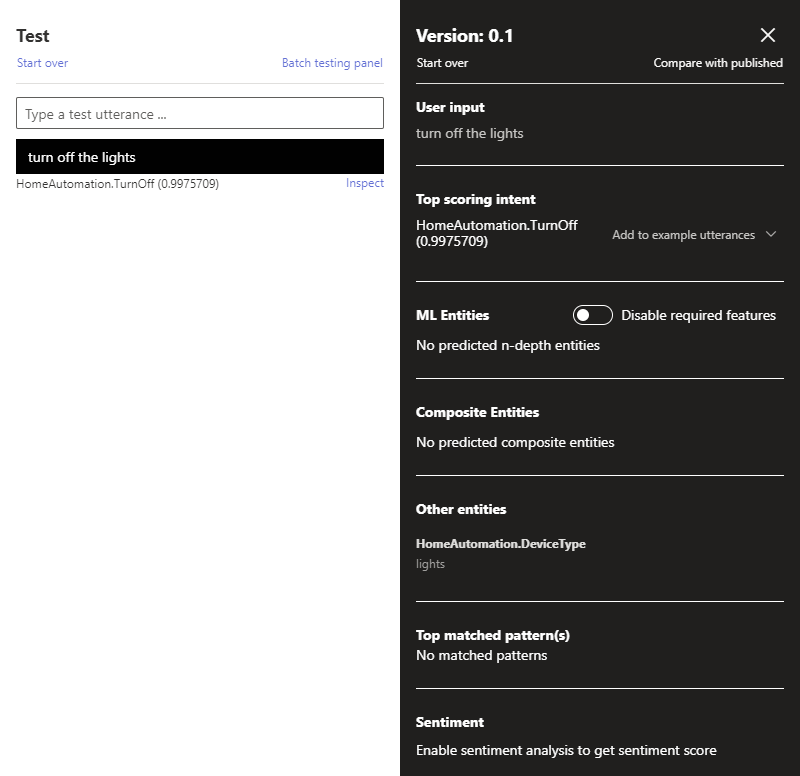
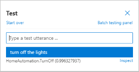

# Quickstart: Use prebuilt Home automation app

In this quickstart, create a LUIS app that uses the prebuilt domain `HomeAutomation` for turning lights and appliances on and off. This prebuilt domain provides intents, entities, and example utterances for you. When you're finished, you'll have a LUIS endpoint running in the cloud.

## Prerequisites

For this article, you need a free LUIS account, created on the LUIS portal at [https://www.luis.ai](https://www.luis.ai). 

[!INCLUDE [Sign in to LUIS](./includes/sign-in-process.md)]

## Create a new app
You can create and manage your applications on **My Apps**. 

2. Select **Create new app**.

    [](media/luis-quickstart-new-app/app-list.png)

3. In the dialog box, name your application "Home Automation".

    [](media/luis-quickstart-new-app/create-new-app-dialog.png)

4. Choose your application culture. For this Home Automation app, choose English. Then select **Done**. LUIS creates the Home Automation app. 

    >[!NOTE]
    >The culture cannot be changed once the application is created. 

## Add prebuilt domain

Select **Prebuilt domains** in the left-side navigation pane. Then search for "Home". Select **Add domain**.

[](media/luis-quickstart-new-app/home-automation.png)

When the domain is successfully added, the prebuilt domain box displays a **Remove domain** button.

[](media/luis-quickstart-new-app/remove-domain.png)

## Intents and entities

Select **Intents** in the left-side navigation pane to review the HomeAutomation domain intents. Each intent has sample utterances.

]

> [!NOTE]
> **None** is an intent provided by all LUIS apps. You use it to handle utterances that don't correspond to functionality your app provides. 

Select the **HomeAutomation.TurnOff** intent. You can see that the intent contains a list of utterances that are labeled with entities.

[](media/luis-quickstart-new-app/home-automation-turnoff.png)

## Train the LUIS app

[!INCLUDE [LUIS How to Train steps](../../../includes/cognitive-services-luis-tutorial-how-to-train.md)]

## Test your app
Once you've trained your app, you can test it. Select **Test** in the top navigation. Type a test utterance like "Turn off the lights" into the Interactive Testing pane, and press Enter. 

```
Turn off the lights
```

Check that the top scoring intent corresponds to the intent you expected for each test utterance.

In this example, `Turn off the lights` is correctly identified as the top scoring intent of **HomeAutomation.TurnOff**.

[](media/luis-quickstart-new-app/test.png)


Select **Inspect** to review more information about the prediction.



Select **Test** again to collapse the test pane. 

<a name="publish-your-app"></a>

## Publish the app to get the endpoint URL

[!INCLUDE [LUIS How to Publish steps](../../../includes/cognitive-services-luis-tutorial-how-to-publish.md)]

## Query the V2 API prediction endpoint

1. [!INCLUDE [LUIS How to get endpoint first step](../../../includes/cognitive-services-luis-tutorial-how-to-get-endpoint.md)] 

1. Go to the end of the URL in the address and enter `turn off the living room light`, and then press Enter. 

    #### [V2 prediction endpoint](#tab/V2)

    ```text
    https://\<region>.api.cognitive.microsoft.com/luis/**v2.0**/apps/\<appID>?verbose=true&subscription-key=\<YOUR_KEY>&**q=\<user-utterance-text>**
    ```

    The browser displays the **V2 API** version of the JSON response of your HTTP endpoint.

    ```json
    {
      "query": "turn off the living room light",
      "topScoringIntent": {
        "intent": "HomeAutomation.TurnOff",
        "score": 0.9753089
      },
      "intents": [
        {
          "intent": "HomeAutomation.TurnOff",
          "score": 0.9753089
        },
        {
          "intent": "HomeAutomation.QueryState",
          "score": 0.01027893
        },
        {
          "intent": "HomeAutomation.TurnUp",
          "score": 0.006881481
        },
        {
          "intent": "HomeAutomation.SetDevice",
          "score": 0.006786365
        },
        {
          "intent": "HomeAutomation.TurnDown",
          "score": 0.005145787
        },
        {
          "intent": "HomeAutomation.TurnOn",
          "score": 0.004114749
        },
        {
          "intent": "None",
          "score": 0.000598924
        }
      ],
      "entities": [
        {
          "entity": "living room",
          "type": "HomeAutomation.Location",
          "startIndex": 13,
          "endIndex": 23,
          "score": 0.94558233
        },
        {
          "entity": "living room light",
          "type": "HomeAutomation.DeviceName",
          "startIndex": 13,
          "endIndex": 29,
          "resolution": {
            "values": [
              "living room light"
            ]
          }
        },
        {
          "entity": "light",
          "type": "HomeAutomation.DeviceType",
          "startIndex": 25,
          "endIndex": 29,
          "resolution": {
            "values": [
              "light"
            ]
          }
        }
      ]
    }
    ```
    
    #### [V3 prediction endpoint](#tab/V3)

    For a [V3 API query](luis-migration-api-v3.md), in the browser, change the GET method HTTPS request, changing out the values in angle brackets for your own values.     

    Without `verbose=true`:

    `
    https://\<region>.api.cognitive.microsoft.com/luis/**v3.0-preview**/apps/\<appID>/**slots**/**production**/**predict**?subscription-key=\<YOUR_KEY>&**query=\<user-utterance-text>**
    `

    ```json
    {
        "query": "turn off the lights",
        "prediction": {
            "normalizedQuery": "turn off the lights",
            "topIntent": "HomeAutomation.TurnOff",
            "intents": {
                "HomeAutomation.TurnOff": {
                    "score": 0.99649024
                }
            },
            "entities": {
                "HomeAutomation.DeviceType": [
                    [
                        "light"
                    ]
                ]
            }
        }
    }
    ```

    With `verbose=true`:

    `
    https://\<region>.api.cognitive.microsoft.com/luis/**v3.0-preview**/apps/\<appID>/**slots**/**production**/**predict**?verbose=true&subscription-key=\<YOUR_KEY>&**query=\<user-utterance-text>**
    `

    ```json
    {
        "query": "turn off the lights",
        "prediction": {
            "normalizedQuery": "turn off the lights",
            "topIntent": "HomeAutomation.TurnOff",
            "intents": {
                "HomeAutomation.TurnOff": {
                    "score": 0.99649024
                }
            },
            "entities": {
                "HomeAutomation.DeviceType": [
                    [
                        "light"
                    ]
                ],
                "$instance": {
                    "HomeAutomation.DeviceType": [
                        {
                            "type": "HomeAutomation.DeviceType",
                            "text": "lights",
                            "startIndex": 13,
                            "length": 6,
                            "modelTypeId": 5,
                            "modelType": "List Entity Extractor",
                            "recognitionSources": [
                                "model"
                            ]
                        }
                    ]
                }
            }
        }
    }
    ```

    Learn more about the [V3 prediction endpoint](luis-migration-api-v3.md).
    
    * * * 

## Clean up resources

[!INCLUDE [LUIS How to clean up resources](../../../includes/cognitive-services-luis-tutorial-how-to-clean-up-resources.md)]

## Next steps

You can call the endpoint from code:

> [!div class="nextstepaction"]
> [Call a LUIS endpoint using code](luis-get-started-cs-get-intent.md)
