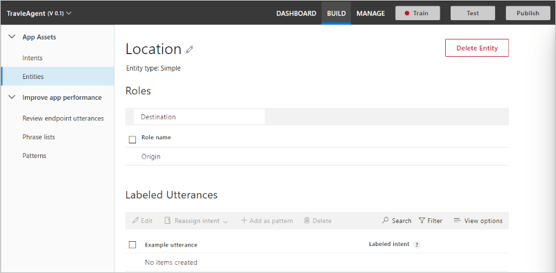
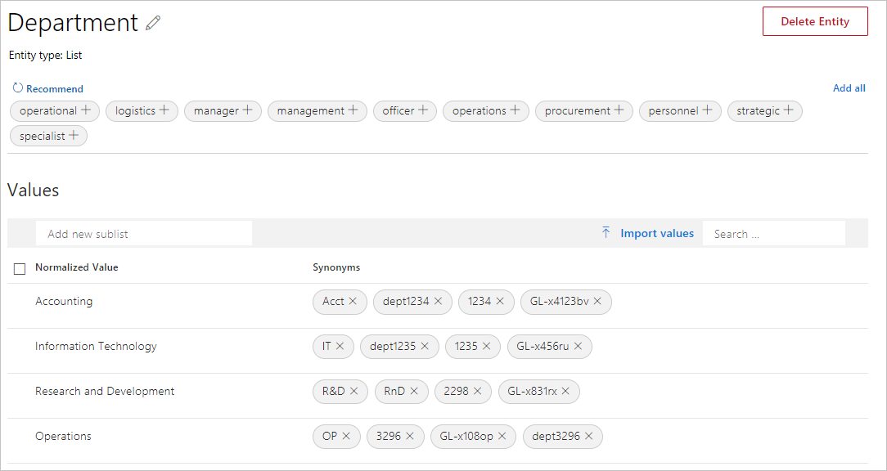
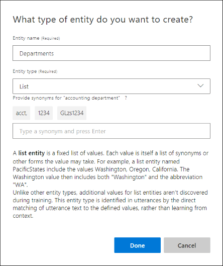
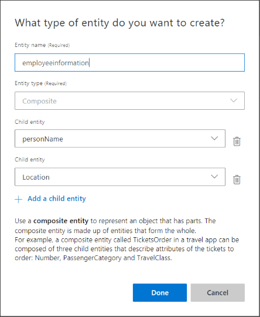
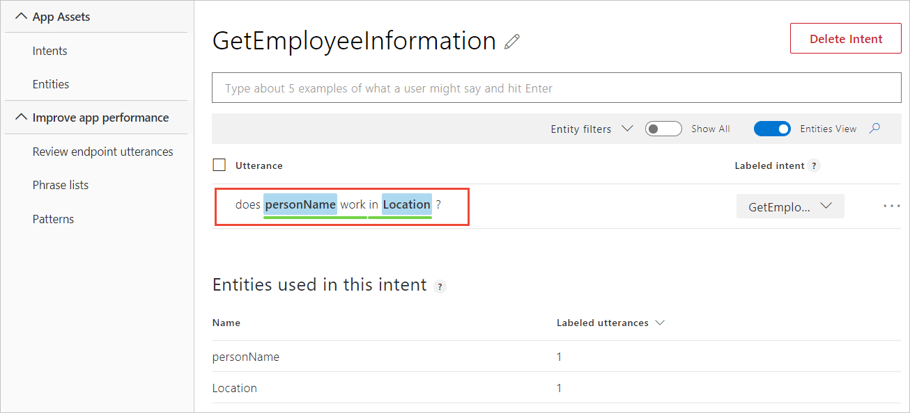
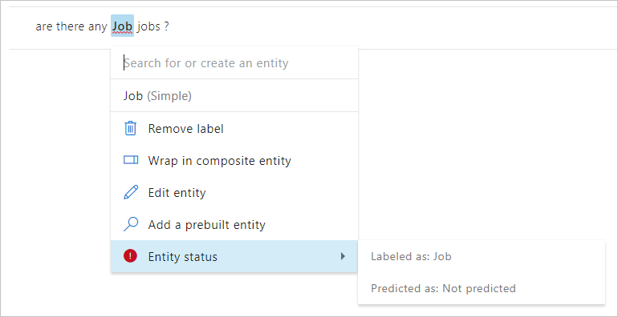

# Add entities to extract data

Create entities to extract key data from user utterances in Language Understanding (LUIS) apps. Extracted entity data is used by the client application to fullfil customer requests.

The entity represents a word or phrase inside the utterance that you want extracted. Entities describe information relevant to the intent, and sometimes they are essential for your app to perform its task. You can create entities when you add an utterance to an intent or apart from (before or after) adding an utterance to an intent.

You can add, edit, or delete entities in your LUIS app through the **Entities list** on the **Entities** page or while labeling an utterance in the intent details page. 

To take advantage of [decomposable concepts](luis-concept-model.md#v3-authoring-model-decomposition), start with the machine-learned entity. Follow the [machine-learned entity tutorial](tutorial-machine-learned-entity.md) for steps on how to create this type of entity. 

Once a machine-learned entity is created, you need to label that entity when it appears in an example utterance.

[!INCLUDE [Uses preview portal](includes/uses-portal-preview.md)]

<a name="add-prebuilt-entity"></a>

## Create entity on Entity page

### Add a prebuilt entity to your app

Common prebuilt entities added to an application are *number* and *datetimeV2*. 

1. In your app, from the **Build** section, select **Entities** in the left panel.
 
1. On the **Entities** page, select **Add prebuilt entities**.

1. In **Add prebuilt entities** dialog box, select the **number** and **datetimeV2** prebuilt entities. Then select **Done**.

    

<a name="add-simple-entities"></a>

### Add simple entities for single concepts

A simple entity describes a single concept. Use the following procedure to create an entity that extracts company department names such as *Human resources* or *Operations*.   

1. In your app, select the **Build** section, then select **Entities** in the left panel, then select **Create new entity**.

1. In the pop-up dialog box, type `Location` in the **Entity name** box, select **Simple** from the **Entity type** list, and then select **Done**.

    Once this entity is created, go to all intents that have example utterances that contain the entity. Select the text in the example utterance and mark the text as the entity. 

    A [phrase list](luis-concept-feature.md) is commonly used to boost the signal of a simple entity.

<a name="add-regular-expression-entities"></a>

### Add regular expression entities for highly structured concepts

A regular expression entity is used to pull out data from the utterance based on a regular expression you provide. 

1. In your app, select **Entities** from the left navigation, and then select **Create new entity**.

1. In the pop-up dialog box, enter `Human resources form name` in the **Entity name** box,  select **Regular expression** from the **Entity type** list, enter the regular expression `hrf-[0-9]{6}`, and then select **Done**. 

    This regular expression matches literal characters `hrf-`, then 6 digits to represent a form number for a Human resources form.

<a name="add-composite-entities"></a>

### Add composite entities to group into a parent-child relationship

You can define relationships between entities of different types by creating a composite entity. In the following example, the entity contains a regular expression, and a prebuilt entity of name.  

In the utterance `Send hrf-123456 to John Smith`, the text `hrf-123456` is matched to a human resources [regular expression](#add-regular-expression-entities) and `John Smith` is extracted with the prebuilt entity personName. Each entity is part of a larger, parent entity. 

1. In your app, select **Entities** from the left navigation of the **Build** section, and then select **Add prebuilt entity**.

1. Add the prebuilt entity **PersonName**. For instructions, see [Add Prebuilt Entities](#add-prebuilt-entity). 

1. Select **Entities** from the left navigation, and then select **Create new entity**.

1. In the pop-up dialog box, enter `SendHrForm` in the **Entity name** box, then select **Composite** from the **Entity type** list.

1. Select **Add Child** to add a new child.

1. In **Child #1**, select the entity **number** from the list.

1. In **Child #2**, select the entity **Human resources form name** from the list. 

1. Select **Done**.

<a name="add-pattern-any-entities"></a>

### Add Pattern.any entities to capture free-form entities

[Pattern.any](luis-concept-entity-types.md) entities are only valid in [patterns](luis-how-to-model-intent-pattern.md), not intents. This type of entity helps LUIS find the end of entities of varying length and word choice. Because this entity is used in a pattern, LUIS knows where the end of the entity is in the utterance template.

If an app has a `FindHumanResourcesForm` intent, the extracted form title may interfere with the intent prediction. In order to clarify which words are in the form title, use a Pattern.any within a pattern. The LUIS prediction begins with the utterance. First, the utterance is checked and matched for entities, when the entities are found, then the pattern is checked and matched. 

In the utterance `Where is Request relocation from employee new to the company on the server?`, the form title is tricky because it is not contextually obvious where the title ends and where the rest of the utterance begins. Titles can be any order of words including a single word, complex phrases with punctuation, and nonsensical ordering of words. A pattern allows you to create an entity where the full and exact entity can be extracted. Once the title is found, the `FindHumanResourcesForm` intent is predicted because that is the intent for the pattern.

1. From the **Build** section, select **Entities** in the left panel, and then select **Create new entity**.

1. In the **Add Entity** dialog box, enter `HumanResourcesFormTitle` in the **Entity name** box, and select **Pattern.any** as the **Entity type**.

    To use the pattern.any entity, add a pattern on the **Patterns** page, in the **Improve app performance** section, with the correct curly brace syntax, such as `Where is **{HumanResourcesFormTitle}** on the server?`.

    If you find that your pattern, when it includes a Pattern.any, extracts entities incorrectly, use an [explicit list](luis-concept-patterns.md#explicit-lists) to correct this problem. 

<a name="add-a-role-to-pattern-based-entity"></a>

### Add a role to distinguish different contexts

A role is a named subtype based on context. It is available in all entities including prebuilt and non-machine-learned entities. 

The syntax for a role is **`{Entityname:Rolename}`** where the entity name is followed by a colon, then the role name. For example, `Move {personName} from {Location:Origin} to {Location:Destination}`.

1. From the **Build** section, select **Entities** in the left panel.

1. Select **Create new entity**. Enter the name of `Location`. Select the type **Simple** and select **Done**. 

1. Select **Entities** from the left panel, then select the new entity **Location** created in the previous step.

1. In the **Role name** textbox, enter the name of the role `Origin` and enter. Add a second role name of `Destination`. 

    

<a name="add-list-entities"></a>

### Add list entities for exact matches

List entities represent a fixed, closed set of related words. 

For a Human Resources app, you can have a list of all departments along with any synonyms for the departments. You don't have to know all the values when you create the entity. You can add more after reviewing real user utterances with synonyms.

1. From the **Build** section, select **Entities** in the left panel, and then select **Create new entity**.

1. In the **Add Entity** dialog box, type `Department` in the **Entity name** box and select **List** as the **Entity type**. Select **Done**.
  
1. The list entity page allows you to add normalized names. In the **Values** textbox, enter a department name for the list, such as `HumanResources` then press Enter on the keyboard. 

1. To the right of the normalized value, enter synonyms, pressing Enter on the keyboard after each item.

1. If you want more normalized items for the list, select **Recommend** to see options from the [semantic dictionary](luis-glossary.md#semantic-dictionary).

    


1. Select an item in the recommended list to add it as a normalized value or select **Add all** to add all the items. 
    You can import values into an existing list entity using the following JSON format:

    ```JSON
    [
        {
            "canonicalForm": "Blue",
            "list": [
                "navy",
                "royal",
                "baby"
            ]
        },
        {
            "canonicalForm": "Green",
            "list": [
                "kelly",
                "forest",
                "avacado"
            ]
        }
    ]  
    ```

<a name="change-entity-type"></a>

## Do not change entity type

LUIS does not allow you to change the type of the entity because it doesn't know what to add or remove to construct that entity. In order to change the type, it is better to create a new entity of the correct type with a slightly different name. Once the entity is created, in each utterance, remove the old labeled entity name and add the new entity name. Once all the utterances have been relabeled, delete the old entity. 

<a name="create-a-pattern-from-an-utterance"></a>

## Create a pattern from an example utterance

See [Add pattern from existing utterance on intent or entity page](luis-how-to-model-intent-pattern.md#add-pattern-from-existing-utterance-on-intent-or-entity-page).

## Train your app after changing model with entities

After you add, edit, or remove entities, [train](luis-how-to-train.md) and [publish](luis-how-to-publish-app.md) your app for your changes to affect endpoint queries. 

## Create and label entity on Intent's detail page

You can create and label and entity in the Intent's detail page. This allows you to, after training, see how the entity is applied to the remaining example utterances. 

## Labeling entities in example utterances

When you select text in the example utterance to label for an entity, an in-place pop-up menu appears. Use this menu to either create or select an entity. 

You can't label entity types that use text matching because they are labeled automatically. 

## Add a list entity

List entities represent a set of exact text matches of related words in your system. 

For a company's department list, you can have normalized values: `Accounting` and `Human Resources`. Each normalized name has synonyms. For a department, these synonyms can include any department acronyms, numbers, or slang. You don't have to know all the values when you create the entity. You can add more after reviewing real user utterances with synonyms.

1. In an example utterance on the **Intents** page, select the word or phrase that you want in the new list. When the entity drop-down appears, enter the name for the new list entity in the top textbox, then select **Create new entity**.   

1. In the **What type of entity do you want to create?** pop-up box, name the entity and select **List** as the type. Add synonyms of this list item, then select **Done**. 

    

    You can add more list items or more item synonyms by labeling other utterances, or by editing the entity from the **Entities** in the left navigation. [Editing](luis-how-to-add-entities.md#add-list-entities) the entities gives you the options of entering additional items with corresponding synonyms or importing a list. 

## Add a composite entity

Composite entities are created from existing **Entities** to form a parent entity. 

Assuming the utterance, `Does John Smith work in Seattle?`, a composite utterance can return entity information of the employee name `John Smith`, and the location `Seattle` in a composite entity. The child entities must already exist in the app and be marked in the example utterance before creating the composite entity.

1. To wrap the child entities into a composite entity, select the **first** labeled entity (left-most) in the utterance for the composite entity. A drop-down list appears to show the choices for this selection.

1. Select **Wrap in composite entity** from the drop-down list. 

1. Select the last word of the composite entity (right-most). Notice a green line follows the composite entity. This is the visual indicator for a composite entity and should be under all words in the composite entity from the left-most child entity to the right-most child entity.

1. Enter the composite entity name in the drop-down list.

    When you wrap the entities correctly, a green line is under the entire phrase.

1. Validate the composite entity details on the **What type of entity do you want to create?** pop-up box then select **Done**.

    

1. The composite entity displays with both blue highlights for individual entities and a green underline for the entire composite entity. 

    

## Add entity's role to utterance

A role is a named subtype of an entity, determined by the context of the utterance. You can mark an entity within an utterance as the entity, or select a role within that entity. Any entity can have roles including custom entities that are machine-learned (simple entities and composite entities), are not machine-learned (prebuilt entities, regular expression entities, list entities). 

Learn [how to mark an utterance with entity roles](tutorial-entity-roles.md) from a hands-on tutorial. 

## Entity status predictions

When you enter a new utterance in the LUIS portal, the utterance may have entity prediction errors. The prediction error is a difference between how an entity is labeled compared with how LUIS has predicted the entity. 

This difference is visually represented in the LUIS portal with a red underline in the utterance. The red underline may appear in entity brackets or outside of brackets. 


Select the words that are underlined in red in the utterance. 

The entity box displays the **Entity status** with a red exclamation mark if there is a prediction discrepancy. To see the Entity status with information about the difference between labeled and predicted entities, select **Entity status** then select the item to the right.



The red-line can appear at any of the following times:

   * When an utterance is entered but before the entity is labeled
   * When the entity label is applied
   * When the entity label is removed
   * When more than one entity label is predicted for that text 

The following solutions help resolve the entity prediction discrepancy:

|Entity|Visual indicator|Prediction|Solution|
|--|--|--|--|
|Utterance entered, entity isn't labeled yet.|red underline|Prediction is correct.|Label the entity with the predicted value.|
|Unlabeled text|red underline|Incorrect prediction|The current utterances using this incorrect entity need to be reviewed across all intents. The current utterances have mistaught LUIS that this text is the predicted entity.
|Correctly labeled text|blue entity highlight, red underline|Incorrect prediction|Provide more utterances with the correctly labeled entity in a variety of places and usages. The current utterances are either not sufficient to teach LUIS that this is the entity is or similar entities appear in the same context. Similar entity should be combined into a single entity so LUIS isn't confused. Another solution is to add a phrase list to boost the significance of the words. |
|Incorrectly labeled text|blue entity highlight, red underline|Correct prediction| Provide more utterances with the correctly labeled entity in a variety of places and usages. 

## Other actions

You can perform actions on example utterances as a selected group or as an individual item. Groups of selected example utterances change the contextual menu above the list. Single items may use both the contextual menu above the list and the individual contextual ellipsis at the end of each utterance row. 

### Remove entity labels from utterances

You can remove machine-learned entity labels from an utterance on the Intents page. If the entity is not machine-learned, it can't be removed from an utterance. If you need to remove a non-machine-learned entity from the utterance, you need to delete the entity from the entire app. 

To remove a machine-learned entity label from an utterance, select the entity in the utterance. Then select **Remove Label** in the entity drop-down box that appears.

### Add a prebuilt entity label

When you add the prebuilt entities to your LUIS app, you don't need to tag utterances with these entities. To learn more about prebuilt entities and how to add them, see [Add entities](luis-how-to-add-entities.md#add-a-prebuilt-entity-to-your-app).

### Add a regular expression entity label

If you add the regular expression entities to your LUIS app, you don't need to tag utterances with these entities. To learn more about regular expression entities and how to add them, see [Add entities](luis-how-to-add-entities.md#add-regular-expression-entities-for-highly-structured-concepts).


### Create a pattern from an utterance

See [Add pattern from existing utterance on intent or entity page](luis-how-to-model-intent-pattern.md#add-pattern-from-existing-utterance-on-intent-or-entity-page).


### Add a pattern.any entity

If you add the pattern.any entities to your LUIS app, you can't label utterances with these entities. They are only valid in patterns. To learn more about pattern.any entities and how to add them, see [Add entities](luis-how-to-add-entities.md#add-patternany-entities-to-capture-free-form-entities).

## Train your app after changing model with utterances

After you add, edit, or remove utterances, [train](luis-how-to-train.md) and [publish](luis-how-to-publish-app.md) your app for your changes to affect endpoint queries. 

## Learn more about creating and labeling entities

[!INCLUDE [Create and label entities in machine-learned tutorial](includes/decomposable-tutorial-links.md)]

## Next steps

For more information about prebuilt entities, see the [Recognizers-Text](https://github.com/Microsoft/Recognizers-Text) project. 

For information about how the entity appears in the JSON endpoint query response, see [Data Extraction](luis-concept-data-extraction.md)

Now that you have added intents, utterances and entities, you have a basic LUIS app. Learn how to [train](luis-how-to-train.md), [test](luis-interactive-test.md), and [publish](luis-how-to-publish-app.md) your app.
 
