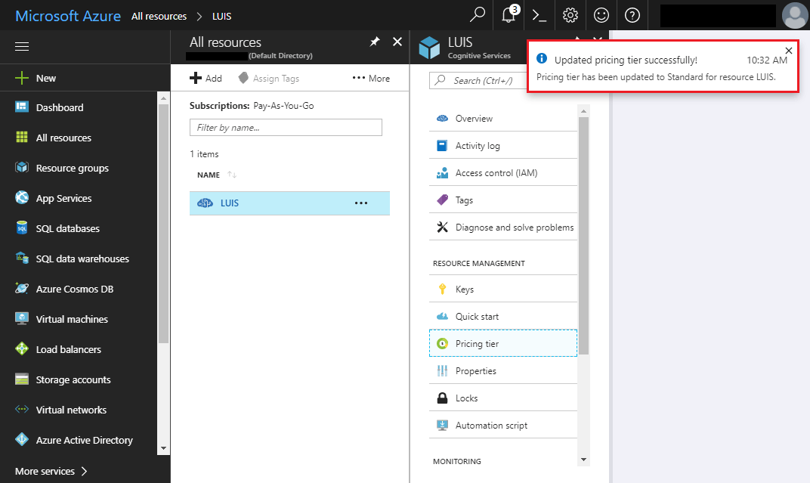
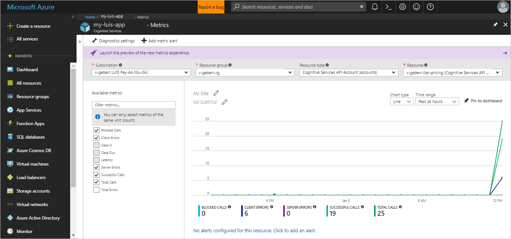

# Using subscription keys with your LUIS app

For testing and prototype only, use the free (F0) tier. For production systems, use a [paid](https://aka.ms/luis-price-tier) tier. 

> [!NOTE]
> Do not use the [authoring key](luis-concept-keys.md#authoring-key) for endpoint queries in production.

<a name="create-luis-service"></a>
## Create LUIS endpoint key

1. Sign in to **[Microsoft Azure](https://ms.portal.azure.com/)**. 
2. Click the green **+** sign in the upper left-hand panel and search for “LUIS” in the marketplace, then click on **Language Understanding** and follow the **create experience** to create a LUIS subscription account. 

     

3. Configure the subscription with settings including account name, pricing tiers, etc. 

     

4. Once you create the LUIS service, you can view the access keys generated in **Resource Management->Keys**.  

    

    > [!Note] 
    > Sign in to your region's [LUIS](luis-reference-regions.md) website and [assign the new LUIS endpoint key](luis-how-to-manage-keys.md#assign-endpoint-key). You need the name of the LUIS subscription from step 3.

## Change LUIS pricing tier

1.  In [Azure](https://portal.azure.com), find your LUIS subscription. Click the LUIS subscription.
    
2.  Click **Pricing tier** in order to see the available pricing tiers. 
    
3.  Click the pricing tier and click **Select** to save your change. 
    
4.  When the pricing change is complete, a pop-up window verifies the new pricing tier. 
    
5. Remember to [assign this endpoint key](luis-how-to-manage-keys.md#assign-endpoint-key) on the **Publish** page and use it in all endpoint queries. 

## Exceed pricing tier usage
Each tier allows endpoint requests to your LUIS account at a specific rate. If the rate of requests is higher than the allowed rate of your metered account per minute or per month, requests receive an HTTP error of "429: Too Many Requests."

Each tier allows accumulative requests per month. If the total requests are higher than the allowed rate, requests receive an HTTP error of "403: forbidden".  

## Viewing summary usage
You can view LUIS usage information in Azure. The **Overview** page shows recent summary information including calls and errors. If you make a LUIS endpoint request, then immediately watch the **Overview page**, allow up to five minutes for the usage to show up.


## Customizing usage charts
Metrics provides a more detailed view into the data.


You can configure your metrics charts for time period and metric type. 



## Total transactions threshold alert
If you would like to know when you have reached a certain transaction threshold, for example 10,000 transactions, you can create an alert. 


Add a metric alert for the **total calls** metric for a certain time period. Add email addresses of all people that should receive the alert. Add webhooks for all systems that should receive the alert. You can also run a logic app when the alert is triggered. 

# Add an Azure LUIS resource to app

After you create a LUIS resource in the Azure portal, assign the resource to the LUIS app and get the correct endpoint URL. Use this endpoint URL to get LUIS predictions.

<a name="programmatic-key" ></a>
<a name="authoring-key" ></a>
<a name="endpoint-key" ></a>
<a name="use-endpoint-key-in-query" ></a>
<a name="api-usage-of-ocp-apim-subscription-key" ></a>
<a name="key-limits" ></a>
<a name="key-limit-errors" ></a>
<a name="key-concepts"></a>
<a name="authoring-key"></a>
<a name="create-and-use-an-endpoint-key"></a>
<a name="assign-endpoint-key"></a>
<a name="assign-resource"></a>


## Assign resource in LUIS Portal

1. Create a LUIS key on the [Azure portal](https://portal.azure.com). For further instructions, see [Creating an endpoint key using Azure](luis-how-to-azure-subscription.md).
 
2. Select **Manage** in the top right menu, then select **Keys and endpoints**.

    [  ](./media/luis-manage-keys/keys-and-endpoints.png#lightbox)

3. In order to add the LUIS, select **Assign Resource +**.

    

4. Select a Tenant in the dialog associated with the email address you login with to the LUIS website.  

5. Choose the **Subscription Name** associated with the Azure resource you want to add.

6. Select the **LUIS resource name**. 

7. Select **Assign resource**. 

8. Find the new row in the table and copy the endpoint URL. It is correctly constructed to make an HTTP GET request to the LUIS endpoint for a prediction. 

<!-- content moved to luis-reference-regions.md, need replacement links-->
<a name="regions-and-keys"></a>
<a name="publishing-to-europe"></a>
<a name="publishing-to-australia"></a>

### Unassign resource
When you unassign the endpoint key, it is not deleted from Azure. It is only unlinked from LUIS. 

When an endpoint key is unassigned, or not assigned to the app, any request to the endpoint URL returns an error: `401 This application cannot be accessed with the current subscription`. 

### Include all predicted intent scores
The **Include all predicted intent scores** checkbox allows the endpoint query response to include the prediction score for each intent. 

This setting allows your chatbot or LUIS-calling application to make a programmatic decision based on the scores of the returned intents. Generally the top two intents are the most interesting. If the top score is the None intent, your chatbot can choose to ask a follow-up question that makes a definitive choice between the None intent and the other high-scoring intent. 

The intents and their scores are also included the endpoint logs. You can [export](luis-how-to-start-new-app.md#export-app) those logs and analyze the scores. 

```JSON
{
  "query": "book a flight to Cairo",
  "topScoringIntent": {
    "intent": "None",
    "score": 0.5223427
  },
  "intents": [
    {
      "intent": "None",
      "score": 0.5223427
    },
    {
      "intent": "BookFlight",
      "score": 0.372391433
    }
  ],
  "entities": []
}
```

### Enable Bing spell checker 
In the **Endpoint url settings**, the **Bing spell checker** toggle allows LUIS to correct misspelled words before prediction. Create a **[Bing Spell Check key](https://azure.microsoft.com/try/cognitive-services/?api=spellcheck-api)**. 

Add the **spellCheck=true** querystring parameter and the **bing-spell-check-subscription-key={YOUR_BING_KEY_HERE}** . Replace the `{YOUR_BING_KEY_HERE}` with your Bing spell checker key.

```JSON
{
  "query": "Book a flite to London?",
  "alteredQuery": "Book a flight to London?",
  "topScoringIntent": {
    "intent": "BookFlight",
    "score": 0.780123
  },
  "entities": []
}
```


### Publishing regions

Learn more about publishing [regions](luis-reference-regions.md) including publishing in [Europe](luis-reference-regions.md#publishing-to-europe), and [Australia](luis-reference-regions.md#publishing-to-australia). Publishing regions are different from authoring regions. Create an app in the authoring region corresponding to the publishing region you want for the query endpoint.

## Assign resource without LUIS portal

For automation purposes such as a CI/CD pipeline, you may want to automate the assignment of a LUIS resource to a LUIS app. In order to that, you need to perform the following steps:

1. Get an Azure Resource Manager token from this [website](https://resources.azure.com/api/token?plaintext=true). This token does expire so use it immediately. The request returns an Azure Resource Manager token.

    

1. Use the token to request the LUIS resources across subscriptions, from the [Get LUIS azure accounts API](https://westus.dev.cognitive.microsoft.com/docs/services/5890b47c39e2bb17b84a55ff/operations/5be313cec181ae720aa2b26c), your user account has access to. 

    This POST API requires the following settings:

    |Header|Value|
    |--|--|
    |`Authorization`|The value of `Authorization` is `Bearer {token}`. Notice that the token value must be preceded by the word `Bearer` and a space.| 
    |`Ocp-Apim-Subscription-Key`|Your [authoring key](luis-how-to-account-settings.md).|

    This API returns an array of JSON objects of your LUIS subscriptions including subscription ID, resource group, and resource name, returned as account name. Find the one item in the array that is the LUIS resource to assign to the LUIS app. 

1. Assign the token to the LUIS resource with the [Assign a LUIS azure accounts to an application](https://westus.dev.cognitive.microsoft.com/docs/services/5890b47c39e2bb17b84a55ff/operations/5be32228e8473de116325515) API. 

    This POST API requires the following settings:

    |Type|Setting|Value|
    |--|--|--|
    |Header|`Authorization`|The value of `Authorization` is `Bearer {token}`. Notice that the token value must be preceded by the word `Bearer` and a space.|
    |Header|`Ocp-Apim-Subscription-Key`|Your [authoring key](luis-how-to-account-settings.md).|
    |Header|`Content-type`|`application/json`|
    |Querystring|`appid`|The LUIS app ID. 
    |Body||{"AzureSubscriptionId":"ddda2925-af7f-4b05-9ba1-2155c5fe8a8e",<br>"ResourceGroup": "resourcegroup-2",<br>"AccountName": "luis-uswest-S0-2"}|

    When this API is successful, it returns a 201 - created status. 

## Next steps

Use your key to publish your app in the **Publish app** page. For instructions on publishing, see [Publish app](luis-how-to-publish-app.md).

See [Keys in LUIS](luis-concept-keys.md) to understand LUIS authoring and endpoint key concepts.


## Next steps

Learn how to use [versions](luis-how-to-manage-versions.md) to manage changes to your LUIS app.