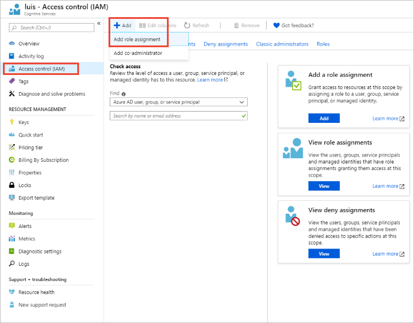
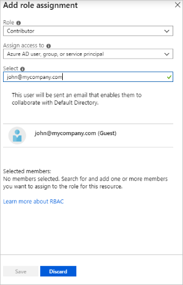

# Add contributors to your app

An app owner can add contributors to apps. These contributors can modify the model, train, and publish the app.

[!INCLUDE [Manage collaborators and contributors based on migrated or not-migrated apps](./includes/manage-contributor-collaborator-migration.md)]

## Add contributor to Azure authoring resource

The following procedure is for all users that have **migrated** to use the Azure authoring resource.

You have migrated if your LUIS authoring experience is tied to an Authoring resource on the **Manage -> Azure resources** page in the LUIS portal.

1. In the Azure portal, find the Language Understanding (LUIS) authoring resource. It has the type `LUIS.Authoring`.
1. On this resource's **Access Control (IAM)** page, select **+Add** then select **Add role assignment**.

    

1. In the **Add role assignment** window, select the **Role** of Contributor. In the **Assign access to** option, select **Azure AD user, group, or service principal**. In the **Select** option, enter the user's email address. If the user is known by more than 1 email address for the same domain, make sure the enter the _primary_ email account.

    

    When the user's email is found, select the account and select **Save**.

    If you have trouble with this role assignment, review [Azure role assignments](../../role-based-access-control/role-assignments-portal.md) and [Azure access control troubleshooting](../../role-based-access-control/troubleshooting.md#problems-with-azure-role-assignments).

## View the app as a contributor

After you have been added as a contributor, [sign in to the LUIS portal](sign-in-luis-portal.md). You may need to switch to a different Azure directory to see apps you've been shared on.

1. Click the avatar in the top right corner of the screen. Then click **Switch to a different Azure directory**. 
1. In the window that appears, be sure to select the Azure directory that contains the LUIS resource that was shared with you. 

    :::image type="content" source="media/migrate-authoring-key/switch-directories.png" alt-text="Switch directories" lightbox="media/migrate-authoring-key/switch-directories.png":::

### Users with multiple emails

If you add contributors to a LUIS app, you are specifying the exact email address. While Azure Active Directory (Azure AD) allows a single user to have more than one email account used interchangeably, LUIS requires the user to sign in with the email address specified when adding the contributor.

### Azure Active Directory resources

If you use [Azure Active Directory](../../active-directory/index.yml) (Azure AD) in your organization, Language Understanding (LUIS) needs permission to the information about your users' access when they want to use LUIS. The resources that LUIS requires are minimal.

You see the detailed description when you attempt to sign up with an account that has admin consent or does not require admin consent, such as administrator consent:

* Allows you to sign in to the app with your organizational account and let the app read your profile. It also allows the app to read basic company information. This gives LUIS permission to read basic profile data, such as user ID, email, name
* Allows the app to see and update your data, even when you are not currently using the app. The permission is required to refresh the access token of the user.

### Azure Active Directory tenant user

LUIS uses standard Azure Active Directory (Azure AD) consent flow.

The tenant admin should work directly with the user who needs access granted to use LUIS in the Azure AD.

* First, the user signs into LUIS, and sees the pop-up dialog needing admin approval. The user contacts the tenant admin before continuing.
* Second, the tenant admin signs into LUIS, and sees a consent flow pop-up dialog. This is the dialog the admin needs to give permission for the user. Once the admin accepts the permission, the user is able to continue with LUIS. If the tenant admin will not sign in to LUIS, the admin can access [consent](https://account.activedirectory.windowsazure.com/r#/applications) for LUIS, shown in the following screenshot. Notice the list is filtered to items that include the name `LUIS`.

If the tenant admin only wants certain users to use LUIS, there are a couple of possible solutions:
* Giving the "admin consent" (consent to all users of the Azure AD), but then set to "Yes" the "User assignment required" under Enterprise Application Properties, and finally assign/add only the wanted users to the Application. With this method, the Administrator is still providing "admin consent" to the App, however, it's possible to control the users that can access it.
* A second solution, is by using the [Azure AD identity and access management API in Microsoft Graph](/graph/azuread-identity-access-management-concept-overview) to provide consent to each specific user.

Learn more about Azure active directory users and consent:
* [Restrict your app](../../active-directory/develop/howto-restrict-your-app-to-a-set-of-users.md) to a set of users

## Next steps

* Learn [how to use versions](luis-how-to-manage-versions.md) to control your app life cycle.
* Understand the concepts including the [authoring resource](luis-how-to-azure-subscription.md#authoring-key) and [contributors](luis-how-to-azure-subscription.md#contributions-from-other-authors) on that resource.
* Learn [how to create](luis-how-to-azure-subscription.md) authoring and runtime resources
* Migrate to the new [authoring resource](luis-migration-authoring.md)