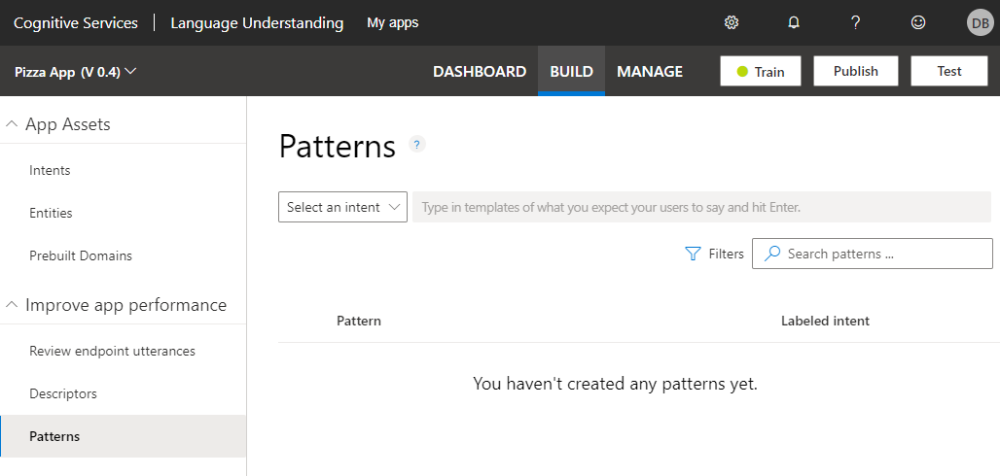
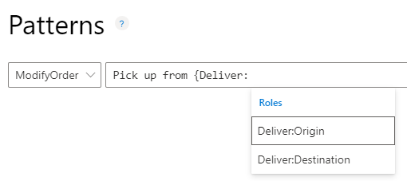

# How to add Patterns to improve prediction accuracy
After a LUIS app receives endpoint utterances, use the [concept](luis-concept-patterns.md) of Patterns to improve prediction accuracy for utterances that reveal a pattern in word order and word choice. Patterns use [entities](luis-concept-entity-types.md) and their roles to extract data using specific pattern syntax. 

## Add template utterance to create pattern
1. Open your app by selecting its name on **My Apps** page, and then select **Patterns** in the left panel, under **Improve app performance**.

    

2. Select the correct intent for the pattern. 

    

3. In the template textbox, type the template utterance and select Enter. When you want to enter the entity name, use the correct pattern entity syntax. Begin the entity syntax with `{`. The list of entities displays. Select the correct entity, and then select Enter. 

    

    If your entity includes a role, indicate the role with a single colon, `:`, after the entity name, such as `{Location:Origin}`. The list of roles for the entities displays in a list. Select the role, and then select Enter. 

    

    After you select the correct entity, finish entering the pattern, and then select Enter. When you are done entering patterns, [train](luis-how-to-train.md) your app.

    

## Search patterns
Searching allows you to find patterns that contain some given text.  

1. Select the magnifying glass icon.

    

    Type the search text in the search box at the top right corner of the patterns list and select Enter. The patterns list is updated to display only the patterns including your search text.

    

    To cancel the search and restore your full list of patterns, delete the search text you've typed.

<!-- TBD: should I be able to click on the magnifying glass again to close the search box? It doesn't reset the list. -->

## Edit a pattern
1. To edit a pattern, select the three dots (...) icon at the right end of the line for that pattern, then select **Edit**. 

     

2. Enter any changes in the text box. When you are done, select enter. When you are done editing patterns, [train](luis-how-to-train.md) your app.

    

## Reassign individual pattern to different intent

To reassign a single pattern to a different intent, select the intent list box to the right of the pattern text, and select a different intent.

## Reassign several patterns to different intent

To reassign several patterns to a different intent, select the checkbox to the left of each pattern or select the top checkbox. The **Reassign intent** option displays on the tool bar. Select the correct intent for the patterns. 

## Delete a single pattern

1. To delete a pattern, select the three dots (...) icon at the right end of the line for that pattern, then select **Delete**. 

    

2. Select **Ok** to confirm the deletion.

    

## Delete several patterns

1. To delete several patterns, select the checkbox to the left of each pattern or select the top checkbox. The **Delete patterns(s)** option displays on the tool bar. Select **Delete patterns(s)**.  

    

2. The **Delete patterns** confirmation dialog appears. Select **Ok** to finish the deletion.

    

## Filter pattern list by entity

To filter the list of patterns by a specific entity, select **Entity filters** in the toolbar above the patterns. 

After the filter is applied, the entity name appears below the tool bar. 

## Filter pattern list by intent

To filter the list of patterns by a specific intent, select **Intent filters** in the toolbar above the patterns. 

After the filter is applied, the intent name appears below the tool bar. 

## Remove entity or intent filter
When the pattern list is filtered, the entity or intent name appears below the toolbar. To remove the filter, select the name.

The filter is removed and all patterns display. 

## Add pattern from existing utterance on intent or entity page
You can create a pattern from an existing utterance on either the **Intent** or **Entity** page. All utterances on any intent or entity page are displayed in a list with the right column providing access to utterance-level options such as **Edit**, **Delete**, and **Add as pattern**.

1. On the selected row of the utterance, select the three dots (...) to the right of the utterance, and select **Add as pattern**.

    

2. Modify the pattern according to the [syntax rules](luis-concept-patterns.md#pattern-syntax). If the utterance you selected is labeled with entities, those entities are already in the pattern with the correct syntax.

    

## Train your app after changing model with patterns
After you add, edit, remove, or reassign a pattern, [train](luis-how-to-train.md) and [publish](PublishApp.md) your app for your changes to affect endpoint queries. 

## Next steps

Learn how to [build a pattern](luis-tutorial-pattern.md) with a pattern.any and roles
Learn how to [train](luis-how-to-train.md) your app