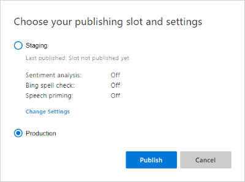

# Publish your trained app

When you finish building and testing your active LUIS app, make it available to your client application by publishing it to the endpoint. 

## Publishing

To publish to the endpoint, select **Publish** in the top, right panel. 

Select the correct slot when the pop-up window displays: staging or production. By using two publishing slots, this allows you to have two different versions with published endpoints or the same version on two different endpoints. 
 

When your app is successfully published, a green success notification appears at the top of the browser. The green notification bar also includes a link to the endpoints. 

If you need the endpoint URL, select the link. You can also get to the endpoint URLs by selecting **Manage** in the top menu, then select **Keys and Endpoints** in the left menu. 

## Configuring publish settings

Configure publish settings by selecting **Manage** in the top, right navigation, then selecting **Publish Settings**. 

### Publish after enabling sentiment analysis

Sentiment analysis allows LUIS to integrate with [Text Analytics](https://azure.microsoft.com/services/cognitive-services/text-analytics/) to provide sentiment and key phrase analysis. 

You do not have to provide a Text Analytics key and there is no billing charge for this service to your Azure account. Once you check this setting, it is persistent. 

Sentiment data is a score between 1 and 0 indicating the positive (closer to 1) or negative (closer to 0) sentiment of the data.

For more information about the JSON endpoint response with sentiment analysis, see [Sentiment analysis](luis-concept-data-extraction.md#sentiment-analysis)

## Next steps

* See [Manage keys](./luis-how-to-manage-keys.md) to add keys to Azure subscription key to LUIS and how to set the Bing Spell Check key and include all intents in results.
* See [Train and test your app](luis-interactive-test.md) for instructions on how to test your published app in the test console.

