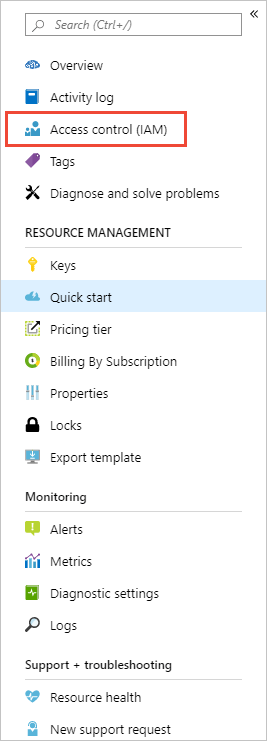

# Migration Steps

From the Language Understanding (LUIS) portal, migrate all the apps you own to use the Azure authoring resource.

## Prerequisites

* **Optionally**, backup the apps from the LUIS portal's apps list by exporting each app or use the export [API](https://westus.dev.cognitive.microsoft.com/docs/services/5890b47c39e2bb17b84a55ff/operations/5890b47c39e2bb052c5b9c40).
* **Optionally**, save each app's collaborator's list. This email list is provided as part of the migration process.
* **Required**, you need to have an [Azure subscription](https://azure.microsoft.com/en-us/free/). A part of the subscription process does require billing information. However, you can use Free (F0) pricing tiers when you use LUIS. You may eventually find you need a paid tier, as your usage increases. 

If you do not have an Azure subscription, [sign up](https://azure.microsoft.com/en-us/free/). 

## Find the migration process

On a weekly basis, you are prompted to migrate your apps. You can cancel this window without migrating. If you want to migrate before the next scheduled period, you can begin the migration process from the **Lock** icon on the top tool bar of the LUIS portal. 

## Begin the migration process

1. The migration pop-up window allows for you to continue the migration or migrate later. Select **Migrate now**. If you choose to migrate later, you have 9 months to migrate to the new authoring key in Azure.

    

1. Choose to create a LUIS authoring resource by selecting **Start by creating an authoring resource to migrate your apps to**. 

    

1. In the next window, enter your resource key information. After you enter the information, select **Create resource**. 

    

    When **creating a new authoring resource**, provide the following information: 

    * **Resource name** - a custom name you choose, used as part of the URL for your authoring and prediction endpoint queries.
    * **Tenant** - the tenant your Azure subscription is associated with. 
    * **Subscription name** - the subscription that will be billed for the resource.
    * **Resource group** - a custom resource group name you choose or create. Resource groups allow you to group Azure resources for access and management. 
    * **Location** - an Azure global region your authoring resource is in. The authoring region determines your available publishing regions.
    * **Pricing tier** - the pricing tier determines the maximum transaction per second and month. 

1. When the authoring resource is created, the success message is shown. Select **Close** to close the pop-up window.

    

## After the migration process, add contributors to your authoring resource

If your apps need to be authoring by other people, you need to add these contributors manually in the Azure portal's authoring resource, using each person's email address.

1. In the Azure portal, for the authoring resource, select the **Access control** page.

    

## Next steps

* Review [concepts](luis-concept-keys.md) about authoring and runtime keys
* Review [how to assign keys](luis-how-to-azure-subscription.md) and add [collaborators](luis-how-to-collaborate.md)