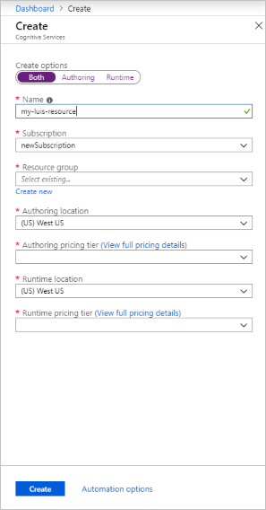
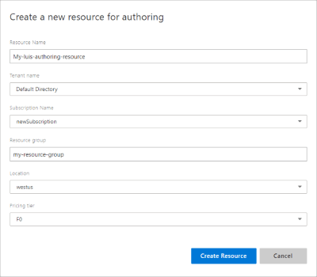

# Migration Steps

From the Language Understanding (LUIS) portal, migrate all the apps you own to use the Azure authoring resource.

## Find the migration process

On a regular basis, you are prompted to migrate your apps. You can cancel this window without migrating. If you want to migrate before the next scheduled period, you can begin the migration process from the **Lock** icon on the top tool bar of the LUIS portal. 

## Begin the migration process

Before you migrate to the Azure resource authoring experience, you need to have an Azure subscription. If you do not have an Azure subscription, [sign up](). 

1. Choose to migrate now or migrate later. You have 9 months to migrate to the new authoring key in Azure.

1. [Sign up to Azure](https://azure.microsoft.com/en-us/free/) and create your first subscription if you do not have an Azure subscription. 

1. Send email to your collaborators. Select the apps and its collaborators to notify your collaborators about the migration.

1. Choose or create a LUIS authoring resource.

    

    If you do not have a LUIS authoring resource, create one. 

    

    

    When **creating a new authoring resource**, provide the following information: 

    * **Resource name** - a custom name you choose, used as part of the URL for your authoring and prediction endpoint queries.
    * **Tenant** - the tenant your Azure subscription is associated with. 
    * **Resource group** - a custom resource group name you choose or create. Resource groups allow you to group Azure resources for access and management. 
    * **Location** - an Azure global region your authoring resource is in. LUIS has 3 regions for authoring. The authoring region determines your available publishing regions.
    * **Pricing tier** - the pricing tier determines the maximum transaction per second and month. 

## After migration process

If your apps (that you own) have collaborators, you need to add these collaborators manually in the Azure portal's authoring resource.

## Next steps

* Review [concepts](luis-concept-keys.md) about authoring and runtime keys
* Review [how to assign keys](luis-how-to-azure-subscription.md) and add [collaborators](luis-how-to-collaborate.md)