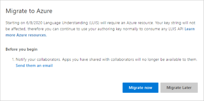
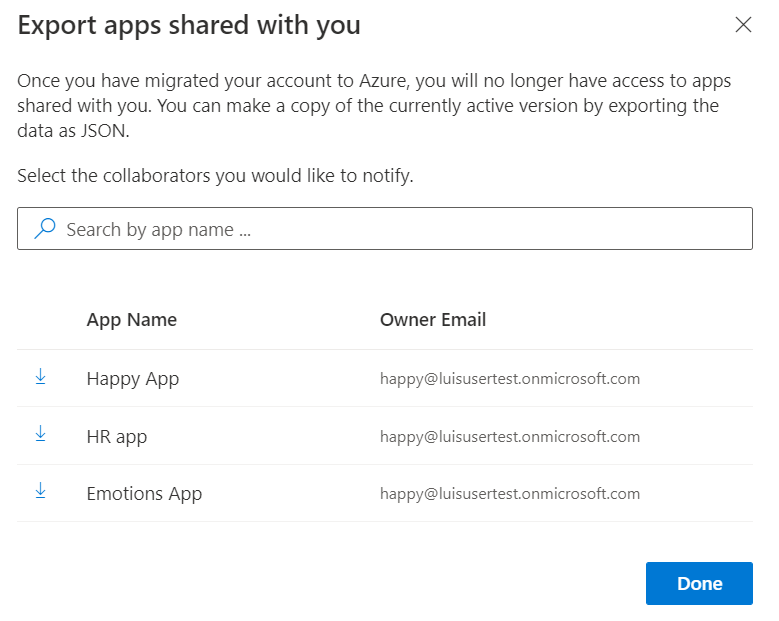
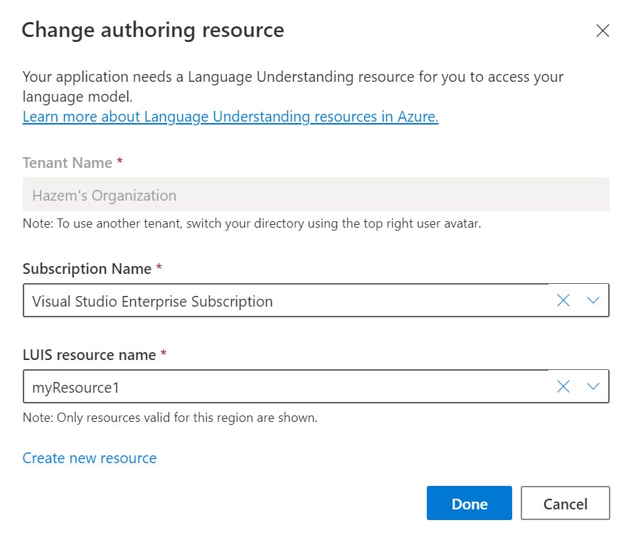
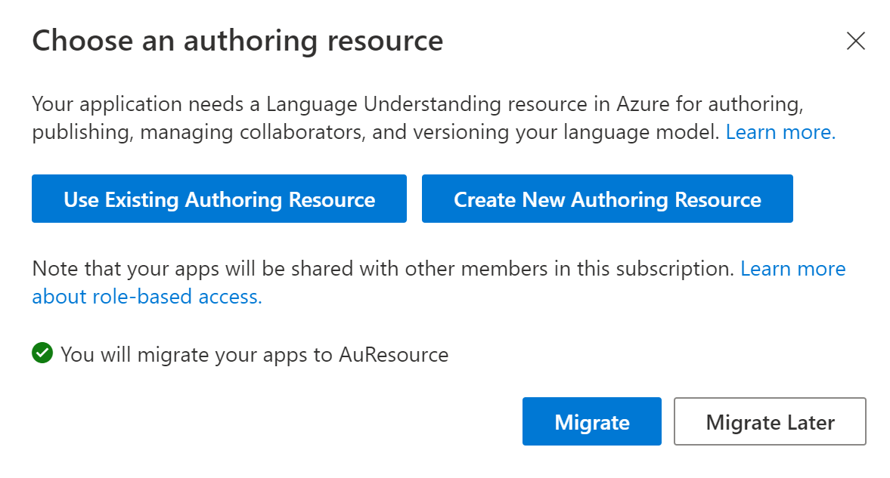
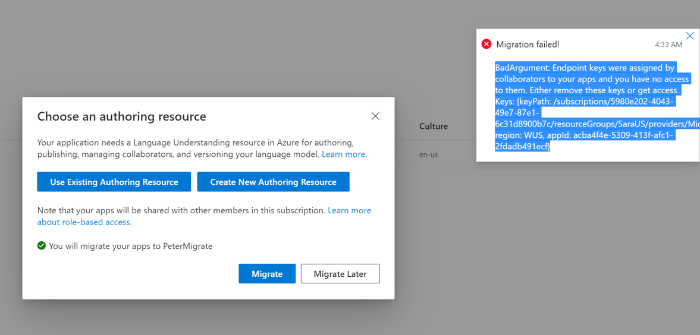
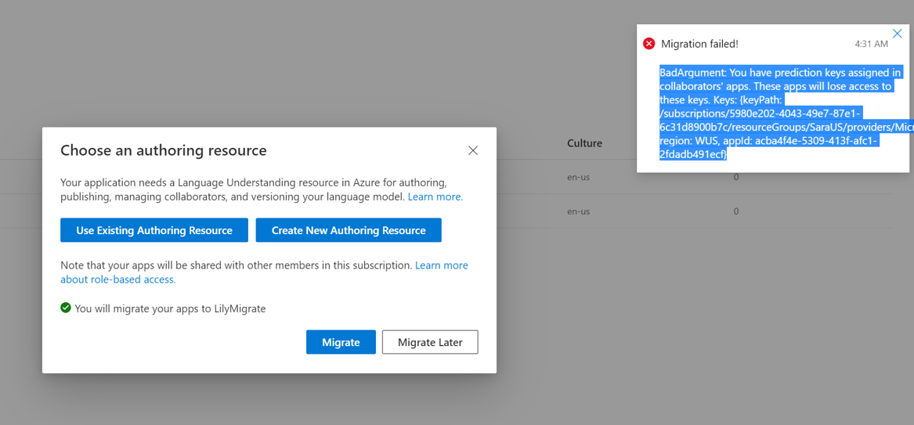

# Migrate to an Azure resource authoring key

Language Understanding (LUIS) authoring authentication changed from an email account to an Azure resource. While not currently required, switching to an Azure resource will be enforced in the future.


## What is migration?

Migration is the process of changing authoring authentication from an email account to an Azure resource. Your account will be linked to an Azure subscription and an Azure authoring resource after you migrate. **All LUIS users (owners or collaborators) will eventually need to migrate.** Migration has to be done from the LUIS portal. If you create the authoring keys, such as with the LUIS CLI, you will still need to complete the migration process in the LUIS portal. You can still have co-authors on your applications after migration, but these will be added on the Azure resource level instead of the application level.

> [!Note]
> Before migration, co-authors are known as _collaborators_ on the LUIS app level. After migration, the Azure role of _contributor_ is used for the same functionality but on the Azure resource level.

## Things to note before you migrate

* Migration is a **one-way** process. You can not go back after you migrate.
* Applications will **automatically migrate** with you if you are the **owner** of the application.
* The owner can't choose a subset of apps to migrate and the process isn't reversible.
* Applications will **disappear from Collaborator's sides** after the **owner migrates**.
* Owners are prompted to send emails to Collaborators to inform them of the migration.
* Applications will **not migrate** with you if you are a **collaborator** on the application.
* There is no way for an owner to know that his collaborators have migrated.
* **Migration does not** automatically collect collaborators and move or add them to the Azure authoring resource. The app owner is the one who needs to complete this step after migration. This step requires [permissions to the Azure Authoring resource](https://docs.microsoft.com/azure/cognitive-services/luis/luis-how-to-collaborate).
* After being assigned to the Azure resource, **collaborators will need to migrate to access applications**. Otherwise, they will have no access to author the applications.
* A migrated user can not be added as a collaborator of the application.
* If **you own prediction keys that are assigned to applications owned by another user**, this will **block migration** for both the owner and collaborators. See below for recommendations.

> [!Note]
> If you need to create a prediction runtime resource, there is [a separate process](luis-how-to-azure-subscription.md#create-resources-in-the-azure-portal) to create it.

## Migration prerequisites

* You need to be associated with a valid Azure Subscription. Ask your tenant admin to add you on the subscription or you can sign up for a free one [here](https://azure.microsoft.com/free/).
* You need to create a LUIS Azure Authoring resource from the LUIS portal or from the Azure portal. Creating an authoring resource from the LUIS portal is part of the migration flow that is discussed in the next section.  
* If you are a **collaborator on applications**, the applications will not automatically migrate. It is **recommended to backup these applications** by exporting them or use the [export API](https://westus.dev.cognitive.microsoft.com/docs/services/5890b47c39e2bb17b84a55ff/operations/5890b47c39e2bb052c5b9c40).You can import the app back into LUIS after migration. The import process creates a new app with a new app ID, for which you are the owner.
* If you are the **owner of the application**, you will not need to export your apps as they will migrate automatically. It is **recommended to save each app's collaborator's list.** An email template that has this list is provided optionally as part of the migration process.


|Portal|Purpose|
|--|--|
|[Azure](https://azure.microsoft.com/free/)|* Create prediction and authoring resources.<br>* Assign contributors on resources.|
|[LUIS](https://www.luis.ai)|* Migrate to new authoring resources.<br>* Create new authoring resource in the migration flow.<br>* Assign or unassign prediction and authoring resources to apps from **Manage -> Azure resources** page. <br>* Move applications from one authrosing resource to another.  |

> [!Note]
> **Authoring your LUIS app is free**, indicated by the `F0` tier. Learn [more about pricing tiers](luis-limits.md#key-limits).


## Migration steps

1. In the LUIS portal that you are working on, you can begin the migration process from the **Azure** icon on the top tool bar of the LUIS portal.
 > [!div class="mx-imgBorder"]
 > 

2. The migration pop-up window allows you to continue the migration or migrate later. Select **Migrate now**.

 

3. Optionally, if any of your apps have collaborators, you are prompted to **send them an email** letting them know about the migration. This is an optional step.

For each collaborator and app, the default email application opens with a lightly formatted email. You can edit the email before sending it. The email template includes the exact app ID and app name.

        ```html
        Dear Sir/Madam,

        I will be migrating my LUIS account to Azure. Consequently, you will no longer have access to the following app:

        App Id: <app-ID-omitted>
        App name: Human Resources

        Thank you
        ```
> [!Note]
> Once you have migrated your account to Azure, your apps will no longer be available to collaborators.


4. Optionally, if you are a collaborator on any application, you are prompted to **export a copy of the apps** by selecting this option during the migration flow. Once you select the option, you will find the page below where you click on the download button on the left to export the apps you want. You may import these apps back after you migrate as they will not be automatically migrated with you. This is an optional step.

 

5. You can choose to create a new LUIS authoring resource or migrate to an existing authoring resource if you have already created one from Azure. Choose the option that you want by selecting the proper button from below.

 > [!div class="mx-imgBorder"]
 > 

### Create new authoring resource from LUIS to migrate

If you want to create a new authoring resource, select **create a new Authoring resource** and provide the following information in the next window.

> [!div class="mx-imgBorder"]
> 

* **Resource name** - a custom name you choose, used as part of the URL for your authoring and prediction endpoint queries.
* **Subscription name** - the subscription that will be associated with the resource. If you have more than one subscription that belongs to your tenant, select the one you want from the dropdown list.
* **Resource group** - a custom resource group name you choose from the drop down list. Resource groups allow you to group Azure resources for access and management.
* **Tenant** - the tenant your Azure subscription is associated with. This is set by default to the tenant you are currently choosing. You can switch tenants by selecting the furthertest to the right avatar which contains your initials.

After you enter the above information, select **Done**.

Note that you can have 10 free authoring resources per region, per subscription. If your subscription has more than 10 authoring resources in the same region, you won't be able to create a new one.

* When the authoring resource is created, the success message is shown. Select **Close** to close the pop-up window.


### Use existing authoring resource to migrate

If your subscription already is associated with a LUIS authoring Azure resource or if you have created on from the Azure portal and you want to migrate to it instead of creating a new resource, select **Use Existing Authoring resource** and provide the following information in the next window.



* **Tenant** - the tenant your Azure subscription is associated with. This is set by default to the tenant you are currently choosing. 
* **Subscription name** - the subscription that will be associated with the resource. If you have more than one subscription that belongs to your tenant, select the one you want from the dropdown list.
* **Resource name** - Select the authoring resource that you want to migrate to.

> [!Note]
> If you can not see your authoring resource in the dropdown list, make sure that you created it in the **proper location** as per the LUIS portal you are signed in. Also make sure that what you created is indeed an **Authoring resource** and not a **prediction resource**.


* Validate your authoring resource name and click on the **Migrate now** button.

 > [!div class="mx-imgBorder"]
 > 

* The success message is shown. Select **Close** to close the pop-up window.
 
 > [!div class="mx-imgBorder"]
 > 

## Accessing my applications after migration

* After the migration process, all your LUIS apps that you are an owner of, will now be assigned to a single LUIS authoring resource.
* The **My apps** list shows the apps migrated to the new authoring resource.
* Before accessing your apps, select the subscription and LUIS authoring resource to see the apps you can author.

 > [!div class="mx-imgBorder"]
 > 

* You don't need to know the authoring resource's key to continue editing your apps in the LUIS portal.
* If you plan to edit your apps programmatically, you will need the authoring key values. These values are displayed on the **Manage -> Azure resources** page in the LUIS portal and are also available in the Azure portal on the resource's **Keys** page. You can also create more authoring resources and assign them from the same page.
 
 > [!div class="mx-imgBorder"]
 > 

## Add co-authors/contributors to authoring resources

[!INCLUDE [Manage contributors for the Azure authoring resource for language understanding](./includes/manage-contributors-authoring-resource.md)]

Learn [how to add contributors](luis-how-to-collaborate.md) on your authoring resource. Contributors will have access to all applications under that resource.

You can add contributors to the authoring resource from the _Azure portal_, on the **Access Control (IAM)** page for that resource. For more information, see [add contributor access](luis-migration-authoring-steps.md#after-the-migration-process-add-contributors-to-your-authoring-resource).

> [!Note]
> If the owner of the LUIS app migrated and added the collaborator as a contributor on the Azure resource, the collaborator will still have no access to the app unless they also migrate.

## LUIS portal migration reminders

The [LUIS portal](https://www.luis.ai) provides the migration process.

You will be asked to migrate if:
* You have apps on the email authentication system for authoring.
* And you are the app owner.

On a weekly basis, you are prompted to migrate your apps. You can cancel this window without migrating. If you want to migrate before the next scheduled period, you can begin the migration process from the **Azure** icon on the top tool bar of the LUIS portal.

You can delay the migration process by canceling out of the window. You are periodically asked to migrate until you migrate or the migration deadline is passed. You can start the migration process from the top navigation bar's lock icon.

## Prediction resources blocking migration
Your migration negatively impacts any applications runtime. When migrating, any collaborators are removed from your apps and you are removed as a collaborator from other apps. This process means the keys a Collaborator assigns get removed too and this may break your application if it is in production. This is the reason we block the migration until you remove collaborators or keys assigned to them manually.

### When does prediction resources block migration?
* Migration gets blocked if you have assigned prediction/runtime resources in apps you do not own.
* Migration gets blocked if you have other users assign prediction/runtime resources to apps you own.

### Recommended steps to do if you are the owner of the app
If you are an owner of some applications and have collaborators assigned prediction/runtime key to these application, an error is shown when you migrate that lists the application IDs that have prediction keys assigned to them owned by other users.

It is recommended to:
* Notify collaborators about the migration.
* Remove all collaborators from the applications shown in the error.
* Undergo the migration process which should succeed if you manually remove collaborators.
* Assign collaborators as contributors to your new authoring resource.
* Collaborators are to migrate and re-assign the prediction resources back to the applications.
Note this will have cause a break in the application temporarily until the prediction resources are re-assigned.

Another solution here is, before owner migration, collaborators may add app owners as contributors on their Azure subscriptions from the Azure portal. This will grant the owner access to the runtime prediction resource. If owner migrates using the new subscription they have been added to (which will be found under a new tenant), this will not only unblock the migration process for both collaborator and app owner, but it will allow for a smooth migration of apps with the prediction key still assigned to them not breaking the apps.


### Recommended steps to do if you are a collaborator on an app
If you are collaborating on applications and have assigned prediction/runtime key to these application, an error is shown when you migrate that lists the application IDs and key paths that are blocking the migration.

It is recommended to:
* Export applications as backup. This is provided as an optional step in the migration process.
* Un-assign the prediction resources from **Manage -> Azure resources** page.
* Undergo the migration process.
* Import back applications after migration.
* Re-assign prediction keys to your applications **Manage -> Azure resources** page.

> [!Note]
> When you import back your applications after you migrate, they will have different app IDs and will be different than the ones being hit in production. You will now be the owner of these applications. 

## Troubleshooting the migration process for LUIS authoring

When you try to migrate but can not find your Azure subscription in the dropdown list:
* Ensure you have a valid azure subscription that is authorized to create Cognitive Services resources. Go to [Azure portal](https://ms.portal.azure.com) and check the status of the subscription. If you do not have one, [create a free trial](https://azure.microsoft.com/free/).
* Ensure that you are in the proper tenant associated with your valid subscription. You can switch tenants from the further left avatar in the toolbar below:


 If you already have an existing authoring resource but can not find it when selecting the "Use Existing Authoring Resource" option:
* You resource was probably created in a different location than the portal you have sign in on. Please check  [LUIS Authoring Regions and the portals](https://docs.microsoft.com/azure/cognitive-services/luis/luis-reference-regions#luis-authoring-regions)
* Create a new resource from the LUIS portal instead

If you select "Create New Authoring Resource" option and migration failed with the error message "Failed retrieving user's Azure information, retry again later"
* Your subscription may have 10 or more authoring resources per region per subscription. If that is the case, you will not be able t create a new authoring resource.
* Migrate by selecting "Use Existing Authoring Resource" option and select one of the existing resources you have under your subscription.

If you see the error below, check the [Recommended steps to do if you are the owner of the app section]


If you see the error below, check the [Recommended steps to do if you are a collaborator on an app Section]



## Next steps

* Review [concepts](luis-concept-keys.md) about authoring and runtime keys
* Review [how to assign keys](luis-how-to-azure-subscription.md) and add [contributors](luis-how-to-collaborate.md)
