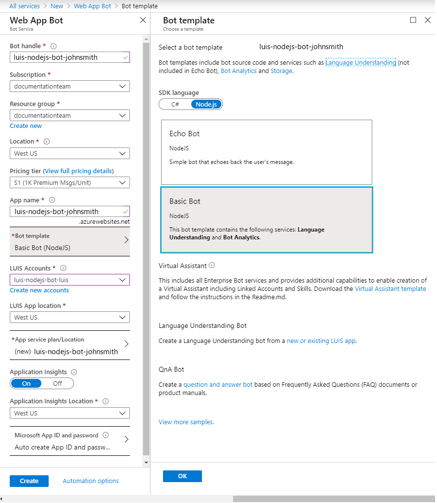
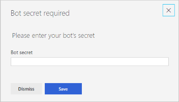
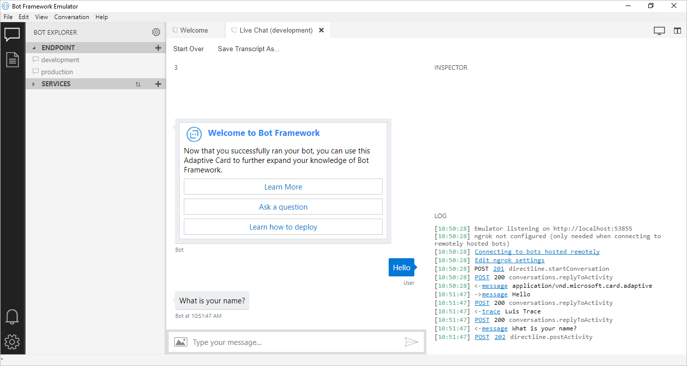

# Tutorial: LUIS bot in Node.js with the Bot Framework 4.x and the Azure Web app bot
Using Node.js, you can build a chat bot integrated with language understanding (LUIS). This bot uses the HomeAutomation app to implement a bot solution. The bot is built the Azure [Web app bot](https://docs.microsoft.com/azure/bot-service/) with [Bot Framework version](https://github.com/Microsoft/botbuilder-js) v4.

**In this tutorial, you learn how to:**

> [!div class="checklist"]
> * Create a web app bot. This process creates a new LUIS app for you.
> * Add a prebuilt domain to the new LUIS model
> * Download the project created by the Web bot service
> * Start bot & emulator locally on your computer
> * Modify bot code for new LUIS intents
> * View utterance results in bot

## Prerequisites

* [Bot emulator](https://aka.ms/abs/build/emulatordownload)
* [Visual Studio Code](https://code.visualstudio.com/Download)


## Create web app bot

1. In the [Azure portal](https://portal.azure.com), select **Create new resource**.

2. In the search box, search for and select **Web App Bot**. Select **Create**.

3. In **Bot Service**, provide the required information:

    |Setting|Purpose|Suggested setting|
    |--|--|--|
    |Bot name|Resource name|`luis-nodejs-bot-` + `<your-name>`, for example, `luis-nodejs-bot-johnsmith`|
    |Subscription|Subscription where to create bot.|Your primary subscription.
    |Resource group|Logical group of Azure resources|Create a new group to store all resources used with this bot, name the group `luis-nodejs-bot-resource-group`.|
    |Location|Azure region - this doesn't have to be the same as the LUIS authoring or publishing region.|`westus`|
    |Pricing tier|Used for service request limits and billing.|`F0` is the free tier.
    |App name|The name is used as the subdomain when your bot is deployed to the cloud (for example, humanresourcesbot.azurewebsites.net).|`luis-nodejs-bot-` + `<your-name>`, for example, `luis-nodejs-bot-johnsmith`|
    |Bot template|Bot framework settings - see next table|
    |LUIS App location|Must be the same as the LUIS resource region|`westus`|

4. In the **Bot template settings**, select the following, then choose the **Select** button under these settings:

    |Setting|Purpose|Selection|
    |--|--|--|
    |SDK version|Bot framework version|**SDK v4**|
    |SDK language|Programming language of bot|**Node.js**|
    |Echo/Basic bot|Type of bot|**Basic bot**|
    
5. Select **Create**. This creates and deploys the bot service to Azure. Part of this process creates a LUIS app named `luis-nodejs-bot-XXXX`. This name is based on the bot and app name's in the previous section.

    [  ](./media/bfv4-nodejs/create-web-app-service.png#lightbox)

6. Leave this browser tab open. For any steps with the LUIS portal, open a new browser tab. Continue to the next section when the new bot service is deployed.

## Add prebuilt domain to model
Part of the bot service deployment creates a new LUIS app with intents and example utterances. The bot provides intent mapping to the new LUIS app for the following intents: 

|Basic bot LUIS intents|example utterance|
|--|--|
|Cancel|`stop`|
|Greeting|`hello`|
|Help|`help`|
|None|Anything outside the domain of the app.|

Add the prebuilt HomeAutomation app to the model to handle utterances like: `Turn off the living room lights`

1. Go to [LUIS](https://www.luis.ai) portal and sign in.
2. On the **My Apps** page, select the **Created date** column to sort by the date the app was created. The Azure Bot service created a new app in the previous section. Its name is `luis-nodejs-bot-` + `<your-name>` + 4 random characters.
3. Open the app and select the **Build** section in the top navigation.
4. From the left navigation, select **Prebuilt Domains**.
5. Select the **HomeAutomation** domain by select **Add domain** on its card.
6. Select **Train** in the top right menu.
7. Select **Publish** in the top right menu. 

    The app created by the Azure Bot service now has new intents:

    |Basic bot new intents|example utterance|
    |--|--|
    |HomeAutomation.TurnOn|`turn the fan to high`
    |HomeAutomation.TurnOff|`turn off ac please`|

## Download the web app bot 
In order to develop the web app bot code, download the code and use on your local computer. 

1. In the Azure portal, still on the web app bot resource, select the **Application Settings** and copy the values of **botFilePath** and **botFileSecret**. You need to add these to an environment file later. 

2. In the Azure portal, select **Build** from the **Bot management** section. 

3. Select **Download Bot source code**. 

    [  ](../../../includes/media/cognitive-services-luis/bfv4/download-code.png#lightbox)

4. When the source code is zipped, a message will provide a link to download the code. Select the link. 

5. Save the zip file to your local computer and extract the files. Open the project. 

6. Open the bot.js file and look for `const results = await this.luisRecognizer.recognize(context);`. This is where the user utterance entered into the bot is sent to LUIS.

   ```javascript
    /**
     * Driver code that does one of the following:
     * 1. Display a welcome card upon startup
     * 2. Use LUIS to recognize intents
     * 3. Start a greeting dialog
     * 4. Optionally handle Cancel or Help interruptions
     *
     * @param {Context} context turn context from the adapter
     */
    async onTurn(context) {
        // Create a dialog context
        const dc = await this.dialogs.createContext(context);

        if(context.activity.type === ActivityTypes.Message) {
            // Perform a call to LUIS to retrieve results for the current activity message.
            const results = await this.luisRecognizer.recognize(context);
            
            const topIntent = LuisRecognizer.topIntent(results);

            // handle conversation interrupts first
            const interrupted = await this.isTurnInterrupted(dc, results);
            if(interrupted) {
                return;
            }

            // Continue the current dialog
            const dialogResult = await dc.continue();

            switch(dialogResult.status) {
                case DialogTurnStatus.empty:
                    switch (topIntent) {
                        case GREETING_INTENT:
                            await dc.begin(GREETING_DIALOG);
                            break;

                        case NONE_INTENT:
                        default:
                            // help or no intent identified, either way, let's provide some help
                            // to the user
                            await dc.context.sendActivity(`I didn't understand what you just said to me. topIntent ${topIntent}`);
                            break;
                    }

                case DialogTurnStatus.waiting:
                    // The active dialog is waiting for a response from the user, so do nothing
                break;

                case DialogTurnStatus.complete:
                    await dc.end();
                    break;

                default:
                    await dc.cancelAll();
                    break;

            }

        } else if (context.activity.type === 'conversationUpdate' && context.activity.membersAdded[0].name === 'Bot') {
            // When activity type is "conversationUpdate" and the member joining the conversation is the bot
            // we will send our Welcome Adaptive Card.  This will only be sent once, when the Bot joins conversation
            // To learn more about Adaptive Cards, see https://aka.ms/msbot-adaptivecards for more details.
            const welcomeCard = CardFactory.adaptiveCard(WelcomeCard);
            await context.sendActivity({ attachments: [welcomeCard] });
        }
    }
    ```

    The bot sends the user's utterance to LUIS and gets the results. The top intent determines the conversation flow. 


## Start the bot
Before changing any code or settings, verify the bot works. 

1. In Visual Studio Code, open a terminal window. 

2. Install the npm dependencies for this bot. 

    ```bash
    npm install
    ```
3. Create a file to hold the environment variables the bot code looks for. Name the file `.env`. Add the following environment variables:

    <!--there is no code language that represents an .env file correctly-->
    ```env
    botFilePath=
    botFileSecret=
    ```

    Set the values of the environment variables to the values you copied from the Azure bot service's Application Settings in Step 1 of the **[Download the web app bot](#download-the-web-app-bot)** section.

4. Start the bot in watch mode. Any changes you make to the code after this start will cause an automatic restart of the app.

    ```bash
    npm run watch
    ```

5. When the bot starts up, the terminal window displays the local port the bot is running on:

    ```console
    > basic-bot@0.1.0 start C:\Users\pattiowens\repos\BFv4\luis-nodejs-bot-src
    > node ./index.js NODE_ENV=development

    restify listening to http://[::]:3978
    
    Get the Emulator: https://aka.ms/botframework-emulator
    
    To talk to your bot, open the luis-nodejs-bot-pattiowens.bot file in the Emulator
    ```

## Start the emulator

1. Begin the Bot Emulator. 

2. In the bot emulator, select the *.bot file in the root of the project. This `.bot` file includes the bot's URL endpoint for messages:

    [  ](../../../includes/media/cognitive-services-luis/bfv4/bot-emulator-v4.png#lightbox)

3. Enter the bot secret you copied from the Azure bot service's Application Settings in Step 1 of the **[Download the web app bot](#download-the-web-app-bot)** section. This allows the emulator to access any encrypted fields in the .bot file.

    


4. In the bot emulator, enter `Hello` and get the proper response for the basic bot.

    [  ](../../../includes/media/cognitive-services-luis/bfv4/emulator-test.png#lightbox)

## Modify bot code 

In the `bot.js` file, add code to handle the new intents. 

1. At the top of the file, find the **Supported LUIS Intents** section, and add constants for the HomeAutomation intents:

   ```javascript
    // Supported LUIS Intents
    const GREETING_INTENT = 'Greeting';
    const CANCEL_INTENT = 'Cancel';
    const HELP_INTENT = 'Help';
    const NONE_INTENT = 'None';
    const TURNON_INTENT = 'HomeAutomation_TurnOn'; // new intent
    const TURNOFF_INTENT = 'HomeAutomation_TurnOff'; // new intent
    ```

    Notice that the period, `.`, between the domain and the intent from the LUIS portal's app is replaced with an underscore, `_`. 

2. Find the **isTurnInterrupted** that receives the LUIS prediction of the utterance and add a line to print out the result to the console.

   ```javascript
    /**
     * Look at the LUIS results and determine if we need to handle
     * an interruptions due to a Help or Cancel intent
     *
     * @param {DialogContext} dc - dialog context
     * @param {LuisResults} luisResults - LUIS recognizer results
     */
    async isTurnInterrupted(dc, luisResults) {
        console.log(JSON.stringify(luisResults));
    ...
    ```

    The bot doesn't have the exact same response as a LUIS REST API request so it is important to learn the differences by looking at the response JSON. The text and intents properties are the same but the entities property values have been modified. 

    ```json
    {
        "$instance": {
            "HomeAutomation_Device": [
                {
                    "startIndex": 23,
                    "endIndex": 29,
                    "score": 0.9776345,
                    "text": "lights",
                    "type": "HomeAutomation.Device"
                }
            ],
            "HomeAutomation_Room": [
                {
                    "startIndex": 12,
                    "endIndex": 22,
                    "score": 0.9079433,
                    "text": "livingroom",
                    "type": "HomeAutomation.Room"
                }
            ]
        },
        "HomeAutomation_Device": [
            "lights"
        ],
        "HomeAutomation_Room": [
            "livingroom"
        ]
    }
    ```

3. Add the intents to the onTurn method's switch statement for the `DialogTurnStatus.empty` case:

   ```javascript
    switch (topIntent) {
        case GREETING_INTENT:
            await dc.begin(GREETING_DIALOG);
            break;

        // New HomeAutomation.TurnOn intent
        case TURNON_INTENT: 

            await dc.context.sendActivity(`TurnOn intent found, entities included: ${JSON.stringify(results.entities)}`);
            break;

        // New HomeAutomation.TurnOff intent
        case TURNOFF_INTENT: 

            await dc.context.sendActivity(`TurnOff intent found, entities included: ${JSON.stringify(results.entities)}`);
            break;

        case NONE_INTENT:
        default:
            // help or no intent identified, either way, let's provide some help
            // to the user
            await dc.context.sendActivity(`I didn't understand what you just said to me. topIntent ${topIntent}`);
            break;
    }
    ```

## View results in bot

1. In the bot emulator, enter the utterance: `Turn on the livingroom lights to 50%`

2. The bot responds with:

    ```json
    TurnOn intent found, entities included: {"$instance":{“HomeAutomation_Device”:[{“startIndex”:23,“endIndex”:29,“score”:0.9776345,“text”:“lights”,“type”:“HomeAutomation.Device”}],“HomeAutomation_Room”:[{“startIndex”:12,“endIndex”:22,“score”:0.9079433,“text”:“livingroom”,“type”:“HomeAutomation.Room”}]},“HomeAutomation_Device”:[“lights”],“HomeAutomation_Room”:[“livingroom”]}
    ```

## Learn more about Bot Framework
Azure Bot service uses the Bot Framework SDK. Learn more about the SDK and bot framework:

* [Azure Bot Service](https://docs.microsoft.com/azure/bot-service/bot-service-overview-introduction?view=azure-bot-service-4.0) v4 documentation
* [Bot Builder Samples](https://github.com/Microsoft/botbuilder-samples)
* [Bot Builder SDK](https://docs.microsoft.com/javascript/api/botbuilder-core/?view=botbuilder-ts-latest)
* [Bot Builder tools](https://github.com/Microsoft/botbuilder-tools):

## Next steps

You created an Azure bot service, copied the bot secret and .bot file path, downloaded the zip file of the code. You added the prebuilt HomeAutomation domain to the LUIS app created as part of the new Azure bot service, then trained and published the app again. You extracted the code project, created an environment file (`.env`), and set the bot secret and the .bot file path. In the bot.js file, you added code to handle the two new intents. Then you tested the bot in the bot emulator to see the LUIS response for an utterance of one of the new intents. 


> [!div class="nextstepaction"]
> [Build a custom domain in LUIS](luis-quickstart-intents-only.md)
