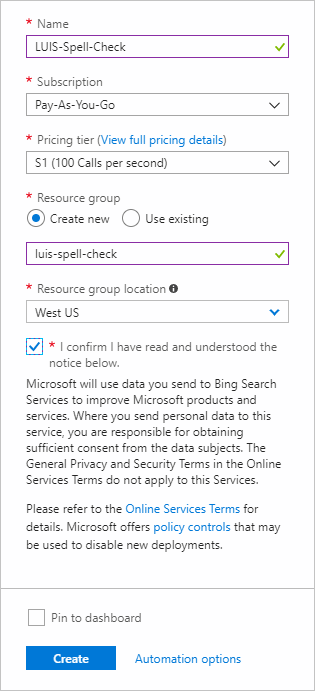
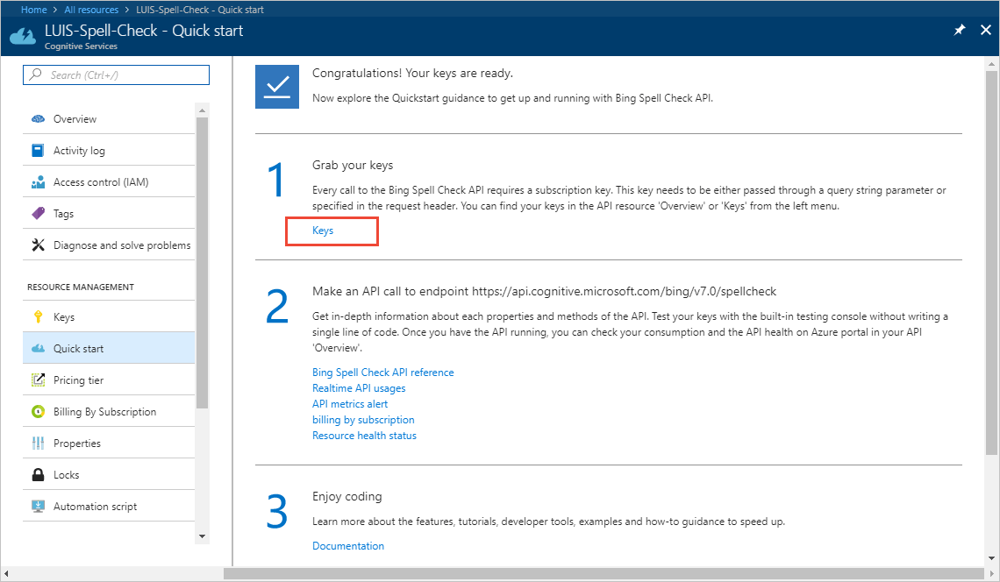

# Correct misspelled words with Bing Spell Check

You can integrate your LUIS app with [Bing Spell Check API V7](https://azure.microsoft.com/services/cognitive-services/spell-check/) to correct misspelled words in utterances before LUIS predicts the score and entities of the utterance. 

## Create first key for Bing Spell Check V7
Your [first Bing Spell Check API v7 key](https://azure.microsoft.com/try/cognitive-services/?api=spellcheck-api) is free. 


<a name"create-subscription-key"></a>
## Create Endpoint key
If your free key expired, create an endpoint key.

1. Log in to the [Azure portal](https://portal.azure.com). 

2. Select **Create a resource** in the top left corner.

3. In the search box, enter `Bing Spell Check API V7`.

    

4. Select the service. 

5. An information panel appears to the right containing information including the Legal Notice. Select **Create** to begin the subscription creation process. 

6. In the next panel, enter your service settings. Wait for service creation process to finish.

    

7. Select **All resources** under the **Favorites** title on the left side navigation.

8. Select the new service. Its type is **Cognitive Services** and the location is **global**. 

9. In the main panel, select **Keys** to see your new keys.

    

10. Copy the first key. You only need one of the two keys. 

## Using the key in LUIS test panel
There are two places in LUIS to use the key. The first is in the [test panel](luis-interactive-test.md#view-bing-spell-check-corrections-in-test-panel). The key isn't saved into LUIS but instead is a session variable. You need to set the key every time you want the test panel to apply the Bing Spell Check API v7 service to the utterance. See [instructions](luis-interactive-test.md#view-bing-spell-check-corrections-in-test-panel) in the test panel for setting the key.

## Adding the key to the endpoint URL
The endpoint query needs the key passed in the query string parameters for each query you want to apply spelling correction. You may have a chatbot that calls LUIS or you may call the LUIS endpoint API directly. Regardless of how the endpoint is called, each and every call must include the required information for spelling corrections to work properly.

The endpoint URL has several values that need to be passed correctly. The Bing Spell Check API v7 key is just another one of these. You must set the **spellCheck** parameter to true and you must set the value of **bing-spell-check-subscription-key** to the key value:

`https://{region}.api.cognitive.microsoft.com/luis/v2.0/apps/{appID}?subscription-key={luisKey}&spellCheck=**true**&bing-spell-check-subscription-key=**{bingKey}**&verbose=true&timezoneOffset=0&q={utterance}` L33135: Creating a codebox to avoid code displayed as text #47991 

## Send misspelled utterance to LUIS
1. In a web browser, copy the preceding string and replace the `region`, `appId`, `luisKey`, and `bingKey` with your own values. Make sure to use the endpoint region, if it is different from your publishing [region](luis-reference-regions.md).

2. Add a misspelled utterance such as "How far is the mountainn?". In English, `mountain`, with one `n`, is the correct spelling. 

3. Select enter to send the query to LUIS.

4. LUIS responds with a JSON result for `How far is the mountain?`. If Bing Spell Check API v7 detects a misspelling, the `query` field in the LUIS app's JSON response contains the original query, and the `alteredQuery` field contains the corrected query sent to LUIS.

```
{
  "query": "How far is the mountainn?",
  "alteredQuery": "How far is the mountain?",
  "topScoringIntent": {
    "intent": "Concierge",
    "score": 0.183866
  },
  "entities": []
}
```

## Ignore spelling mistakes
If you don't want to use the Bing Spell Check API v7 service, you can label utterances that have spelling mistakes so that LUIS can learn proper spelling as well as typos. This option requires more labeling effort than using a spell checker.

## Publishing page
The [publishing](luis-how-to-publish-app.md) page has an **Enable Bing spell checker** checkbox. This is a convenience to create the key and understand how the endpoint URL changes. You still have to use the correct endpoint parameters in order to have spelling corrected for each utterance. 

> [!div class="nextstepaction"]
> [Learn more about example utterances](luis-how-to-add-example-utterances.md)
