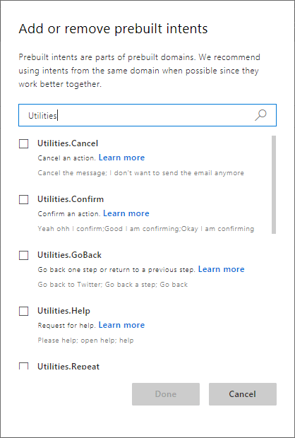

---
title: Prebuilt intents and entities
titleSuffix: Azure Cognitive Services
description: In this tutorial, add prebuilt intents and entities to an app to quickly gain intent prediction and data extraction. You do not need to label any utterances with prebuilt entities. The entity is detected automatically. 
services: cognitive-services
author: diberry
manager: cgronlun
ms.custom: seodec18
ms.service: cognitive-services
ms.component: language-understanding
ms.topic: tutorial
ms.date: 12/21/2018
ms.author: diberry
--- 

# Tutorial: Identify common intents and entities

In this tutorial, add prebuilt intents and entities to the Human Resources tutorial app to quickly gain intent prediction and data extraction. You do not need to label any utterances with prebuilt entities because the entity is detected automatically.

Prebuilt models (domains, intents, and entities) help you build your model quickly as well as provide an example of what a model looks like.

**In this tutorial, you learn how to:**

> [!div class="checklist"]
> * Create new app
> * Add prebuilt intents 
> * Add prebuilt entities 
> * Train 
> * Publish 
> * Get intents and entities from endpoint

[!INCLUDE [LUIS Free account](../../../includes/cognitive-services-luis-free-key-short.md)]

## Create a new app

[!INCLUDE [Follow these steps to create a new LUIS app](../../../includes/cognitive-services-luis-create-new-app-steps.md)]


## Add prebuilt intents to help with common user intentions

LUIS provides several prebuilt intents to help with common user intentions.  

1. [!INCLUDE [Start in Build section](../../../includes/cognitive-services-luis-tutorial-build-section.md)]

2. Select **Add prebuilt intent**. 

3. Search for `Utilities`. 

    [ ](./media/luis-tutorial-prebuilt-intents-and-entities/prebuilt-intent-utilities.png#lightbox)

4. Select the following intents and select **Done**: 

    * Utilities.Cancel
    * Utilities.Confirm
    * Utilities.Help
    * Utilities.StartOver
    * Utilities.Stop

    These intents are helpful to determine where, in the conversation, the user is and what they are asking to do. 


## Add prebuilt entities to help with common data type extraction

LUIS provides several prebuilt entities for common data extraction. 

1. Select **Entities** from the left navigation menu.

2. Select **Manage prebuilt entity** button.

3. Select **[PersonName](luis-reference-prebuilt-person.md)** and **[GeographyV2](luis-reference-prebuilt-geographyV2.md)** from the list of prebuilt entities then select **Done**.

    

    These entities will help you add name and place recognition to your client application.

## Train the app so the changes to the intent can be tested 

[!INCLUDE [LUIS How to Train steps](../../../includes/cognitive-services-luis-tutorial-how-to-train.md)]

## Publish the app so the trained model is queryable from the endpoint

[!INCLUDE [LUIS How to Publish steps](../../../includes/cognitive-services-luis-tutorial-how-to-publish.md)]

## Get intent and entity prediction from endpoint

1. [!INCLUDE [LUIS How to get endpoint first step](../../../includes/cognitive-services-luis-tutorial-how-to-get-endpoint.md)]

2. Go to the end of the URL in the browser address bar and enter `I want to cancel on March 3`. The last query string parameter is `q`, the utterance **query**. 

    ```json
    {
      "query": "I want to cancel on March 3",
      "topScoringIntent": {
        "intent": "Utilities.Cancel",
        "score": 0.7818295
      },
      "intents": [
        {
          "intent": "Utilities.Cancel",
          "score": 0.7818295
        },
        {
          "intent": "ApplyForJob",
          "score": 0.0237864349
        },
        {
          "intent": "GetJobInformation",
          "score": 0.017576348
        },
        {
          "intent": "Utilities.StartOver",
          "score": 0.0130122062
        },
        {
          "intent": "Utilities.Help",
          "score": 0.006731322
        },
        {
          "intent": "None",
          "score": 0.00524190161
        },
        {
          "intent": "Utilities.Stop",
          "score": 0.004912514
        },
        {
          "intent": "Utilities.Confirm",
          "score": 0.00092950504
        }
      ],
      "entities": [
        {
          "entity": "march 3",
          "type": "builtin.datetimeV2.date",
          "startIndex": 20,
          "endIndex": 26,
          "resolution": {
            "values": [
              {
                "timex": "XXXX-03-03",
                "type": "date",
                "value": "2018-03-03"
              },
              {
                "timex": "XXXX-03-03",
                "type": "date",
                "value": "2019-03-03"
              }
            ]
          }
        },
        {
          "entity": "3",
          "type": "builtin.number",
          "startIndex": 26,
          "endIndex": 26,
          "resolution": {
            "value": "3"
          }
        }
      ]
    }
    ```

    The result predicted the Utilities.Cancel intent and extracted the date of March 3 and the number 3. 

    There are two values for March 3 because the utterance didn't state if March 3 is in the past or in the future. It is up to the client application to make an assumption or ask for clarification, if that is needed. 

## Clean up resources

[!INCLUDE [LUIS How to clean up resources](../../../includes/cognitive-services-luis-tutorial-how-to-clean-up-resources.md)]

## Learn more about prebuilt models

* [Prebuilt domains](luis-reference-prebuilt-domains.md): these are common domains that reduce overall LUIS app authoring
* Prebuilt intents: these are the individual intents of the common domains. You can add intents individually instead of adding the entire domain.
* [Prebuilt entities](luis-prebuilt-entities.md): these are common data types useful to most LUIS apps.

## Next steps

By adding prebuilt intents and entities, the client application can determine common user intentions and extract common datatypes.  

> [!div class="nextstepaction"]
> [Add a regular expression entity to the app](luis-quickstart-intents-regex-entity.md)

