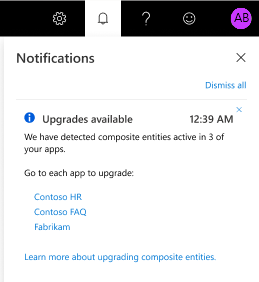

# Upgrade composite entity to machine-learned entity

Upgrade composite entity to machine-learned entity to build an entity that receives more complete predictions with better decomposability for debugging the entity.

## Current version model restrictions

The upgrade process creates machine-learned entities, based on the existing composite entities found in your app, into a new version of your app. This includes composite entity children and roles. The process also switches the labels in example utterances to use the new entity.

## Upgrade process

The upgrade process:
* Creates new machine-learned entity for each composite entity.
* Child entities:
    * If child entity is only used in composite entity, it will only be added to machine-learned entity.
    * If child entity is used in composite _and_ as a separate entity (labeled in example utterances), it will be added to the version as an entity and as a subentity to the new machine-learned entity.
    * If the child entity uses a role, each role will be converted into a subentity of the same name.
    * If the child entity is a non-machine-learned entity (regular expression, list entity, or prebuilt entity), a new subentity is created with the same name, and the new subentity has a feature using the non-machine-learned entity with the constraint added.
* Names are retained but must be unique at same subentity/sibling level. Refer to [unique naming limits](luis-boundaries.md#name-uniqueness).
* Labels in example utterances are switched to new machine-learned entity with subentities.

Use the following chart to understand how your model changes:

|Old object|New object|Notes|
|--|--|--|
|Composite entity|Machine-learned entity with structure|Both objects are parent objects.|
|Composite's child entity is **simple entity**|subentity|Both objects are child objects.|
|Composite's child entity is **Prebuilt entity** such as Number|subentity with name of Prebuilt entity such as Number, and subentity has _feature_ of Prebuilt Number entity with constraint option set to _true_.|subentity contains feature with constraint at subentity level.|
|Composite's child entity is **Prebuilt entity** such as Number, and prebuilt entity has a **role**|subentity with name of role, and subentity has feature of Prebuilt Number entity with constraint option set to true.|subentity contains feature with constraint at subentity level.|
|Role|subentity|The role name becomes the subentity name. The subentity is a direct descendant of the machine-learned entity.|

## Begin upgrade process

Before updating, make sure to:

* Change versions if you are not on the correct version to upgrade

1. Begin the upgrade process from the notification or you can wait until the next scheduled prompt.

    > [!div class="mx-imgBorder"]
    > 

1. On the pop-up, select **Upgrade now**.

1. Review the **What happens when you upgrade** information then select **Continue**.

1. Select the composite entities from the list to upgrade then select **Continue**.

1. You can move any untrained changes from the current version into the upgraded version by selecting the checkbox.

1. Select **Continue** to begin the upgrade process.

1. The progress bar indicates the status of the upgrade process.

1. When the process is done, you are on a new trained version with the new machine-learned entities. Select **Try your new entities** to see the new entity.

    If the upgrade or training failed for the new entity, a notification provides more information.

1. On the Entity list page, the new entities are marked with **NEW** next to the type name.

## Next steps

* [Authors and collaborators](luis-how-to-collaborate.md)