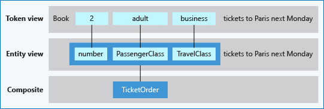

# Composite entity 

A composite entity is made up of other entities, such as prebuilt entities, simple, regular expression, and list entities. The separate entities form a whole entity. 

This entity is a good fit when the data:

* Are related to each other. 
* Are related to each other in the context of the utterance.
* Use a variety of entity types.
* Need to be grouped and processed by the client application as a unit of information.
* Have a variety of user utterances that require machine-learning.



## Example JSON

Consider a composite entity of prebuilt `number` and `Location::ToLocation` with the following utterance:

`book 2 tickets to paris`

Notice that `2`, the number, and `paris`, the ToLocation have words between them that are not part of any of the entities. The green underline, used in a labeled utterance in the [LUIS](luis-reference-regions.md) website, indicates a composite entity.


Composite entities are returned in a `compositeEntities` array and all entities within the composite are also returned in the `entities` array:

```JSON

"entities": [
    {
    "entity": "2 tickets to cairo",
    "type": "ticketInfo",
    "startIndex": 0,
    "endIndex": 17,
    "score": 0.67200166
    },
    {
    "entity": "2",
    "type": "builtin.number",
    "startIndex": 0,
    "endIndex": 0,
    "resolution": {
        "subtype": "integer",
        "value": "2"
    }
    },
    {
    "entity": "cairo",
    "type": "builtin.geographyV2",
    "startIndex": 13,
    "endIndex": 17
    }
],
"compositeEntities": [
    {
    "parentType": "ticketInfo",
    "value": "2 tickets to cairo",
    "children": [
        {
        "type": "builtin.geographyV2",
        "value": "cairo"
        },
        {
        "type": "builtin.number",
        "value": "2"
        }
    ]
    }
]
```    

|Data object|Entity name|Value|
|--|--|--|
|Prebuilt Entity - number|"builtin.number"|"2"|
|Prebuilt Entity - GeographyV2|"Location::ToLocation"|"paris"|

## Next steps

[Tutorial](luis-tutorial-composite-entity.md)<br>
